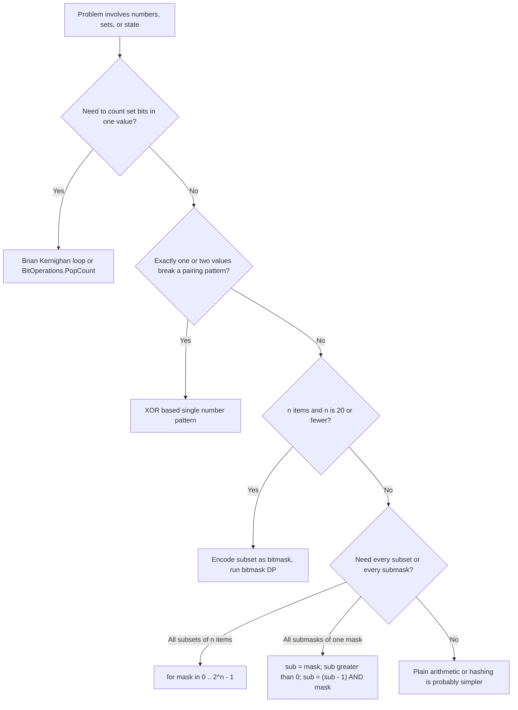

# Bit Manipulation

> **Scope** — bitwise operators, two's-complement arithmetic, classic bit tricks, bitmasking over sets/subsets, and bitmask DP, all in C#.

**Contents**
- [1. Core Concepts](#1-core-concepts)
- [2. Complexity Reference](#2-complexity-reference)
- [3. C# Toolbox](#3-c-toolbox)
- [4. Core Patterns / Techniques](#4-core-patterns--techniques)
- [5. Classic Problems & Solutions](#5-classic-problems--solutions)
- [6. Pattern Recognition](#6-pattern-recognition)
- [7. Interview Focus](#7-interview-focus)
- [8. Common Traps & Edge Cases](#8-common-traps--edge-cases)
- [9. Related LeetCode Problems](#9-related-leetcode-problems)
- [10. Cheat Sheet](#10-cheat-sheet)
- [See Also](#see-also)

---

## 1. Core Concepts

### Two's complement

- The negation `-x` is encoded as `~x + 1` (invert bits, add one). This gives a single representation of zero and lets addition hardware work identically for signed and unsigned values.
- The sign lives in the most significant bit: for a 32-bit `int`, `x < 0` iff bit 31 is set.
- `int.MinValue` (`-2147483648`) has **no positive counterpart** in 32 bits. In an `unchecked` expression, `-int.MinValue` wraps back to `int.MinValue`; in a `checked` expression it throws. `Math.Abs(int.MinValue)` also throws `OverflowException`.

### Signed vs unsigned widths in C#

| Type | Bits | Range | Right-shift `>>` behavior |
|---|---|---|---|
| `sbyte` / `short` | 8 / 16 | signed | promoted to `int` before any bitwise op |
| `byte` / `ushort` | 8 / 16 | unsigned | promoted to `int` before any bitwise op |
| `int` | 32 | -2³¹ … 2³¹-1 | **arithmetic** (sign-extends) |
| `uint` | 32 | 0 … 2³²-1 | **logical** (zero-fills) |
| `long` | 64 | -2⁶³ … 2⁶³-1 | **arithmetic** |
| `ulong` | 64 | 0 … 2⁶⁴-1 | **logical** |

> **Quick Note** — `byte`, `sbyte`, `short`, `ushort` are integer-promoted to `int` for any arithmetic/bitwise expression. Cast back explicitly if you need the narrower type.

### Arithmetic vs logical right shift

- `>>` on a **signed** type replicates the sign bit: `-8 >> 1 == -4`.
- `>>` on an **unsigned** type fills with zero: `unchecked((uint)-8) >> 1 == 2147483644u`.
- C# 11 added `>>>`, the **unsigned right shift** operator — it always zero-fills, even on a signed operand, without a cast: `(-8) >>> 1 == 2147483644` for `int`.

> **Common Trap** — `x >> 1` is **not** the same as `x / 2` for negative `x`: shifting rounds toward negative infinity, division rounds toward zero. `-3 >> 1 == -2`, but `-3 / 2 == -1`.

### The shift-count masking rule

C# does **not** treat an out-of-range shift count as undefined behavior — it silently **masks** the count:

- For `int`/`uint`, the shift amount is taken `& 31`.
- For `long`/`ulong`, the shift amount is taken `& 63`.

So for an `int`, `x << 32` is exactly `x << 0`, and `x << 33` is `x << 1` — no exception, no zeroed value, just a quietly wrong-looking result if you expected "shift past width = 0". This is defined in C#; do not carry the assumption to C/C++, where shifting by a count greater than or equal to the width is undefined behavior. Always validate or normalize dynamic shift counts yourself if the logic depends on them.

### XOR — the workhorse operator

| Property | Identity | Why it matters |
|---|---|---|
| Self-inverse | `a ^ a = 0` | pairs cancel out → find the "odd one out" |
| Identity element | `a ^ 0 = a` | safe accumulator seed |
| Commutative | `a ^ b = b ^ a` | order of XOR-ing a list doesn't matter |
| Associative | `(a ^ b) ^ c = a ^ (b ^ c)` | can fold left-to-right, e.g. with `Aggregate` |
| Involution | `(a ^ b) ^ b = a` | XOR is its own decoder — recovers `a` given `b` and the combined value |

These five lines are the entire theoretical basis for single-number problems, XOR-swap, XOR prefix sums, and "encode/decode" style array questions.

### Operator truth table

| A | B | `A & B` | `A \| B` | `A ^ B` |
|---|---|---|---|---|
| 0 | 0 | 0 | 0 | 0 |
| 0 | 1 | 0 | 1 | 1 |
| 1 | 0 | 0 | 1 | 1 |
| 1 | 1 | 1 | 1 | 0 |

At the single-bit truth-table level, `~0 -> 1` and `~1 -> 0`. On an actual two's-complement integer, `~A` has the same bit pattern as `-A - 1` under wraparound arithmetic; for example, `~0 == -1`, not `1`.



---

## 2. Complexity Reference

| Operation | Time | Space | Notes |
|---|---|---|---|
| Single bitwise op (`&`, `\|`, `^`, `~`, `<<`, `>>`, `>>>`) | O(1) | O(1) | one CPU instruction on a fixed-width word |
| Naive popcount (test all 32 bits) | O(32) = O(1) | O(1) | fixed iteration count regardless of value |
| Brian Kernighan popcount | O(popcount(x)) | O(1) | loop runs once **per set bit**, not per bit-width — faster when x is sparse |
| `BitOperations.PopCount` | O(1) | O(1) | hardware `POPCNT` intrinsic when available |
| Subset enumeration, n items | O(2ⁿ · n) | O(1) extra | 2ⁿ masks, O(n) to decode each unless state carried incrementally |
| Submask enumeration over all masks | O(3ⁿ) total | O(1) extra | each bit is "outside mask", "in mask & in submask", or "in mask & not in submask" — 3 states per bit |
| Bitmask DP (TSP / assignment) | O(2ⁿ · n²) | O(2ⁿ · n) | `dp[mask][i]`, one transition per next city per state |
| Count set bits 1..N — brute | O(N log N) | O(1) | Kernighan popcount per number |
| Count set bits 1..N — DP | O(N) | O(N) | `dp[i] = dp[i >> 1] + (i & 1)` |
| Count set bits 1..N — closed form | O(log N) | O(log N) stack | halves the range every recursive call |
| Add without `+` | O(32) = O(1) | O(1) | XOR gives sum without carry; `(a & b) << 1` carries until zero |
| Reverse 32 bits — SWAR masks | O(1) | O(1) | five fixed swaps: 16/8/4/2/1-bit blocks |
| Maximum XOR pair — binary trie | O(32n) | O(32n) | insert values high-bit first, query opposite branches greedily |
| Gray code generation | O(2ⁿ) | O(2ⁿ) output | `g(i) = i ^ (i >> 1)` per entry |

---

## 3. C# Toolbox

### `System.Numerics.BitOperations`

| Method family | .NET 8 signature shape | Does | Gotcha |
|---|---|---|---|
| `PopCount` | `PopCount(uint value)`, `PopCount(ulong value)` | count of set bits | maps to hardware `POPCNT` when available |
| `LeadingZeroCount` | `LeadingZeroCount(uint value)`, `LeadingZeroCount(ulong value)` | leading zero count | returns bit-width (32/64) for input `0` |
| `TrailingZeroCount` | `TrailingZeroCount(int value)`, `TrailingZeroCount(uint value)`, `TrailingZeroCount(long value)`, `TrailingZeroCount(ulong value)` | trailing zero count | returns bit-width for input `0` |
| `Log2` | `Log2(uint value)`, `Log2(ulong value)` | floor log2 | `Log2(0) == 0`, **not** an exception or -infinity — guard the zero case yourself |
| `IsPow2` | `IsPow2(int value)`, `IsPow2(uint value)`, `IsPow2(long value)`, `IsPow2(ulong value)` | true iff exactly one bit set | `IsPow2(0) == false` |
| `RoundUpToPowerOf2` | `RoundUpToPowerOf2(uint value)`, `RoundUpToPowerOf2(ulong value)` | next power of two >= x | `RoundUpToPowerOf2(0) == 0`; overflow wraps to `0` |
| `RotateLeft` / `RotateRight` | `RotateLeft(uint value, int offset)`, `RotateLeft(ulong value, int offset)`, and matching `RotateRight` overloads | circular bit rotation | wraps the shift count automatically |

> **Quick Note** — .NET 8 also exposes pointer-sized overloads (`UIntPtr` for most families, plus `IntPtr` for `IsPow2` and `TrailingZeroCount`). DSA interview code usually sticks to `uint`/`ulong`/`int`/`long`.

### GCC intrinsic → .NET mapping

| GCC builtin | .NET equivalent | Note |
|---|---|---|
| `__builtin_popcount(x)` | `BitOperations.PopCount((uint)x)` | `__builtin_popcountll` maps to the `ulong` overload |
| `__builtin_clz(x)` | `BitOperations.LeadingZeroCount((uint)x)` | GCC: UB for `x == 0`; .NET: returns 32 |
| `__builtin_clzll(x)` | `BitOperations.LeadingZeroCount((ulong)x)` | GCC: UB for `x == 0`; .NET: returns 64 |
| `__builtin_ctz(x)` | `BitOperations.TrailingZeroCount((uint)x)` | GCC: UB for `x == 0`; .NET: returns 32 |
| `__builtin_ctzll(x)` | `BitOperations.TrailingZeroCount((ulong)x)` | GCC: UB for `x == 0`; .NET: returns 64 |
| `__builtin_ffs(x)` | `x == 0 ? 0 : BitOperations.TrailingZeroCount((uint)x) + 1` | both APIs use 1-based index for the first set bit after the zero guard |

### Other essentials

- **`Convert.ToString(x, 2)`** — prints the binary string. For a *negative* `int`/`long` it prints the **full two's-complement bit pattern** (32 or 64 characters), not a `"-"`-prefixed magnitude — a common surprise.
- **`System.Collections.BitArray`** — dynamic-size bitset when you need more than 64 flags; supports `And`, `Or`, `Xor`, `Not` in place.
- **`[Flags]` enums** — named bitmasks for readability. Prefer a direct `(flags & Flag.X) != 0` check over `Enum.HasFlag` in hot paths (boxing/virtual dispatch overhead on older runtimes); `HasFlag` is fine for clarity elsewhere.
- **`checked` / `unchecked`** — bit tricks that rely on deliberate integer wraparound (e.g. adding via XOR/AND-carry, or negating for `x & -x`) must run in an `unchecked` context, or they throw `OverflowException` in a project compiled with `CheckForOverflowUnderflow`. Prefer `uint`/`ulong` masks when the value is really a bit pattern rather than a signed number.

---

## 4. Core Patterns / Techniques

### Bit Tricks Reference

| Trick | C# expression | Notes |
|---|---|---|
| Get bit `i` as 0/1 | `(x >> i) & 1` | parenthesize as `((x >> i) & 1)` when mixing with comparisons |
| Test bit `i` | `(x & (1 << i)) != 0` | use `1u`/`1L` for bit 31+ or unsigned masks |
| Set bit `i` | `x \|= 1 << i` | turns that bit to `1` |
| Clear bit `i` | `x &= ~(1 << i)` | turns that bit to `0` |
| Toggle bit `i` | `x ^= 1 << i` | flips that bit |
| Clear lowest set bit | `x & (x - 1)` | drops the rightmost `1`; core of Kernighan's popcount |
| Isolate lowest set bit | `x & -x` | keeps only the rightmost `1`; wrap in `unchecked` for signed `int.MinValue` |
| Set lowest clear bit | `x \| (x + 1)` | turns the rightmost `0` into `1` |
| Set all bits below the lowest set bit | `x \| (x - 1)` | useful for prefix-style masks; for `x == 0`, this becomes all 1s |
| Mask lowest set bit and all bits below it | `x ^ (x - 1)` | produces `0b...0011..11` through the lowest set bit |
| Lowest `n` bits mask | `n == 32 ? uint.MaxValue : (1u << n) - 1u` | avoid the `1u << 32` shift-masking bug |
| Check power of two | `x > 0 && (x & (x - 1)) == 0` | a positive power of two has exactly one bit set |
| Multiply by 2^k | `x << k` | overflow/sign risk - check range first |
| Divide by 2^k (non-negative x) | `x >> k` | rounds toward -infinity for negatives, not toward 0 |
| Turn off bits **below** `i`, keep `i` and above | `x &= ~((1 << i) - 1)` | clears bits `0..i-1` |
| Turn off bit `i` and above, keep below `i` | `x &= (1 << i) - 1` | clears bit `i` and everything above |
| Check even / odd | `(x & 1) == 0` | avoids `%` |
| Absolute value (branchless) | `int m = x >> 31; (x + m) ^ m;` | still returns/overflows to `int.MinValue`; prefer guarded `Math.Abs` |
| Branchless min | `int d = a - b; b + (d & (d >> 31));` | relies on sign bit of `a - b`; can overflow |
| Branchless max | `int d = a - b; a - (d & (d >> 31));` | same caveat |
| Swap without temp | `a ^= b; b ^= a; a ^= b;` | do not ship it: aliasing can zero the value, and tuple swap is clearer |
| Count set bits - Kernighan | `while (u != 0) { u &= u - 1; count++; }` | O(popcount) iterations; use `uint`/`ulong` for raw bit patterns |
| Count set bits - DP / lookup | `dp[i] = dp[i >> 1] + (i & 1)` | O(1) amortized per value once table is built |

Minimal sanity check for the two non-obvious low-bit tricks:

```text
x = 0b01010000
x & (x - 1) = 0b01000000    // clears the rightmost 1
x & -x      = 0b00010000    // keeps only the rightmost 1
```

### XOR Cancellation and Prefix Patterns

| Pattern | Template | Use | Caveat |
|---|---|---|---|
| Unique among pairs | `ans ^= x` over all values | Single Number I; all even-count values cancel | only works for even multiplicities |
| Unique among triples | bit counts mod 3, or `ones/twos` automaton | Single Number II | plain XOR is wrong here |
| Two uniques among pairs | `xorAll`, then split by `xorAll & -xorAll` | Single Number III | use `unchecked` or unsigned masks around `-xorAll` |
| Missing number `0..n` | seed `ans = n`, then `ans ^= i ^ nums[i]` | no sum overflow | input must be a permutation missing exactly one value |
| Static range XOR | `prefix[r + 1] ^ prefix[l]` | O(1) inclusive `[l, r]` query | prefix array is exclusive on the right |

### Bitmask as Set Operations

Use masks when the universe is small and dense (usually <= 32/64 elements) and membership, union, intersection, subset checks, or DP state transitions dominate.

| Set idea | C# expression | Notes |
|---|---|---|
| Empty set | `0` | no elements selected |
| Universe of `n` elements | `n == 32 ? uint.MaxValue : (1u << n) - 1u` | guard full width because shifts are masked |
| Add / remove `i` | `mask \| (1 << i)`, `mask & ~(1 << i)` | use `1L`/`1UL` for wider masks |
| Contains `i` | `(mask & (1 << i)) != 0` | parenthesize before comparison |
| Union / intersection | `a \| b`, `a & b` | either vs both sets contain the element |
| Difference / symmetric difference | `a & ~b`, `a ^ b` | remove vs exactly one side |
| `a` subset of `b` | `(a & b) == a` | all set bits of `a` also appear in `b` |
| Cardinality | `BitOperations.PopCount((uint)mask)` | use the `ulong` overload for 64-bit masks |

Switch to `BitArray`, `Span<ulong>` bitsets, or a domain-specific compressed structure once the universe is not naturally word-sized.

### Subsets and Submasks

All subsets of `n` items:

```csharp
for (int mask = 0; mask < (1 << n); mask++)
{
    for (int i = 0; i < n; i++)
        if ((mask & (1 << i)) != 0)
            Process(items[i]);
}
```

All non-empty submasks of a fixed mask:

```csharp
for (int sub = mask; sub > 0; sub = (sub - 1) & mask)
{
    Process(sub);
}
```

This skips zero; include it with a break-on-zero loop when the empty submask matters:

```csharp
for (int sub = mask; ; sub = (sub - 1) & mask)
{
    Process(sub);
    if (sub == 0) break;
}
```

`(sub - 1) & mask` jumps to the next lower submask without visiting bits outside `mask`. One mask has `2^popcount(mask)` submasks; enumerating submasks for every mask costs O(3^n) total because each bit has three states: outside mask, inside mask and inside submask, inside mask but outside submask.

### Bitmask DP - TSP / Assignment Template

**When to use** - `n <= ~20`, state is a used/visited subset plus a small pointer (last city, worker index, current row), and `2^n * poly(n)` fits.

```csharp
int full = 1 << n;
var dp = new int[full, n];
Fill(dp, INF);
dp[1, 0] = 0;

for (int mask = 1; mask < full; mask++)
    for (int last = 0; last < n; last++)
        if ((mask & (1 << last)) != 0 && dp[mask, last] < INF)
            for (int next = 0; next < n; next++)
                if ((mask & (1 << next)) == 0)
                    Relax(dp[mask | (1 << next), next], dp[mask, last] + Cost(last, next));
```

For TSP, `dp[mask,last]` is the minimum cost to visit exactly `mask` and end at `last`; transitions add one unvisited city. Complexity is usually O(2^n * n^2) time and O(2^n * n) space. If `n` jumps to 10^5, this is the wrong model.

### Gray Code

```csharp
IList<int> GrayCode(int n)
{
    var result = new List<int>(1 << n);
    for (int i = 0; i < (1 << n); i++)
        result.Add(i ^ (i >> 1));
    return result;
}
```

Consecutive codes differ by one bit. Decoding is not the same formula: repeatedly XOR-fold shifted copies until the Gray value becomes zero.

### Bitset for Small Alphabets

```csharp
int LetterMask(string word)
{
    int mask = 0;
    foreach (char c in word)
        mask |= 1 << (c - 'a');
    return mask;
}

bool ShareNoLetters(string a, string b) => (LetterMask(a) & LetterMask(b)) == 0;
```

Useful for lowercase word overlap, anagram-ish features, and compact filters; normalize input first and switch representation above 32/64 symbols.

## 5. Classic Problems & Solutions

### Compact Identity Problems

| Problem | One-line trick | Complexity |
|---|---|---|
| Power of Two (LC 231) | `x > 0 && (x & (x - 1)) == 0` | O(1) |
| Power of Four (LC 342) | power of two and `(x & 0x55555555) != 0` so the single bit is in an even index | O(1) |
| Hamming Distance (LC 461) | `BitOperations.PopCount((uint)(x ^ y))` | O(1) |
| Number of 1 Bits (LC 191) | `PopCount`, or Kernighan `u &= u - 1` loop | O(1) word / O(popcount) loop |
| Reverse Bits (LC 190) | shift-accumulate into `uint`; for repeated calls use byte cache or SWAR masks | O(32) or O(1) fixed |
| Complement of Base 10 Integer (LC 1009) | build mask through highest set bit, then `(~n) & mask`; define `0 -> 1` | O(1) word |
| Alternating Bits (LC 693) | `m = n ^ (n >> 1)` must be all ones: `(m & (m + 1)) == 0` | O(1) |
| Add Binary (LC 67) | scan strings right-to-left with integer carry | O(max(m,n)) |
| Total Hamming Distance (LC 477) | for each bit add `ones * (n - ones)` | O(32n) |
| Maximum Product of Word Lengths (LC 318) | precompute 26-bit masks; compatible iff `(aMask & bMask) == 0` | O(n^2 + total chars) |
| Minimum Flips for `a OR b == c` (LC 1318) | per bit: if `c` bit is 0, flip set bits in `a,b`; else need one set bit | O(32) |

### Single Number Family + Missing Number

All variants are XOR-cancellation questions; the only change is the repeat count model.

| Variant | Core idea | Time / space |
|---|---|---|
| Single Number I: one value once, others twice | XOR every value | O(n) / O(1) |
| Single Number II: one value once, others three times | per-bit count mod 3, or `ones/twos` finite automaton | O(32n) or O(n) / O(1) |
| Single Number III: two values once, others twice | `xorAll = a ^ b`; split by `xorAll & -xorAll` | O(n) / O(1) |
| Missing Number `0..n` | XOR `n`, every index, and every value | O(n) / O(1) |

```csharp
int SingleNumber(int[] nums)
{
    int ans = 0;
    foreach (int x in nums) ans ^= x;
    return ans;
}

int SingleNumberII(int[] nums)
{
    int ones = 0, twos = 0;
    foreach (int x in nums)
    {
        ones = (ones ^ x) & ~twos;
        twos = (twos ^ x) & ~ones;
    }
    return ones;
}

(int First, int Second) SingleNumberIII(int[] nums)
{
    int xorAll = 0;
    foreach (int x in nums) xorAll ^= x;

    int diff = unchecked(xorAll & -xorAll);
    int first = 0;
    foreach (int x in nums)
        if ((x & diff) != 0)
            first ^= x;

    return (first, xorAll ^ first);
}

int MissingNumber(int[] nums)
{
    int missing = nums.Length;
    for (int i = 0; i < nums.Length; i++)
        missing ^= i ^ nums[i];
    return missing;
}
```

For Single Number II, the automaton tracks each bit's count modulo 3: `00 -> 01 -> 10 -> 00`. Update order matters because `twos` uses the new `ones`. For Single Number III, `diff` is any bit where the two unique values differ, so all duplicate pairs stay in the same partition and still cancel.

### Counting Bits (LC 338) and Total Set Bits 1..N

```csharp
int[] CountBits(int n)
{
    var dp = new int[n + 1];
    for (int i = 1; i <= n; i++)
        dp[i] = dp[i >> 1] + (i & 1);
    return dp;
}
```

Recurrences worth remembering:

| Recurrence | Meaning |
|---|---|
| `dp[i] = dp[i >> 1] + (i & 1)` | drop the lowest bit, then add it back |
| `dp[i] = dp[i & (i - 1)] + 1` | clear the lowest set bit |

Counting bits for every number `0..n` is O(n) time and O(n) output. If asked only for the total set bits from `1..N`, summing this DP is O(N); the O(log N) follow-up splits at the highest power of two: top-bit contribution `n - msb + 1`, full lower-block contribution `bit * 2^(bit - 1)`, then recurse on `n - msb`.

### Sum of Two Integers (LC 371)

`a ^ b` is the per-bit sum without carry; `(a & b) << 1` is the carry to add next.

```csharp
int GetSum(int a, int b)
{
    unchecked
    {
        while (b != 0)
        {
            int carry = (a & b) << 1;
            a ^= b;
            b = carry;
        }
        return a;
    }
}
```

O(32) time, O(1) space. Keep `unchecked` explicit in C# projects where overflow checking may be enabled.

### Subsets via Bitmask (LC 78)

```csharp
IList<IList<int>> Subsets(int[] nums)
{
    int n = nums.Length;
    var result = new List<IList<int>>(1 << n);

    for (int mask = 0; mask < (1 << n); mask++)
    {
        var subset = new List<int>();
        for (int i = 0; i < n; i++)
            if ((mask & (1 << i)) != 0)
                subset.Add(nums[i]);
        result.Add(subset);
    }

    return result;
}
```

O(2^n * n) if each subset is rebuilt. This pattern is the entry point to bitmask DP: replace materializing `subset` with `dp[mask]` state, transitions by adding/removing one bit, and submask enumeration when splitting a chosen set.

### Maximum XOR of Two Numbers in an Array (LC 421)

Greedy from MSB to LSB: a higher XOR bit dominates all lower bits. The prefix-set version is compact; a binary trie stores the same high-bit decisions and is better for online queries.

```csharp
int FindMaximumXOR(int[] nums)
{
    int best = 0, mask = 0;

    for (int bit = 30; bit >= 0; bit--)
    {
        mask |= 1 << bit;
        var prefixes = new HashSet<int>();
        foreach (int x in nums)
            prefixes.Add(x & mask);

        int candidate = best | (1 << bit);
        foreach (int p in prefixes)
        {
            if (prefixes.Contains(p ^ candidate))
            {
                best = candidate;
                break;
            }
        }
    }

    return best;
}
```

O(32n) time, O(n) space. LeetCode constrains values to non-negative 31-bit integers, hence `bit = 30`; for arbitrary payloads use `uint` and include bit 31.

### Bitwise AND of Numbers Range (LC 201)

Only the common binary prefix survives; every lower differing bit flips at least once inside the range.

```csharp
int RangeBitwiseAnd(int left, int right)
{
    int shift = 0;
    while (left < right)
    {
        left >>= 1;
        right >>= 1;
        shift++;
    }
    return left << shift;
}
```

O(32) time, O(1) space. Equivalent trick: repeatedly clear `right`'s lowest set bit with `right &= right - 1` until `right <= left`.

## 6. Pattern Recognition

**Keywords that scream "bit manipulation":**
- "single number", "appears once/twice/three times", "XOR", "parity"
- "power of two", "binary representation", "count bits", "Hamming"
- "subset", "combination", "state compression", "assign N to N", "visit all"
- "flags", "gray code", "distinct characters"

**High-signal phrases:**

| Problem phrase | Pattern to reach for |
|---|---|
| "without using `+` or `-`" | full-adder loop: XOR sum plus shifted AND carry |
| "missing number in `0..n`" | XOR indices with values; sum formula only with overflow guard |
| "reverse bits", "binary string reversal", "endianness" | shift/mask accumulation; SWAR or byte cache follow-up |
| "maximum XOR pair" or "max XOR with each query" | binary trie, or prefix-set greedy for one offline array |
| "all submasks", "partition a chosen subset" | `(sub - 1) & mask` enumeration, O(3ⁿ) across all masks |
| "no shared letters" over lowercase words | 26-bit alphabet mask and `(aMask & bMask) == 0` |

**Input/output shapes and hidden hints:**
- **n ≤ 18–24** in the constraints, combined with "order doesn't matter" or "visited set" → bitmask DP is almost certainly intended.
- Array where "every element repeats except one/two" → XOR-based single-number family.
- Multiple range queries on a static array combined with XOR → prefix-XOR.
- Small fixed alphabet (≤ 32/64 symbols) and questions about overlap/subset of characters → bitset masks.
- "Maximize/minimize AND/OR/XOR of a chosen subset" → greedy bit-by-bit from MSB, or linear-basis XOR.

---

## 7. Interview Focus

- **Why it's asked** — tests comfort with binary representation, O(1)-space thinking, and the ability to recognize when an exponential-but-small search space (2ⁿ subsets) is actually tractable.
- **Trade-offs** — bitmask DP trades an extra factor of `n` or `n²` for `2ⁿ` space/time; it is only viable while `n` stays small enough for `2ⁿ · poly(n)` to fit the time limit (rule of thumb: `n ≤ 20`).
- **Production uses** — dense membership (`BitArray`, `Span<ulong>` bitsets), feature flags, permission masks, Bloom filters, hash mixing, compact state encoding, and protocol/header fields.
- **Typical follow-ups** — "what if `n` were 10⁵ instead of 20?" (bitmask DP becomes infeasible — need a different formulation); "can you avoid the extra `HashSet`/array?" (push toward Kernighan/XOR O(1)-space tricks); "what about negative numbers?" (forces a discussion of sign extension and two's complement).
- **When NOT to reach for bit tricks** — when a `HashSet`/`Dictionary` is asymptotically identical and dramatically more readable; branchless min/max/abs tricks belong in performance-critical inner loops, not general application code, since they obscure intent for negligible real-world gain on modern branch predictors.

---

## 8. Common Traps & Edge Cases

| Trap | Explanation |
|---|---|
| `int.MinValue` negation | In `unchecked`, `-int.MinValue` wraps back to `int.MinValue`; in `checked`, it throws. `Math.Abs(int.MinValue)` throws `OverflowException`. In unchecked bit tricks, `x & -x` still isolates the high bit for `int.MinValue` |
| Operator precedence | `&`, `\|`, `^` bind **looser** than `==` in C# — `if (x & 1 == 1)` parses as `x & (1 == 1)`, which fails to compile. Always write `if ((x & 1) == 1)` |
| Shift-count masking | `x << 32` for `int` behaves as `x << 0`, and `x << 33` behaves as `x << 1` (count masked with `& 31`); for `long`, count is masked with `& 63` |
| C/C++ portability | C# defines shift-count masking and checked/unchecked overflow contexts. C/C++ shifts by a negative count or by a count >= width are undefined behavior, and signed overflow is undefined behavior |
| `1 << 31` is negative | For `int`, `1 << 31 == int.MinValue`. Use `1u << 31` or `1L << 31` when you need a positive high-bit pattern |
| Arithmetic vs logical shift | `>>` sign-extends on signed types — casting to `uint`/`ulong` (or using C# 11's `>>>`) is required for a true zero-fill logical shift |
| `Convert.ToString(x, 2)` on negatives | Returns the full 32/64-character two's-complement bit pattern, not a `"-"`-prefixed magnitude |
| `BitOperations.Log2(0)` | Returns `0`, not an exception or `-infinity` — special-case zero yourself |
| `[Flags]` enum comparison | Checking a multi-bit combination with `==` instead of `(flags & Combo) == Combo` silently breaks for partial matches |
| `checked` contexts | Bit tricks relying on deliberate wraparound (carry-based addition, certain negations) throw `OverflowException` under `checked` — wrap in `unchecked { }` |
| `1 << 32` full-mask bug | For `int`, shift count `32` is masked to `0`, so `(1 << 32) - 1` becomes `0`; special-case full-width masks or use `uint.MaxValue` / `ulong.MaxValue` |
| Sum formula overflow | `n * (n + 1) / 2` for Missing Number can overflow `int`; compute with `long` or use the XOR cancellation version |
| XOR on triples | Plain XOR only cancels even multiplicities; for "three times except one", use per-bit mod counting or the two-mask automaton |
| `1` vs `1L` when shifting | `1 << 31` sets the sign bit, and `1 << 32` becomes `1`; use `1L << i`/`1UL << i` only with a matching wider target, and still guard full-width counts |

---

## 9. Related LeetCode Problems

> The full tiered problem set lives in [Practice Roadmap](../DSAPatterns/Practice-Roadmap.md). The list below is the minimum set for this topic.

| # | Problem | Difficulty | Pattern |
|---|---|---|---|
| 136 | Single Number | Easy | XOR cancellation |
| 137 | Single Number II | Medium | per-bit mod 3 / `ones/twos` automaton |
| 260 | Single Number III | Medium | lowest-set-bit partition |
| 268 | Missing Number | Easy | XOR indices and values |
| 191 | Number of 1 Bits | Easy | Kernighan / `PopCount` |
| 338 | Counting Bits | Easy | bit DP recurrence |
| 371 | Sum of Two Integers | Medium | XOR sum plus shifted AND carry |
| 78 | Subsets | Medium | enumerate masks |
| 201 | Bitwise AND of Numbers Range | Medium | common prefix / clear low bits |
| 318 | Maximum Product of Word Lengths | Medium | alphabet masks |
| 421 | Maximum XOR of Two Numbers | Medium | greedy MSB prefix set / trie |
| 847 | Shortest Path Visiting All Nodes | Hard | bitmask DP over visited set |

## 10. Cheat Sheet

- `-x == ~x + 1`; `int.MinValue` negates/absorbs to itself in `unchecked`, and `Math.Abs(int.MinValue)` throws.
- Signed `>>` sign-extends; use unsigned casts or C# 11 `>>>` for zero-fill.
- Shift counts are masked: `int`/`uint` use `& 31`, `long`/`ulong` use `& 63`; `x << 32 == x << 0` for `int`.
- XOR single-number progression: XOR all (pairs), bit counts or `ones/twos` (triples), XOR all then lowbit partition (two uniques); Missing Number is the same cancellation over indices.
- Lowbit family: `x & (x - 1)` clears, `x & -x` isolates, `x ^ (x - 1)` masks through the lowest set bit.
- Full masks need guards: `n == 32 ? uint.MaxValue : (1u << n) - 1u`.
- Popcount: `BitOperations.PopCount` for production; Kernighan loop to explain sparsity.
- Subsets: `mask = 0..(1 << n)-1`; submasks: `for (int sub = mask; sub > 0; sub = (sub - 1) & mask)`.
- Bitmask DP tell: `n <= ~20` plus visited/used subset; expect `dp[mask][i]` and O(2^n * poly(n)).
- Range AND keeps common prefix; maximum XOR prefers MSB-greedy prefix set or trie.
- Use bit tricks for flags, permissions, bitsets, Bloom filters, compact DP state, and protocol/header fields - not as readability-hostile micro-optimizations.

---

## See Also

- [Dynamic Programming](../Dynamic%20Programming/Dynamic%20Programming.md) — Bitmask DP is the main place these tricks earn their keep.
- [Backtracking](../Backtracking/Backtracking.md) — Subset enumeration and visited masks.
- [Hashing](../Hashing/Hashing.md) — Bit tricks show up in hash mixing and compact set membership.
- [Arrays and Strings](../Arrays%20and%20Strings/Arrays%20and%20Strings.md) — XOR-based single-number and missing-number scans.
- [DSA Patterns](../DSAPatterns/DSAPatterns.md) — master index: pattern selection flowchart and complexity-from-constraints.
- [Practice Roadmap](../DSAPatterns/Practice-Roadmap.md) — the tiered problem set to drill this topic.
