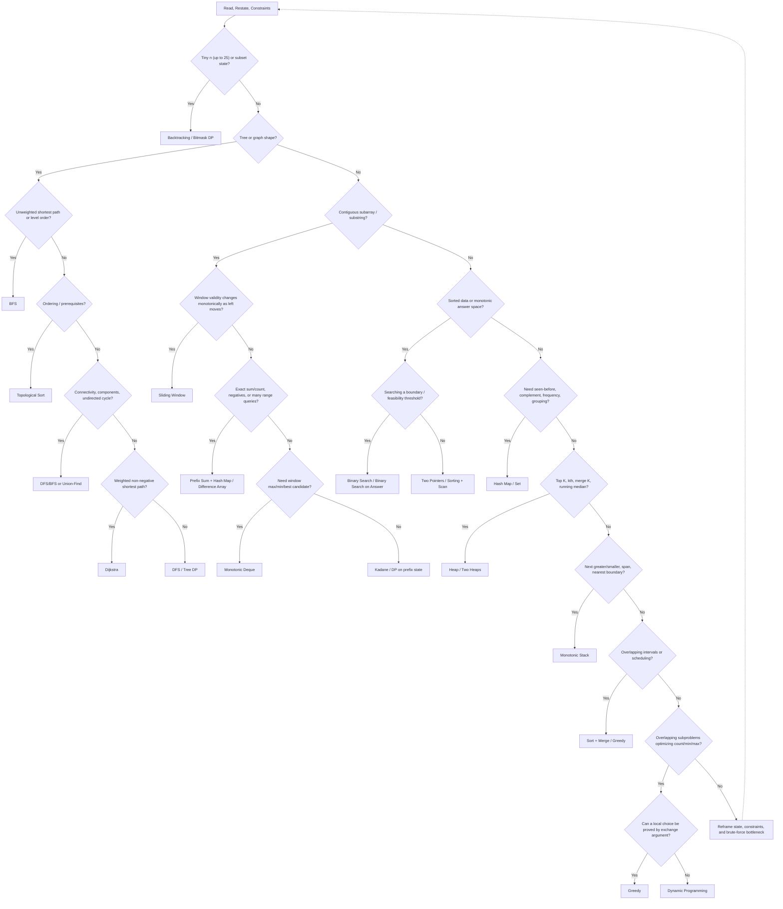
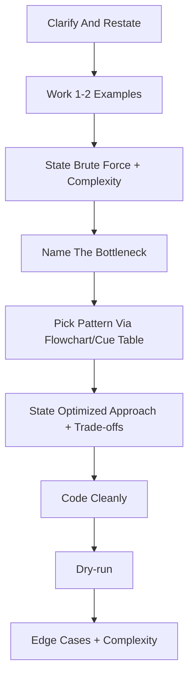

# DSA Patterns - Master Index

> **Scope** - Fast pattern selection, complexity back-solving, minimal C# recall templates, and routing to the deep topic notes. This is an index, not the textbook.

**Contents**
- [1. How to Use These Notes](#1-how-to-use-these-notes)
- [2. Complexity Foundations](#2-complexity-foundations)
- [3. The Pattern Selection Flowchart](#3-the-pattern-selection-flowchart)
- [4. Pattern Recognition Cue Table](#4-pattern-recognition-cue-table)
- [5. The Patterns](#5-the-patterns)
- [6. Interview Playbook](#6-interview-playbook)
- [7. Common Pitfalls in C#](#7-common-pitfalls-in-c)
- [8. Master Cheat Sheet](#8-master-cheat-sheet)

---

## 1. How to Use These Notes

Use this file in three passes:
1. **Before solving** - back-solve target complexity from [§2.3](#23-constraint---target-complexity-the-single-highest-roi-interview-skill).
2. **When choosing a pattern** - walk [§3](#3-the-pattern-selection-flowchart), then confirm with [§4](#4-pattern-recognition-cue-table).
3. **When recall slips** - skim the stanza in [§5](#5-the-patterns), then jump to the topic note for depth.

| Note | Owns the deep dive |
|---|---|
| [Arrays and Strings](../Arrays%20and%20Strings/Arrays%20and%20Strings.md) | Linear scans, two pointers, sliding window, prefix/difference arrays, in-place array/string work |
| [Hashing](../Hashing/Hashing.md) | Maps/sets, frequency counting, grouping, complements, collision assumptions |
| [Linked List](../Linked%20List/Linked%20List.md) | Pointer rewiring, reversal, fast/slow pointers, dummy nodes, LRU-style links |
| [Stack and Queue](../Stack%20and%20Queue/Stack%20and%20Queue.md) | Stack/queue mechanics, monotonic stack/deque, expression evaluation |
| [Binary Search](../Binary%20Search/Binary%20Search.md) | Boundaries, lower/upper bound, rotated arrays, binary search on answer |
| [Trees](../Trees/Trees.md) | Traversals, BST invariants, LCA, tree DP, serialization, [Trie](../Trees/Trees.md#412-tries) |
| [Heaps](../Heaps/Heaps.md) | Priority queues, top-K, two heaps, k-way merge, scheduling |
| [Graphs](../Graphs/Graphs.md) | BFS/DFS, topological sort, union-find, shortest paths, connectivity |
| [Dynamic Programming](../Dynamic%20Programming/Dynamic%20Programming.md) | State design, memo vs. tabulation, knapsack/LCS/interval/bitmask families |
| [Backtracking](../Backtracking/Backtracking.md) | Choose/recurse/undo, pruning, permutations, combinations, constraint search |
| [Greedy](../Greedy/Greedy.md) | Local choices, exchange arguments, interval scheduling, proofs |
| [Bit Manipulation](../Bit%20Manipulation/Bit%20Manipulation.md) | Bit tricks, XOR, masks, subset enumeration, bitmask DP |
| [Practice Roadmap](Practice-Roadmap.md) | The problem set and spaced repetition plan |

### Study Plan

| Phase | Focus | Goal |
|---|---|---|
| 1 (weeks 1-2) | [Arrays and Strings](../Arrays%20and%20Strings/Arrays%20and%20Strings.md) -> [Hashing](../Hashing/Hashing.md) -> [Binary Search](../Binary%20Search/Binary%20Search.md) | Make linear scans, lookup trade-offs, and boundary thinking automatic. |
| 2 (week 3) | [Linked List](../Linked%20List/Linked%20List.md) -> [Stack and Queue](../Stack%20and%20Queue/Stack%20and%20Queue.md) -> [Heaps](../Heaps/Heaps.md) | Drill pointer rewiring, monotonic structures, top-K, and streams. |
| 3 (weeks 4-5) | [Trees](../Trees/Trees.md) -> [Trie](../Trees/Trees.md#412-tries) -> [Graphs](../Graphs/Graphs.md) | Move from traversal templates to LCA, serialization, topo sort, DSU, and shortest paths. |
| 4 (weeks 6-8) | [Backtracking](../Backtracking/Backtracking.md) -> [Greedy](../Greedy/Greedy.md) -> [Dynamic Programming](../Dynamic%20Programming/Dynamic%20Programming.md) -> [Bit Manipulation](../Bit%20Manipulation/Bit%20Manipulation.md) | Re-solve misses from brute force -> optimized -> proof -> edge cases. |

> Depth beats breadth: use this index to choose; use the topic notes and [Practice Roadmap](Practice-Roadmap.md) to master.

---

## 2. Complexity Foundations

### 2.1 Asymptotic Notation

| Notation | Bound | Interview meaning |
|---|---|---|
| `O(g(n))` | Upper | Runtime/space will not grow faster than this class; usually quote worst case. |
| `Omega(g(n))` | Lower | Any algorithm/input needs at least this much work. |
| `Theta(g(n))` | Tight | Upper and lower bounds match. |

Default answer: **worst-case time and extra space**, naming all dimensions (`n`, `m`, `V`, `E`, `L`, `k`). Do not hide graph edges, string length, alphabet size, or output size inside `n`.

### 2.2 Growth Rates (Fastest -> Slowest)

Assume `10^8` very simple operations/sec as an optimistic ceiling; managed runtime, allocations, cache misses, and constants can reduce it by 10x+.

| Complexity | Typical cause | Practical smell test |
|---|---|---|
| `O(1)` | Index, stack push, average hash lookup | Any realistic input |
| `O(log n)` | Binary search, balanced tree height | Any realistic input |
| `O(sqrt n)` | Trial division, factor checks | Values up to about `10^16` |
| `O(n)` | Single pass, BFS/DFS over input | `10^7`-`10^8` if simple |
| `O(n log n)` | Sort, heap per item, divide/conquer | `10^5`-`10^6` |
| `O(n^2)` | Pair loops, 2-D DP | `10^3`-`10^4` |
| `O(n^3)` | Floyd-Warshall, interval DP | `300`-`500` |
| `O(2^n)` | Subsets, masks | `20`-`25` |
| `O(n!)` | Permutations/orderings | `10`-`11` |

### 2.3 Constraint -> Target Complexity (the single highest-ROI interview skill)

Before coding, map constraints to the likely accepted complexity. If your plan is slower, find the missing pattern.

| Constraint | Expected complexity | Typical patterns |
|---|---|---|
| `n <= 10-12` | `O(n!)`, `O(n * 2^n)`, heavy pruning | Permutations, TSP bitmask, exhaustive search |
| `n <= 20-25` | `O(2^n)` to `O(n^2 * 2^n)` | Subsets, bitmask DP, meet-in-the-middle |
| `n <= 100` | `O(n^3)` or sometimes `O(n^4)` with pruning | Dense graph/DP, all-pairs transitions |
| `n <= 300-500` | `O(n^3)` tight | Floyd-Warshall, interval DP, matrix transitions |
| `n <= 2,000-5,000` | `O(n^2)` | Pair scans, LCS/edit distance, LIS variants |
| `n <= 10^5` | `O(n log n)` or `O(n)` | Sort, heap, binary search, hash map, linear scan |
| `n <= 10^6` | Prefer `O(n)`; `O(n log n)` only with modest constants | Prefix, sliding window, sort once |
| `n <= 10^7-10^8` | `O(n)` or better | Single pass, counting arrays, streaming |
| Value `<= 10^9` | `O(sqrt value)` or `O(log value)` | Number theory, binary search on answer |
| Value `<= 10^18` | `O(log value)` with overflow-safe math | `long`, checked multiplication, fast power |

If `n <= 20` is visible, suspect masks/backtracking. If `n <= 10^5`, suspect `O(n)` or `O(n log n)`.

Complexity sanity checks:
- **Output size is a lower bound:** returning all subsets already costs `Theta(n * 2^n)`.
- **Graph input size is `V + E`:** an `O(V^2)` matrix idea may fail sparse-graph constraints.
- **Sorting is not free:** if `n = 10^5`, `O(n log n)` is fine; if repeated per query, precompute or rethink.
- **Value range differs from input length:** `10^9` values can still allow `O(log value)` binary search.
- **Memory matters:** `O(n^2)` ints at `n = 10^5` is impossible even before runtime.

### 2.4 Loop & Recursion Complexity Patterns

```csharp
for (int i = 0; i < n; i++) { }             // O(n)
for (int i = 0; i < n; i++)
    for (int j = i; j < n; j++) { }         // O(n^2), arithmetic series
for (long x = 1; x < n; x *= 2) { }         // O(log n)
```

| Recursion shape | Recurrence | Complexity |
|---|---|---|
| One call on `n-1` | `T(n) = T(n-1) + O(1)` | `O(n)` |
| Two calls on `n-1` | `T(n) = 2T(n-1) + O(1)` | `O(2^n)` |
| One half-size branch | `T(n) = T(n/2) + O(1)` | `O(log n)` |
| Two half-size branches + linear merge | `T(n) = 2T(n/2) + O(n)` | `O(n log n)` |
| Two half-size branches + constant combine | `T(n) = 2T(n/2) + O(1)` | `O(n)` |
| Memoized repeated subproblems | states x work per state | Usually polynomial |

```text
Master theorem for T(n) = aT(n/b) + O(n^d):
a < b^d -> O(n^d)
a = b^d -> O(n^d log n)
a > b^d -> O(n^(log_b a))
```

Recursion depth counts as space. A skewed-tree DFS is `O(n)` stack and may overflow in C#.

### 2.5 Amortized Analysis

Amortized is cost over a **sequence**, not average over random inputs.

- `List<T>.Add` is `O(1)` amortized; resize copies are spread across many appends.
- `Dictionary<TKey,TValue>` / `HashSet<T>` are `O(1)` expected/amortized with a good comparer; resizing/collisions are the caveat.
- Sliding-window nested `while` loops are `O(n)` when each pointer only moves forward.
- Heap lazy deletion counts heap pushes; stale entries still consume time/space until popped.

### 2.6 Data Structure Complexity Reference

| Need | C# structure | Key complexity note |
|---|---|---|
| Dynamic array | `List<T>` | Index `O(1)`, append amortized `O(1)`, middle insert/delete `O(n)` |
| Hash map/set | `Dictionary<TKey,TValue>` / `HashSet<T>` | Expected `O(1)` lookup/insert/delete; `O(n)` space |
| Ordered map/set | `SortedDictionary<TKey,TValue>` / `SortedSet<T>` | `O(log n)` ordered operations |
| Heap | `PriorityQueue<TElement,TPriority>` | Min-heap; enqueue/dequeue `O(log n)`, peek `O(1)` |
| Stack/queue | `Stack<T>` / `Queue<T>` | Push/pop/enqueue/dequeue `O(1)` amortized |
| Deque-like window | `LinkedList<T>` or index deque | Need pop front and pop back for monotonic deque |
| Trie | Custom node dictionary/array | `O(word length)` lookup; high constant space |

### 2.7 Algorithm Complexity Reference

| Algorithm | Time | Extra space |
|---|---|---|
| Binary search | `O(log n)` | `O(1)` |
| Sorting (`Array.Sort`, `List<T>.Sort`) | `O(n log n)` | `O(log n)` typical, unstable |
| Quickselect | `O(n)` avg, `O(n^2)` worst | `O(1)` |
| BFS / DFS | `O(V + E)` | `O(V)` extra |
| Topological sort | `O(V + E)` | `O(V)` |
| Dijkstra + binary heap | `O((V + E) log(V + E))` with stale entries | `O(V + E)` worst case |
| Bellman-Ford / Floyd-Warshall | `O(V * E)` / `O(V^3)` | `O(V)` / `O(V^2)` |
| Union-Find op | `O(alpha(n))` amortized | `O(1)` per op plus arrays |
| Heapify | `O(n)` | `O(1)` |

---

## 3. The Pattern Selection Flowchart



> Fallback script: state what you eliminated, name the brute-force bottleneck, reduce to a smaller subproblem, and re-enter the chart.

---

## 4. Pattern Recognition Cue Table

| Problem phrasing | Likely pattern | Go deeper |
|---|---|---|
| "sorted array", "rotated sorted", "first/last position" | Binary Search / Two Pointers | [Binary Search](../Binary%20Search/Binary%20Search.md) |
| "minimize the maximum", "maximize the minimum", "capacity" | Binary Search on Answer | [Binary Search](../Binary%20Search/Binary%20Search.md) |
| "pair/triplet sum", "two ends", "palindrome" | Two Pointers | [Arrays and Strings](../Arrays%20and%20Strings/Arrays%20and%20Strings.md) |
| "contiguous", "at most K", "longest/shortest substring" | Sliding Window | [Arrays and Strings](../Arrays%20and%20Strings/Arrays%20and%20Strings.md) |
| "exactly K", "subarray sum equals K", negatives allowed | Prefix Sum + Hash Map | [Hashing](../Hashing/Hashing.md) |
| "range sum/update", "cumulative", many queries | Prefix Sum / Difference Array | [Arrays and Strings](../Arrays%20and%20Strings/Arrays%20and%20Strings.md) |
| "seen before", "frequency", "group", "complement" | Hash Map / Set | [Hashing](../Hashing/Hashing.md) |
| "group after sorting", "adjacent after sort", "dedupe runs" | Sorting + Scan | [Arrays and Strings](../Arrays%20and%20Strings/Arrays%20and%20Strings.md) |
| "top K", "kth", "most frequent", "merge K" | Heap | [Heaps](../Heaps/Heaps.md) |
| "running median", "online median" | Two Heaps | [Heaps](../Heaps/Heaps.md) |
| "all subsets/permutations/combinations" | Backtracking | [Backtracking](../Backtracking/Backtracking.md) |
| "N-Queens", "Sudoku", "word search grid" | Backtracking + pruning | [Backtracking](../Backtracking/Backtracking.md) |
| "n <= 20", "subset state", "TSP-like" | Bitmask / Bitmask DP | [Bit Manipulation](../Bit%20Manipulation/Bit%20Manipulation.md) |
| "minimum steps", unweighted shortest path, level expansion | BFS | [Graphs](../Graphs/Graphs.md) |
| Weighted non-negative shortest path | Dijkstra | [Graphs](../Graphs/Graphs.md) |
| "prerequisites", "course schedule", "build order" | Topological Sort | [Graphs](../Graphs/Graphs.md) |
| "connected components", "islands", "provinces" | DFS/BFS or Union-Find | [Graphs](../Graphs/Graphs.md) |
| "next greater/smaller", "span", "nearest boundary" | Monotonic Stack | [Stack and Queue](../Stack%20and%20Queue/Stack%20and%20Queue.md) |
| "sliding window maximum/minimum" | Monotonic Deque | [Stack and Queue](../Stack%20and%20Queue/Stack%20and%20Queue.md) |
| "values 1..n", "missing/duplicate", `O(1)` extra | Cyclic Sort | [Arrays and Strings](../Arrays%20and%20Strings/Arrays%20and%20Strings.md) |
| "cycle", "middle", repeating sequence | Fast & Slow Pointers | [Linked List](../Linked%20List/Linked%20List.md) |
| "reverse sublist", "reverse in k-group" | In-place Reversal | [Linked List](../Linked%20List/Linked%20List.md) |
| "overlapping intervals", "meeting rooms" | Merge Intervals / Greedy | [Arrays and Strings](../Arrays%20and%20Strings/Arrays%20and%20Strings.md) |
| "always pick earliest/smallest/largest" | Greedy, prove by exchange | [Greedy](../Greedy/Greedy.md) |
| "count ways", "min/max cost", repeated subproblems | Dynamic Programming | [Dynamic Programming](../Dynamic%20Programming/Dynamic%20Programming.md) |
| "prefix matching", "autocomplete", dictionary words | Trie | [Trees](../Trees/Trees.md#412-tries) |
| "O(1) get/put", "LRU/LFU", "getRandom" | Design (Augmented Structures) | [Hashing](../Hashing/Hashing.md) |
| "split in half", "inversions", "closest pair" | Divide & Conquer | [Arrays and Strings](../Arrays%20and%20Strings/Arrays%20and%20Strings.md) |
| "LCA", "subtree", "path sum", "diameter" | Tree DFS | [Trees](../Trees/Trees.md) |
| "level order", "minimum depth", "by levels" | Tree BFS | [Trees](../Trees/Trees.md) |

Senior problems often compose patterns:

| Composition cue | Read it as |
|---|---|
| "minimum feasible X" plus "can schedule/pack/split" | Binary search on answer + greedy feasibility |
| "contiguous exact sum/count" with negatives | Prefix sum + hash map |
| "longest/shortest substring" with frequencies | Sliding window + hash map |
| "top K" with changing/deleting priorities | Heap + hash map + lazy deletion |
| "shortest path while carrying keys/visited subset" | BFS + bitmask state |
| "allocate resources over time intervals" | Sort + greedy + heap |
| "dictionary words on a grid" | Trie + backtracking |

---
## 5. The Patterns

> Templates are intentionally small. They jog recall; the linked notes own derivations, variants, edge cases, and practice queues.

### Two Pointers

**Reach for it:** sorted data, pair/triplet target, palindrome/two-end checks, in-place compaction.
**Invariant:** sorted order justifies moving one pointer; preserve original indices if sorting changes the answer.

```csharp
int[] TwoSumSorted(int[] a, int target)
{
    int l = 0, r = a.Length - 1;
    while (l < r)
    {
        long sum = (long)a[l] + a[r];
        if (sum == target) return new[] { l, r };
        if (sum < target) l++; else r--;
    }
    return Array.Empty<int>();
}
```

**Complexity:** usually `O(n)` time, `O(1)` extra space. See [Arrays and Strings](../Arrays%20and%20Strings/Arrays%20and%20Strings.md) for depth.

### Fast & Slow Pointers

**Reach for it:** linked-list cycle, middle node, cycle entry, repeated function state.
**Invariant:** fast either hits null or laps slow; for cycle entry, reset one pointer to head after meeting.

```csharp
bool HasCycle(ListNode? head)
{
    ListNode? slow = head, fast = head;
    while (fast?.Next != null)
    {
        slow = slow!.Next;
        fast = fast.Next.Next;
        if (ReferenceEquals(slow, fast)) return true;
    }
    return false;
}
```

**Complexity:** `O(n)` time, `O(1)` space. See [Linked List](../Linked%20List/Linked%20List.md) for depth.

### Sliding Window (Fixed + Variable)

**Reach for it:** contiguous subarray/substring where validity changes monotonically as `left` moves.
**Invariant:** each index enters/leaves once; if negatives or exact sums break monotonicity, switch to prefix sums.

```csharp
int LongestAtMostKDistinct(string s, int k)
{
    var freq = new Dictionary<char, int>();
    int left = 0, best = 0;
    for (int right = 0; right < s.Length; right++)
    {
        freq[s[right]] = freq.GetValueOrDefault(s[right]) + 1;
        while (freq.Count > k)
            if (--freq[s[left]] == 0) freq.Remove(s[left++]); else left++;
        best = Math.Max(best, right - left + 1);
    }
    return best;
}
```

**Complexity:** `O(n)` time, `O(k)` or alphabet space. See [Arrays and Strings](../Arrays%20and%20Strings/Arrays%20and%20Strings.md) for depth.

### Prefix Sum / Difference Array

**Reach for it:** range sums, exact subarray sums with negatives, many offline range updates.
**Invariant:** count prefixes before the current index; seed prefix `0` for subarrays starting at index `0`.

```csharp
long CountSubarraySum(int[] a, int k)
{
    var count = new Dictionary<long, int> { [0] = 1 };
    long sum = 0, ans = 0;
    foreach (int x in a)
    {
        sum += x;
        ans += count.GetValueOrDefault(sum - k);
        count[sum] = count.GetValueOrDefault(sum) + 1;
    }
    return ans;
}
```

**Complexity:** `O(n + q)` for preprocessing/updates; `O(1)` range query after prefix; `O(n)` space. See [Arrays and Strings](../Arrays%20and%20Strings/Arrays%20and%20Strings.md) for depth.

### Hash Map / Set

**Reach for it:** seen-before, complement, duplicate, frequency, grouping, signature lookup.
**Invariant:** insert after checking when the current element must not pair with itself.

```csharp
int[] TwoSum(int[] nums, int target)
{
    var seen = new Dictionary<int, int>();
    for (int i = 0; i < nums.Length; i++)
    {
        int need = target - nums[i];
        if (seen.TryGetValue(need, out int j)) return new[] { j, i };
        seen[nums[i]] = i;
    }
    return Array.Empty<int>();
}
```

**Complexity:** expected `O(n)` time, `O(n)` space. See [Hashing](../Hashing/Hashing.md) for depth.
### Binary Search (incl. On the Answer)

**Reach for it:** sorted boundary, monotonic predicate, feasible/infeasible threshold.
**Invariant:** predicate must be monotonic; decide first-true vs. last-false before coding.

```csharp
int FirstTrue(int lo, int hi, Func<int, bool> ok)
{
    while (lo < hi)
    {
        int mid = lo + (hi - lo) / 2;
        if (ok(mid)) hi = mid; else lo = mid + 1;
    }
    return lo;
}
```

**Complexity:** `O(log n)` search, or `O(check * log range)` on answer space. See [Binary Search](../Binary%20Search/Binary%20Search.md) for depth.

### Sorting + Scan

**Reach for it:** order-independent grouping, adjacent comparisons after sort, sweep once after paying `O(n log n)`.
**Invariant:** after sorting, adjacent/running state is enough; store original indices if the output needs them.

```csharp
int LongestEqualRun(int[] a)
{
    Array.Sort(a);
    int best = 0;
    for (int i = 0; i < a.Length; )
    {
        int j = i;
        while (j < a.Length && a[j] == a[i]) j++;
        best = Math.Max(best, j - i);
        i = j;
    }
    return best;
}
```

**Complexity:** `O(n log n)` time, usually `O(1)` to `O(n)` extra depending on sort/output. See [Arrays and Strings](../Arrays%20and%20Strings/Arrays%20and%20Strings.md) for depth.

### Monotonic Stack

**Reach for it:** next greater/smaller, previous boundary, span, histogram-like nearest blocker.
**Invariant:** stack stores unresolved indices in monotonic order; each index is pushed and popped at most once.

```csharp
int[] NextGreater(int[] a)
{
    var ans = Enumerable.Repeat(-1, a.Length).ToArray();
    var st = new Stack<int>();
    for (int i = 0; i < a.Length; i++)
    {
        while (st.Count > 0 && a[st.Peek()] < a[i]) ans[st.Pop()] = a[i];
        st.Push(i);
    }
    return ans;
}
```

**Complexity:** `O(n)` time, `O(n)` space. See [Stack and Queue](../Stack%20and%20Queue/Stack%20and%20Queue.md) for depth.

### Monotonic Deque

**Reach for it:** sliding-window max/min or best candidate where expired indices leave from the front.
**Invariant:** deque stores candidate indices, not values; drop expired front before reading the answer.

```csharp
int[] MaxSlidingWindow(int[] a, int k)
{
    var dq = new LinkedList<int>();
    var ans = new int[a.Length - k + 1];
    for (int r = 0; r < a.Length; r++)
    {
        while (dq.Count > 0 && dq.First!.Value <= r - k) dq.RemoveFirst();
        while (dq.Count > 0 && a[dq.Last!.Value] <= a[r]) dq.RemoveLast();
        dq.AddLast(r);
        if (r >= k - 1) ans[r - k + 1] = a[dq.First!.Value];
    }
    return ans;
}
```

**Complexity:** `O(n)` time, `O(k)` space. See [Stack and Queue](../Stack%20and%20Queue/Stack%20and%20Queue.md) for depth.

### Top-K with Heap

**Reach for it:** kth largest/smallest, top K, merge K, stream where full sort is wasteful.
**Invariant:** heap holds only the best `k` candidates seen so far; know min-heap vs. max-heap direction.

```csharp
int KthLargest(int[] a, int k)
{
    var pq = new PriorityQueue<int, int>();
    foreach (int x in a)
    {
        pq.Enqueue(x, x);
        if (pq.Count > k) pq.Dequeue();
    }
    return pq.Peek();
}
```

**Complexity:** `O(n log k)` time, `O(k)` space. See [Heaps](../Heaps/Heaps.md) for depth.

### Two Heaps

**Reach for it:** online median, balanced lower/upper halves, streaming order statistic.
**Invariant:** all values in `low` are `<=` all values in `high`, and sizes differ by at most one.

```csharp
var low = new PriorityQueue<int, long>();
var high = new PriorityQueue<int, int>();
void Add(int x)
{
    if (low.Count == 0 || x <= low.Peek()) low.Enqueue(x, -(long)x); else high.Enqueue(x, x);
    if (low.Count > high.Count + 1) { int v = low.Dequeue(); high.Enqueue(v, v); }
    if (high.Count > low.Count) { int v = high.Dequeue(); low.Enqueue(v, -(long)v); }
}
double Median() => low.Count == high.Count ? (low.Peek() + (double)high.Peek()) / 2 : low.Peek();
```

**Complexity:** `O(log n)` insert, `O(1)` median, `O(n)` space. See [Heaps](../Heaps/Heaps.md) for depth.

### Merge Intervals

**Reach for it:** overlapping intervals, meeting rooms, union of ranges, scheduling after sorting by start/end.
**Invariant:** after sorting by start, only the last merged interval can overlap the current one.

```csharp
int[][] Merge(int[][] intervals)
{
    Array.Sort(intervals, (a, b) => a[0].CompareTo(b[0]));
    var res = new List<int[]>();
    foreach (var iv in intervals)
        if (res.Count == 0 || iv[0] > res[^1][1]) res.Add(iv);
        else res[^1][1] = Math.Max(res[^1][1], iv[1]);
    return res.ToArray();
}
```

**Complexity:** `O(n log n)` time, `O(n)` output space. See [Arrays and Strings](../Arrays%20and%20Strings/Arrays%20and%20Strings.md) for depth.
### Cyclic Sort

**Reach for it:** array values map to indices (`1..n` or `0..n-1`), missing/duplicate in `O(1)` extra space.
**Invariant:** each swap places at least one valid value into its final slot; guard duplicates to avoid loops.

```csharp
void CyclicPlace(int[] a)
{
    int i = 0;
    while (i < a.Length)
    {
        int correct = a[i] - 1;
        if (1 <= a[i] && a[i] <= a.Length && a[i] != a[correct])
            (a[i], a[correct]) = (a[correct], a[i]);
        else i++;
    }
}
```

**Complexity:** `O(n)` time, `O(1)` extra space. See [Arrays and Strings](../Arrays%20and%20Strings/Arrays%20and%20Strings.md) for depth.

### In-place Reversal (Linked List)

**Reach for it:** reverse list/sublist/k-group while preserving nodes, not values.
**Invariant:** `prev` is the reversed prefix and `cur` is first unreversed node; save `next` before rewiring.

```csharp
ListNode? Reverse(ListNode? head)
{
    ListNode? prev = null, cur = head;
    while (cur != null)
    {
        ListNode? next = cur.Next;
        cur.Next = prev;
        prev = cur;
        cur = next;
    }
    return prev;
}
```

**Complexity:** `O(n)` time, `O(1)` space. See [Linked List](../Linked%20List/Linked%20List.md) for depth.

### Tree BFS

**Reach for it:** level order, minimum depth, nearest node by edge count, width/zigzag per level.
**Invariant:** queue holds the next frontier; capture `levelSize` before dequeuing a level.

```csharp
IList<IList<int>> LevelOrder(TreeNode? root)
{
    var ans = new List<IList<int>>();
    if (root == null) return ans;
    var q = new Queue<TreeNode>();
    q.Enqueue(root);
    while (q.Count > 0)
    {
        int size = q.Count;
        var level = new List<int>();
        while (size-- > 0)
        {
            var node = q.Dequeue();
            level.Add(node.val);
            if (node.left != null) q.Enqueue(node.left);
            if (node.right != null) q.Enqueue(node.right);
        }
        ans.Add(level);
    }
    return ans;
}
```

**Complexity:** `O(n)` time, `O(width)` space. See [Trees](../Trees/Trees.md) for depth.

### Tree DFS

**Reach for it:** subtree property, path sum, LCA, height/diameter, BST validation.
**Invariant:** define exactly what each recursive call returns to its parent before writing code.

```csharp
int MaxDepth(TreeNode? node)
{
    if (node == null) return 0;
    return 1 + Math.Max(MaxDepth(node.left), MaxDepth(node.right));
}
```

**Complexity:** `O(n)` time, `O(h)` stack. See [Trees](../Trees/Trees.md) for depth.

### Graph BFS/DFS

**Reach for it:** components, reachability, flood fill, unweighted shortest path, bipartite coloring.
**Invariant:** mark visited when enqueuing/pushing so cycles and duplicate edges do not duplicate work.

```csharp
void Bfs(List<int>[] g, int start, bool[] seen)
{
    var q = new Queue<int>();
    seen[start] = true;
    q.Enqueue(start);
    while (q.Count > 0)
        foreach (int v in g[q.Dequeue()])
            if (!seen[v]) { seen[v] = true; q.Enqueue(v); }
}
```

**Complexity:** `O(V + E)` time, `O(V)` space. See [Graphs](../Graphs/Graphs.md) for depth.

### Topological Sort

**Reach for it:** prerequisites, build order, DAG scheduling, cycle detection in directed graph.
**Invariant:** in-degree zero means no remaining prerequisites; leftover nodes after Kahn imply a cycle.

```csharp
int[] Topo(List<int>[] g)
{
    int n = g.Length;
    var indeg = new int[n];
    for (int u = 0; u < n; u++) foreach (int v in g[u]) indeg[v]++;
    var q = new Queue<int>(Enumerable.Range(0, n).Where(i => indeg[i] == 0));
    var order = new List<int>();
    while (q.Count > 0)
    {
        int u = q.Dequeue(); order.Add(u);
        foreach (int v in g[u]) if (--indeg[v] == 0) q.Enqueue(v);
    }
    return order.Count == n ? order.ToArray() : Array.Empty<int>();
}
```

**Complexity:** `O(V + E)` time, `O(V)` space. See [Graphs](../Graphs/Graphs.md) for depth.

### Union-Find (Disjoint Set)

**Reach for it:** dynamic connectivity, undirected cycle detection, components under unions.
**Invariant:** `Find` returns a component representative; `Union` only attaches roots, never arbitrary nodes.

```csharp
sealed class Dsu
{
    readonly int[] parent, size;
    public Dsu(int n) { parent = Enumerable.Range(0, n).ToArray(); size = Enumerable.Repeat(1, n).ToArray(); }
    public int Find(int x) => parent[x] == x ? x : parent[x] = Find(parent[x]);
    public bool Union(int a, int b)
    {
        int ra = Find(a), rb = Find(b);
        if (ra == rb) return false;
        if (size[ra] < size[rb]) (ra, rb) = (rb, ra);
        parent[rb] = ra; size[ra] += size[rb];
        return true;
    }
}
```

**Complexity:** near `O(1)` amortized per op (`O(alpha(n))`), `O(n)` space. See [Graphs](../Graphs/Graphs.md) for depth.

### Dijkstra / Shortest Path

**Reach for it:** weighted graph with non-negative weights; need shortest distance from source.
**Invariant:** a popped distance is final only with non-negative weights; skip stale heap entries.

```csharp
long[] Dijkstra(List<(int To, int W)>[] g, int src)
{
    var dist = Enumerable.Repeat(long.MaxValue, g.Length).ToArray();
    var pq = new PriorityQueue<int, long>();
    dist[src] = 0; pq.Enqueue(src, 0);
    while (pq.TryDequeue(out int u, out long d))
    {
        if (d != dist[u]) continue;
        foreach (var (v, w) in g[u])
            if (d + w < dist[v]) { dist[v] = d + w; pq.Enqueue(v, dist[v]); }
    }
    return dist;
}
```

**Complexity:** `O((V + E) log(V + E))` time with stale entries, `O(V + E)` space. See [Graphs](../Graphs/Graphs.md) for depth.
### Backtracking

**Reach for it:** enumerate all valid combinations/permutations/subsets; constraints are small; pruning matters.
**Invariant:** `path` is the current partial choice; undo exactly what you choose before returning.

```csharp
IList<IList<int>> Subsets(int[] nums)
{
    var ans = new List<IList<int>>();
    var path = new List<int>();
    void Dfs(int i)
    {
        if (i == nums.Length) { ans.Add(path.ToArray()); return; }
        Dfs(i + 1);
        path.Add(nums[i]); Dfs(i + 1); path.RemoveAt(path.Count - 1);
    }
    Dfs(0);
    return ans;
}
```

**Complexity:** output-sensitive; subsets `O(n * 2^n)`, permutations `O(n * n!)`. See [Backtracking](../Backtracking/Backtracking.md) for depth.

### Dynamic Programming

**Reach for it:** overlapping subproblems, choices optimize count/min/max/boolean feasibility.
**Invariant:** state must be sufficient and orderable; base cases anchor every transition.

```csharp
int CoinChange(int[] coins, int amount)
{
    var dp = Enumerable.Repeat(amount + 1, amount + 1).ToArray();
    dp[0] = 0;
    foreach (int coin in coins)
        for (int x = coin; x <= amount; x++)
            dp[x] = Math.Min(dp[x], dp[x - coin] + 1);
    return dp[amount] > amount ? -1 : dp[amount];
}
```

**Complexity:** `O(states * transition)`, space by stored states. See [Dynamic Programming](../Dynamic%20Programming/Dynamic%20Programming.md) for depth.

### Greedy

**Reach for it:** local choice can be proved safe by exchange argument, often after sorting.
**Invariant:** the local choice needs a proof (exchange, stays-ahead, cut), not just intuition.

```csharp
int MaxNonOverlapping((int Start, int End)[] intervals)
{
    Array.Sort(intervals, (a, b) => a.End.CompareTo(b.End));
    int count = 0, end = int.MinValue;
    foreach (var iv in intervals)
        if (iv.Start >= end) { count++; end = iv.End; }
    return count;
}
```

**Complexity:** often `O(n log n)` for sorting, then `O(n)`. See [Greedy](../Greedy/Greedy.md) for depth.

### Bitmask

**Reach for it:** `n <= 20-25`, subset states, set membership encoded in bits, bitmask DP.
**Invariant:** bit `i` answers whether element `i` is included; watch `1 << n` overflow.

```csharp
for (int mask = 0; mask < (1 << n); mask++)
{
    for (int i = 0; i < n; i++)
        if ((mask & (1 << i)) != 0)
        {
            // use element i in subset mask
        }
}
```

**Complexity:** subset iteration `O(n * 2^n)`; bitmask DP often `O(n * 2^n)` to `O(n^2 * 2^n)`. See [Bit Manipulation](../Bit%20Manipulation/Bit%20Manipulation.md) for depth.

### Trie

**Reach for it:** prefix search, autocomplete, dictionary words, word search with shared prefixes.
**Invariant:** the root-to-node path equals a prefix; terminal flag separates a complete word from a prefix.

```csharp
sealed class TrieNode { public readonly Dictionary<char, TrieNode> Next = new(); public bool Word; }
sealed class Trie
{
    readonly TrieNode root = new();
    public void Insert(string s)
    {
        var cur = root;
        foreach (char c in s) cur = cur.Next.TryGetValue(c, out var nxt) ? nxt : cur.Next[c] = new TrieNode();
        cur.Word = true;
    }
}
```

**Complexity:** `O(L)` per insert/search, `O(total characters)` space. See [Trees](../Trees/Trees.md#412-tries) for depth.

### Design (Augmented Structures)

**Reach for it:** API design with strict per-operation bounds; combine structures so each covers another's weakness.
**Invariant:** every public operation updates all backing structures so redundant representations stay consistent.

```csharp
sealed class RandomizedSet
{
    readonly List<int> a = new();
    readonly Dictionary<int, int> pos = new();
    readonly Random rnd = new();
    public bool Insert(int x) { if (pos.ContainsKey(x)) return false; pos[x] = a.Count; a.Add(x); return true; }
    public bool Remove(int x)
    {
        if (!pos.TryGetValue(x, out int i)) return false;
        int last = a[^1]; a[i] = last; pos[last] = i; a.RemoveAt(a.Count - 1); pos.Remove(x);
        return true;
    }
    public int GetRandom() => a[rnd.Next(a.Count)];
}
```

**Complexity:** depends on API contract; common target is expected `O(1)` time per op and `O(n)` space. See [Hashing](../Hashing/Hashing.md) for depth.

### Divide & Conquer

**Reach for it:** independent halves, no overlapping subproblems, combine step is cheaper than brute force.
**Invariant:** subproblems are independent; if they overlap and repeat, it is probably DP.

```csharp
int Solve(int left, int right)
{
    if (left == right) return Base(left);
    int mid = left + (right - left) / 2;
    int a = Solve(left, mid);
    int b = Solve(mid + 1, right);
    return Combine(a, b, left, mid, right);
}
```

**Complexity:** usually from the recurrence, e.g. `2T(n/2) + O(n) -> O(n log n)`. See [Arrays and Strings](../Arrays%20and%20Strings/Arrays%20and%20Strings.md) for depth.

Problem lists live in [Practice Roadmap](Practice-Roadmap.md), not in this index.

---
## 6. Interview Playbook



1. **Clarify** input shape, return shape, mutability, duplicates, negatives, sortedness, and constraints.
2. **Example** one normal case and one edge case; keep the state table visible.
3. **Brute force** gives a correctness baseline and exposes repeated work.
4. **Bottleneck** language wins interviews: repeated scan, missing order, duplicate states, or expensive lookup.
5. **Pattern** cite [§3](#3-the-pattern-selection-flowchart) / [§4](#4-pattern-recognition-cue-table) and why it fits.
6. **Trade-off** state time, extra space, and any mutation/preprocessing assumptions.
7. **Code** the invariant first; avoid cleverness you cannot dry-run.
8. **Dry-run** one example, then name edge cases and final complexity.

> Good narration: "Brute force checks all pairs in `O(n^2)`. The bottleneck is repeated lookup, so a hash map caches complements and gives expected `O(n)` time for `O(n)` space."

### Good Clarifying Questions

| Question | Why it matters |
|---|---|
| Can input be empty/singleton? | Base cases and index safety. |
| Are values negative, zero, duplicated, or huge? | Breaks some window/greedy assumptions; raises overflow risk. |
| Is input sorted, and may I sort/mutate it? | Sorting unlocks patterns but costs time and may destroy order. |
| What are `n`, value bounds, and call frequency? | Picks target complexity and preprocessing trade-offs. |
| Need one answer, count, optimum value, or all answers? | Separates greedy/DP/backtracking/output-sensitive solutions. |

### Senior Follow-up Radar

| Follow-up | Response shape |
|---|---|
| Input exceeds memory | Stream, chunk, external sort, process per component/window. |
| Data arrives online | Maintain incremental heap/two heaps/trie/rolling aggregate. |
| Many repeated queries | Precompute prefix/index/trie/sparse table; state build vs. query cost. |
| Concurrency | Avoid shared mutation; use locks, immutable snapshots, or concurrent collections; define consistency. |
| Distributed scale | Partition by key/range, aggregate locally, merge; call out skew/network cost. |
| Adversarial inputs | Prefer worst-case-safe structures, overflow checks, iterative DFS, collision-resistant assumptions. |

### When Stuck

1. Re-read constraints; infer the expected row in [§2.3](#23-constraint---target-complexity-the-single-highest-roi-interview-skill).
2. List brute-force state: index, choice, remaining target, last value, visited set, component.
3. Ask what can be **cached, ordered, skipped, bounded, or streamed**.
4. Try a simpler variant: fixed window before variable; unweighted before weighted; decision before optimization.
5. Say the fork aloud: "Negatives break sliding-window monotonicity, so I am switching to prefix sums."
6. If constraints allow, code correct brute force; otherwise outline it and optimize the bottleneck.

### Universal Edge-Case Checklist

- Empty/null input; one element; two elements.
- Duplicates; all same; already sorted; reverse sorted.
- Negative numbers, zero, very large values, overflow in sum/product/midpoint.
- `k = 0`, `k = 1`, `k > n`; empty capacity/window.
- Missing children, dummy head/tail, cycle in tree-shaped input.
- Disconnected graph, self-loop, parallel edges, unreachable target.
- Deep recursion in C#; offer iterative DFS/BFS.
- Mutating caller input when order/content must be preserved.

---
## 7. Common Pitfalls in C#

| Pitfall | Bad smell | Interview-safe fix |
|---|---|---|
| Integer overflow | `int sum = a + b;`, `mid = (lo + hi) / 2` | Cast before arithmetic (`long`), use `lo + (hi - lo) / 2`, use `checked` when desired. |
| `int.MinValue` negation | `-int.MinValue`, `Math.Abs(int.MinValue)` | Cast first or special-case min value. |
| Integer division | `double avg = sum / count` with ints | Cast before division. |
| Comparator subtraction | `(a, b) => a.End - b.End` | Use `a.End.CompareTo(b.End)`. |
| `PriorityQueue` semantics | Expecting max-heap or decrease-key | It is a min-heap; reverse priority carefully (`-(long)x`); use stale entries for updates. |
| `Array.BinarySearch` miss | Assuming miss is always `-1` | If `idx < 0`, insertion point is `~idx`. |
| Dictionary order | Depending on `foreach` order | Treat as non-contractual; sort keys if order matters. |
| LINQ in hot loops | Multiple enumerations/allocations hidden in chains | Use explicit loops for critical paths; materialize once if needed. |
| String concatenation | `ans += c` in a loop | Use `StringBuilder` or `char[]`. |
| Mutating during `foreach` | Removing from `List<T>` while enumerating | Iterate backwards, build a new list, or use `RemoveAll`. |
| Struct copies | Mutating a struct returned from index/property | Write the modified value back or use reference/class types. |
| Nullability | `node.Left.Val` without base case | Guard before dereference; make recursive base cases explicit. |
| Recursion depth | DFS on 100k-chain | Use iterative stack/queue; C# has no reliable tail-call rescue. |
| `GetValueOrDefault` counts | Incrementing missing map key manually | `map[x] = map.GetValueOrDefault(x) + 1`; remove zero counts in windows. |

---

## 8. Master Cheat Sheet

| Pattern | Trigger | Template gist | Complexity |
|---|---|---|---|
| Two Pointers | Sorted/two-end/pair sum | Move `left/right` based on comparison | `O(n)` / `O(1)` |
| Fast & Slow Pointers | Cycle/middle/repeated state | `slow += 1`, `fast += 2` | `O(n)` / `O(1)` |
| Sliding Window | Contiguous + monotonic validity | Expand right; shrink left while invalid | `O(n)` / `O(k)` |
| Prefix Sum / Difference | Range sum/exact sum/range update | Store cumulative state; query by difference | `O(n + q)` / `O(n)` |
| Hash Map / Set | Seen/complement/frequency/group | Cache value/signature/count | Expected `O(n)` / `O(n)` |
| Binary Search | Sorted or monotonic predicate | Find first true / last false | `O(log n)` or `O(check log range)` |
| Sorting + Scan | Order unlocks adjacency/groups | Sort once, sweep | `O(n log n)` |
| Monotonic Stack | Next greater/smaller/span | Pop while invariant breaks | `O(n)` / `O(n)` |
| Monotonic Deque | Window max/min | Drop expired front; maintain monotonic back | `O(n)` / `O(k)` |
| Top-K Heap | Kth/top K/merge K | Bounded heap or k-way heap | `O(n log k)` |
| Two Heaps | Running median | Max-heap lower + min-heap upper | `O(log n)` insert |
| Merge Intervals | Overlapping ranges | Sort by start, extend last | `O(n log n)` |
| Cyclic Sort | Values map to indices | Swap to correct index until stuck | `O(n)` / `O(1)` |
| In-place Reversal | Linked-list reverse | `prev, cur, next` | `O(n)` / `O(1)` |
| Tree BFS | Levels/min depth | Queue with level size | `O(n)` / `O(width)` |
| Tree DFS | Subtree/path/LCA | Recurse and combine child results | `O(n)` / `O(h)` |
| Graph BFS/DFS | Components/reachability | Queue/stack + visited | `O(V + E)` |
| Topological Sort | Prerequisites/DAG order | Kahn indegrees | `O(V + E)` |
| Union-Find | Connectivity/undirected cycle | Path compression + size/rank | `O(alpha(n))` |
| Dijkstra | Non-negative weighted shortest path | PQ by best distance; skip stale | `O((V + E) log(V + E))` |
| Backtracking | Enumerate all valid choices | Choose -> recurse -> undo | Output-sensitive exponential |
| Dynamic Programming | Overlapping states optimize value | State, transition, base case | `states * transition` |
| Greedy | Safe local choice | Sort/select; exchange proof | Usually `O(n log n)` |
| Bitmask | `n <= 20`, subset state | Iterate masks/test bits | `O(n * 2^n)`+ |
| Trie | Prefix/dictionary | Char tree with terminal flag | `O(L)` per op |
| Design | Strict API bounds | Compose map/list/heap/links | Contract-dependent |
| Divide & Conquer | Independent halves | Split, solve, combine | Often `O(n log n)` |

### 5-minute Revision Loop

1. Read [§2.3](#23-constraint---target-complexity-the-single-highest-roi-interview-skill) and name the target complexity for 3 random constraint rows.
2. Walk [§3](#3-the-pattern-selection-flowchart) for one recent miss.
3. Scan [§4](#4-pattern-recognition-cue-table) and say the pattern from phrasing alone.
4. Pick 3 rows above; reproduce the template gist without looking.
5. Drill actual problems from [Practice Roadmap](Practice-Roadmap.md).
