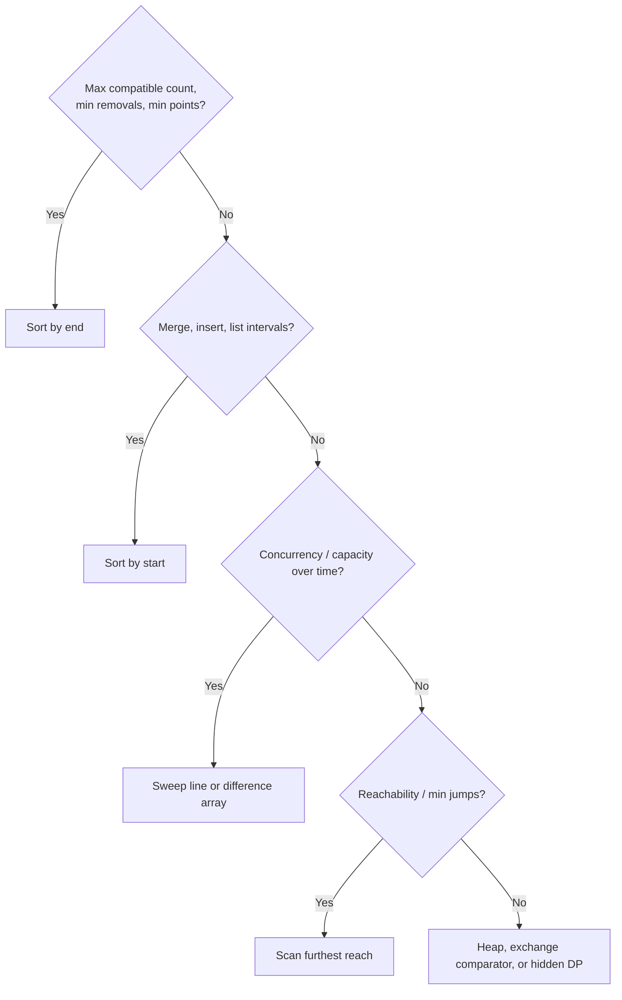

# Greedy

> **Scope** — Greedy-choice reasoning, the exchange-argument proof technique, and the sorting-based greedy patterns that dominate interviews: interval scheduling, jump/reach problems, heap-driven greedy (including Huffman coding), prefix-balance problems, and rearrangement/exchange greedy.

**Contents**
- [1. Core Concepts](#1-core-concepts)
- [2. Complexity Reference](#2-complexity-reference)
- [3. C# Toolbox](#3-c-toolbox)
- [4. Core Patterns / Techniques](#4-core-patterns--techniques)
- [5. Classic Problems & Solutions](#5-classic-problems--solutions)
- [6. Pattern Recognition](#6-pattern-recognition)
- [7. Interview Focus](#7-interview-focus)
- [8. Common Traps & Edge Cases](#8-common-traps--edge-cases)
- [9. Related LeetCode Problems](#9-related-leetcode-problems)
- [10. Cheat Sheet](#10-cheat-sheet)
- [See Also](#see-also)

---

## 1. Core Concepts

A **greedy algorithm** commits to the locally best available choice and never revisits it. It is fast only when that local choice can be forced into some global optimum.

| Property | Meaning |
|---|---|
| **Greedy-choice property** | Some optimal solution begins with the greedy choice; the local pick does not discard all optima. |
| **Optimal substructure** | After fixing that choice, solving the residual subproblem optimally solves the whole problem. |

DP also has optimal substructure. The difference is breadth: DP tries all viable choices and memoizes; greedy proves one choice dominates and discards the rest.

### Proving it: the exchange argument

> **Interview Tip** — Propose the greedy rule, then immediately prove it or produce a counterexample. That proof/refutation is the senior signal.

Template:
1. Let `OPT` be an optimal solution that first differs from the greedy choice `G`.
2. Swap `OPT`'s first differing choice for `G`; show feasibility is preserved and objective value is not worse.
3. Repeat on the residual subproblem. The transformed optimum matches every greedy choice, so greedy is optimal.

Use this for comparator/order greedy: activity selection, arrows, rescue boats, deadline scheduling, two-city scheduling, Huffman sibling merging.

### Proving it: greedy-stays-ahead

Use when greedy maintains a prefix lead: after processing index `i`, it reaches at least as far as any strategy with the same jumps; after picking `k` intervals, its `lastEnd` is no later than any feasible `k`-interval solution. Prove the base case and induction step; at the end, the prefix invariant bounds every competitor.

### Matroid intuition (advanced)

A matroid has hereditary and exchangeable feasible sets; in that special case, sorting by weight and repeatedly taking the best feasible element is optimal. In interviews, do not lead with matroid theory. Use the exchange property as a smell, then prove the concrete rule.

### Greedy failure counterexamples

| Problem | Greedy rule that fails | Counterexample | Correct approach |
|---|---|---|---|
| Coin change, arbitrary denominations | take largest coin first | coins `{1,3,4}`, amount `6`: greedy `4+1+1` uses 3 coins; optimal `3+3` uses 2 | DP over amount unless the coin system is proven canonical |
| 0/1 knapsack | sort by value/weight ratio | capacity `50`, items `(10,60)`, `(20,100)`, `(30,120)`: density greedy takes `10+20 = 160`; optimum `20+30 = 220` | DP over item/capacity; ratio works only for fractional knapsack |

> **Remember** — Passing samples is not a proof; samples only show a few executions. A proof must show the greedy choice never discards all optimal solutions.

### Greedy vs DP vs Backtracking

| Aspect | Greedy | DP | Backtracking |
|---|---|---|---|
| Choices explored | one, irrevocable | all relevant choices, memoized | all choices with undo/prune |
| Proof burden | exchange / stays-ahead | recurrence + overlap | exhaustive by construction |
| Typical shape | count, feasibility, one optimum | exact optimum/count/reconstruction | enumerate or find any arrangement |
| Typical cost | `O(n log n)` sort + scan, or `O(n)` | `O(n^2)`, `O(n·capacity)`, ... | exponential, pruned |

**Spotting greedy:** one dominant order exists (end time, deadline, ratio, cost difference); the state collapses to `lastEnd`, `furthest`, heap top, or prefix balance; and you can explain the exchange in under a minute. If a 3-5 item counterexample appears (large item blocks two medium items, exact-`k`, negative/zero values, tie-heavy inputs), pivot to DP/backtracking.



---

## 2. Complexity Reference

| Pattern | Time | Space | Notes |
|---|---|---|---|
| Sort by end time (activity selection, non-overlap) | `O(n log n)` | `O(1)` extra | sort dominates; scan is `O(n)` |
| Sort by start time (merge / insert intervals) | `O(n log n)` | `O(n)` output | sort dominates |
| Minimum arrows / points covering intervals | `O(n log n)` | `O(1)` extra | sort by end, place each point at the earliest uncovered end |
| Meeting Rooms II (min-heap of end times) | `O(n log n)` | `O(n)` heap | up to `2n` heap ops, each `O(log n)` |
| Sweep line / difference array | `O(n log n)` | `O(n)` | sorting the event times dominates; `O(n)` if coordinates are small enough to bucket |
| Two-pointer matching after sorting | `O(n log n)` | `O(1)` extra | assign cookies, rescue boats, pair extremes under a limit |
| Jump Game I / II | `O(n)` | `O(1)` | single pass; decision is driven by index order, not a derived key — no sort needed |
| Gas Station | `O(n)` | `O(1)` | single pass over a circular prefix sum |
| Candy distribution | `O(n)` | `O(n)` | two linear passes, no sort |
| Partition Labels | `O(n)` | `O(1)` (26 buckets) | one pass to record last index, one pass to cut |
| Task Scheduler (formula) | `O(n)` | `O(1)` (26 buckets) | counting sort of 26 buckets replaces a real sort |
| Huffman — heap version | `O(n log n)` | `O(n)` | `n-1` extract-min pairs, each `O(log n)` |
| Huffman — two-queue version (pre-sorted input) | `O(n)` | `O(n)` | both queues stay sorted, so picking the smaller front is `O(1)` |
| Remove K Digits (monotonic stack) | `O(n)` | `O(n)` | each digit pushed/popped at most once |
| Largest Number / Two City Scheduling | `O(n log n)` | `O(n)` | custom comparator sort dominates |

> **Optimization** — Nearly every greedy pattern is bottlenecked by its sort. The few `O(n)` entries
> (jump game, gas station, candy, partition labels, task scheduler, sorted-input Huffman) earn that
> speed specifically because the input is already ordered the way the greedy needs it — by index or
> by pre-sorted frequency — so no comparison-based sort is required.

---

## 3. C# Toolbox

| Tool | Use for | Gotcha |
|---|---|---|
| `Array.Sort(T[], Comparison<T>)` | in-place `O(n log n)` sort with a custom key | **not stable** — introsort may reorder equal keys; add an index tie-break if order-among-equals matters |
| `Enumerable.OrderBy(...)` (LINQ) | stable sort when equal-key order must be preserved | allocates a new sequence; slightly more overhead than `Array.Sort` |
| `Array.Sort(int[][], (a, b) => a[0].CompareTo(b[0]))` | sorting interval arrays by start/end | prefer `CompareTo` over subtraction (`a[0] - b[0]`) to avoid `int` overflow on adversarial inputs |
| `PriorityQueue<TElement, TPriority>` | min-heap for Meeting Rooms II, task scheduler frequencies, Huffman, connect-ropes | dequeues **smallest priority first**; for max-heap behavior negate the priority or pass `Comparer<int>.Create((a, b) => b.CompareTo(a))` |
| `Queue<T>` | the O(n) two-queue Huffman construction | requires the leaf queue to already be sorted ascending by frequency |
| `(int[][])arr.Clone()` on jagged arrays | avoid mutating the caller's interval array before sorting | `Clone()` on `int[][]` is **shallow** — the inner `int[]` rows are shared; fine if you don't mutate rows in place, otherwise deep-copy |
| `long` accumulators | summing gas/cost, candies, profits | prevents silent `int` overflow on large adversarial inputs |

---

## 4. Core Patterns / Techniques

### Intervals Toolkit

First clarify interval semantics: closed `[start,end]` vs half-open `[start,end)`. Touching intervals (`[1,2]`, `[2,3]`) overlap only in the closed interpretation.

**Sort choice:** start for merge/insert/rooms; end for max compatible count or min removals/points; separate start/end arrays for sweep concurrency.

```csharp
bool Overlaps(int[] a, int[] b) => a[0] < b[1] && b[0] < a[1]; // half-open
```

| Variant | Sort / state | Output |
|---|---|---|
| Merge / Insert Intervals | start, accumulator | canonical union |
| Non-overlapping / Activity Selection | end, `lastEnd` | max kept / min removed |
| Arrows / minimum points | end, current point | min points covering all intervals |
| Meeting Rooms I | start, `lastEnd` | feasibility |
| Meeting Rooms II | start + min-heap, or sweep starts/ends | max concurrency |
| Car Pooling | difference array / events | capacity feasibility |

---

### Pattern 1 — Sort by End Time (activity selection family)

- **Use for** max non-overlapping intervals, min removals, min points/arrows covering intervals.
- **Sorting key** ascending end time.
- **Invariant** after keeping `count` intervals, `lastEnd` is minimal among all feasible `count`-interval selections from the processed prefix.

```csharp
public int MaxActivities(int[][] intervals)
{
    Array.Sort(intervals, (a, b) => a[1].CompareTo(b[1]));
    int count = 0, lastEnd = int.MinValue;

    foreach (var iv in intervals)
    {
        if (iv[0] >= lastEnd)
        {
            count++;
            lastEnd = iv[1];
        }
    }
    return count;
}
// Min removals = intervals.Length - MaxActivities(intervals)
```

**Why safe** — exchange the first interval in any optimum with the earliest-ending compatible interval; it ends no later, so it cannot block the optimum's suffix. **Complexity** `O(n log n)` time, `O(1)` extra. **Pitfall** sorting by start is wrong for max count/min removals.

---

### Pattern 2 — Sort by Start Time (merge / insert / room counting)

- **Use for** canonical interval union, inserting an interval, or tracking active rooms.
- **Sorting key** ascending start, tie by end for determinism.
- **Invariant** merge: `merged` is the union of processed intervals; rooms: heap contains end times still active after freeing every `end <= currentStart`.

```csharp
public int[][] MergeIntervals(int[][] intervals)
{
    var sorted = (int[][])intervals.Clone();
    Array.Sort(sorted, (a, b) => a[0] != b[0] ? a[0].CompareTo(b[0]) : a[1].CompareTo(b[1]));

    var merged = new List<int[]>();
    foreach (var iv in sorted)
    {
        if (merged.Count == 0 || merged[^1][1] < iv[0])
            merged.Add(new[] { iv[0], iv[1] });
        else
            merged[^1][1] = Math.Max(merged[^1][1], iv[1]);
    }
    return merged.ToArray();
}

public int[][] InsertInterval(int[][] intervals, int[] next)
{
    var merged = new List<int[]>();
    int i = 0, start = next[0], end = next[1];

    while (i < intervals.Length && intervals[i][1] < start)
        merged.Add(intervals[i++]);

    while (i < intervals.Length && intervals[i][0] <= end)
    {
        start = Math.Min(start, intervals[i][0]);
        end = Math.Max(end, intervals[i][1]);
        i++;
    }
    merged.Add(new[] { start, end });

    while (i < intervals.Length)
        merged.Add(intervals[i++]);

    return merged.ToArray();
}

public int MinMeetingRooms(int[][] intervals)
{
    Array.Sort(intervals, (a, b) => a[0] != b[0] ? a[0].CompareTo(b[0]) : a[1].CompareTo(b[1]));
    var ends = new PriorityQueue<int, int>();
    int best = 0;

    foreach (var iv in intervals)
    {
        while (ends.Count > 0 && ends.Peek() <= iv[0]) ends.Dequeue();
        ends.Enqueue(iv[1], iv[1]);
        best = Math.Max(best, ends.Count);
    }
    return best;
}
```

**Why safe** — sorted-by-start order means a new interval can overlap only the last merged interval; for rooms, reusing the earliest-free room is never worse than leaving it idle. **Complexity** merge `O(n log n)`/`O(n)` output; rooms `O(n log n)`/`O(n)`. **Pitfalls** endpoint convention and mutating caller-owned arrays.

---

### Pattern 3 — Sweep Line / Difference Array

- **Use for** simultaneous overlap/capacity: meeting rooms, car pooling, max open intervals.
- **Sorting key** sort events by coordinate; for half-open `[start,end)`, process end before start at the same coordinate. Difference arrays avoid sorting only when coordinates are small/bucketable.
- **Invariant** running count equals starts/pickups processed minus ends/drop-offs processed.

```csharp
public int MinMeetingRoomsSweep(int[][] intervals)
{
    int n = intervals.Length;
    var starts = new int[n];
    var ends = new int[n];
    for (int i = 0; i < n; i++)
    {
        starts[i] = intervals[i][0];
        ends[i] = intervals[i][1];
    }
    Array.Sort(starts);
    Array.Sort(ends);

    int active = 0, best = 0, s = 0, e = 0;
    while (s < n)
    {
        if (starts[s] < ends[e])
        {
            active++;
            best = Math.Max(best, active);
            s++;
        }
        else
        {
            active--;
            e++;
        }
    }
    return best;
}

public bool CarPooling(int[][] trips, int capacity)
{
    int maxLocation = 0;
    foreach (var t in trips) maxLocation = Math.Max(maxLocation, t[2]);

    var diff = new int[maxLocation + 1];
    foreach (var t in trips)
    {
        diff[t[1]] += t[0];
        diff[t[2]] -= t[0];
    }

    int riders = 0;
    foreach (int delta in diff)
    {
        riders += delta;
        if (riders > capacity) return false;
    }
    return true;
}
```

**Why safe** — this is exact event bookkeeping, not a heuristic. **Complexity** sorted sweep `O(n log n)`/`O(n)`; difference array `O(n + U)`/`O(U)` for coordinate range `U`. **Pitfall** tie order at equal endpoints.

---

### Pattern 4 — Greedy Reach / Furthest Index

- **Use for** Jump Game-style reachability or min steps over an array.
- **Sorting key** none; original index order is the graph layer order.
- **Invariant** `furthest` is the farthest reachable index seen so far; in Jump II, `currentEnd` is the current BFS layer boundary and `farthest` is the next boundary.

```csharp
public bool CanJump(int[] nums)
{
    int furthest = 0;
    for (int i = 0; i < nums.Length; i++)
    {
        if (i > furthest) return false;
        furthest = Math.Max(furthest, i + nums[i]);
    }
    return true;
}

public int Jump(int[] nums)
{
    if (nums.Length <= 1) return 0;
    int jumps = 0, currentEnd = 0, farthest = 0;

    for (int i = 0; i < nums.Length - 1; i++)
    {
        if (i > farthest) return -1;
        farthest = Math.Max(farthest, i + nums[i]);
        if (i == currentEnd)
        {
            jumps++;
            currentEnd = farthest;
        }
    }
    return currentEnd >= nums.Length - 1 ? jumps : -1;
}
```

**Why safe** — scanning to `currentEnd` examines every index reachable in `jumps` jumps, so the farthest extension is exactly the next BFS layer. **Complexity** `O(n)`/`O(1)`. **Pitfall** loop only to `n - 2` for Jump II.

---

### Pattern 5 — Greedy with a Heap

- **Use for** repeatedly selecting the current min/max under changing eligibility: connect sticks, Huffman, task scheduler, reorganize string, IPO.
- **Sorting key** none upfront; the best item changes after each merge/consume/release.
- **Invariant** heap contains exactly currently eligible roots/items; fixed cost is the sum of decisions already forced.

```csharp
public long ConnectSticks(int[] sticks)
{
    var pq = new PriorityQueue<long, long>();
    foreach (int s in sticks) pq.Enqueue(s, s);

    long total = 0;
    while (pq.Count > 1)
    {
        long a = pq.Dequeue();
        long b = pq.Dequeue();
        long merged = a + b;
        total += merged;
        pq.Enqueue(merged, merged);
    }
    return total;
}

public int ScheduleCourse(int[][] courses)
{
    Array.Sort(courses, (a, b) => a[1].CompareTo(b[1]));
    var picked = new PriorityQueue<int, int>(); // max-heap by negative duration
    int time = 0;

    foreach (var c in courses)
    {
        int duration = c[0], deadline = c[1];
        picked.Enqueue(duration, -duration);
        time += duration;

        if (time > deadline)
            time -= picked.Dequeue();
    }
    return picked.Count;
}
```

**Why safe** — Huffman-style sibling exchange makes the two smallest weights deepest siblings; for deadline courses, if the selected set misses the current deadline, dropping the longest duration frees the most time and cannot reduce the count below any feasible set of the same size. **Complexity** heap patterns are usually `O(n log n)` time and `O(n)` space.

---

### Pattern 6 — Local Balance / Prefix Accounting

- **Use for** running-balance feasibility (gas station, lemonade change) or local neighbor constraints (candy).
- **Sorting key** none; input order defines the prefix/local constraints.
- **Invariant** gas: `tank` is balance from current candidate start; candy: each pass satisfies one neighbor direction with minimum candies.

```csharp
public int CanCompleteCircuit(int[] gas, int[] cost)
{
    long total = 0, tank = 0;
    int start = 0;

    for (int i = 0; i < gas.Length; i++)
    {
        long delta = (long)gas[i] - cost[i];
        total += delta;
        tank += delta;
        if (tank < 0)
        {
            start = i + 1;
            tank = 0;
        }
    }
    return total < 0 ? -1 : start;
}

public int Candy(int[] ratings)
{
    int n = ratings.Length;
    var candies = new int[n];
    Array.Fill(candies, 1);

    for (int i = 1; i < n; i++)
        if (ratings[i] > ratings[i - 1]) candies[i] = candies[i - 1] + 1;

    for (int i = n - 2; i >= 0; i--)
        if (ratings[i] > ratings[i + 1]) candies[i] = Math.Max(candies[i], candies[i + 1] + 1);

    long total = 0;
    foreach (int c in candies) total += c;
    return checked((int)total);
}
```

**Why safe** — a negative gas prefix proves every start in that failed segment also fails; Candy's second pass uses `Max`, so fixing right-neighbor constraints never breaks left-neighbor constraints. **Complexity** gas `O(n)`/`O(1)`, candy `O(n)`/`O(n)`.

---

### Pattern 7 — Partitioning by Last Occurrence

- **Use for** splitting into maximal chunks so no element crosses a boundary.
- **Sorting key** none; precompute each element's last occurrence, then scan original order.
- **Invariant** `end` is the furthest last occurrence of anything in the current partition.

```csharp
public IList<int> PartitionLabels(string s)
{
    var last = new int[26];
    for (int i = 0; i < s.Length; i++) last[s[i] - 'a'] = i;

    var ans = new List<int>();
    int start = 0, end = 0;
    for (int i = 0; i < s.Length; i++)
    {
        end = Math.Max(end, last[s[i] - 'a']);
        if (i == end)
        {
            ans.Add(end - start + 1);
            start = i + 1;
        }
    }
    return ans;
}
```

**Why safe** — before `i == end`, some seen character appears later, so a cut is invalid; at `end`, all seen characters are contained. **Complexity** `O(n)`/`O(1)` for fixed alphabet.

---

### Pattern 8 — Exchange / Rearrangement

- **Use for** ordering/dropping elements by a custom exchange: Largest Number, Remove K Digits, Two City Scheduling.
- **Sorting key** problem-specific comparator (`b+a` vs `a+b`, `costA-costB`) or monotonic stack order.
- **Invariant** no local adjacent swap/pop can improve the current prefix under the remaining budget.

```csharp
public string LargestNumber(int[] nums)
{
    var s = nums.Select(x => x.ToString()).ToArray();
    Array.Sort(s, (a, b) => string.Compare(b + a, a + b, StringComparison.Ordinal));
    return s.Length == 0 || s[0] == "0" ? "0" : string.Concat(s);
}

public string RemoveKdigits(string num, int k)
{
    var st = new List<char>();
    foreach (char c in num)
    {
        while (k > 0 && st.Count > 0 && st[^1] > c)
        {
            st.RemoveAt(st.Count - 1);
            k--;
        }
        st.Add(c);
    }
    while (k > 0 && st.Count > 0)
    {
        st.RemoveAt(st.Count - 1);
        k--;
    }

    int first = 0;
    while (first < st.Count && st[first] == '0') first++;
    string ans = new string(st.ToArray(), first, st.Count - first);
    return ans.Length == 0 ? "0" : ans;
}

public int TwoCitySchedCost(int[][] costs)
{
    Array.Sort(costs, (a, b) => ((long)a[0] - a[1]).CompareTo((long)b[0] - b[1]));
    int n = costs.Length / 2;
    long total = 0;
    for (int i = 0; i < costs.Length; i++) total += i < n ? costs[i][0] : costs[i][1];
    return checked((int)total);
}
```

**Why safe** — if an adjacent swap/pop improves the objective now, some optimum can make that local exchange first; sorted/monotone order has no remaining improving exchange. **Complexity** sort cases `O(n log n)`; stack case `O(n)`.

---

### Pattern 9 — Two-Pointer Matching

- **Use for** pairing sorted resources under a limit: assign cookies, rescue boats, pair extremes.
- **Sorting key** ascending size/capacity; process the most constrained extreme.
- **Invariant** items outside `[light, heavy]` have already been assigned with the minimum resources forced by previous heaviest choices.

```csharp
public int NumRescueBoats(int[] people, int limit)
{
    Array.Sort(people);
    int light = 0, heavy = people.Length - 1, boats = 0;

    while (light <= heavy)
    {
        if ((long)people[light] + people[heavy] <= limit) light++;
        heavy--;
        boats++;
    }
    return boats;
}
```

**Why safe** — the heaviest remaining person must leave now; if the lightest cannot pair with them nobody can, and if they can, using the lightest partner preserves harder future options. **Complexity** `O(n log n)`/`O(1)`.

---

## 5. Classic Problems & Solutions

Most classics are direct applications of Section 4. Keep the proof idea, sort key, and boundary convention; avoid rewriting the same code in every variant.

### Interval family (LC 56 / 57 / 252 / 253 / 435 / 452)

Worked treatment: choose the sort key from the question's output. If selecting/removing/placing points, sort by **end** and maintain `lastEnd`/`arrowAt`; if building a union or active-room count, sort by **start** or sweep starts/ends.

| Problem | Pattern | Greedy choice / delta | Time | Space |
|---|---|---|---|---|
| Merge Intervals / Insert Interval | Pattern 2 | sort by start; merge only with the last accumulated interval | `O(n log n)` | `O(n)` output |
| Non-overlapping Intervals / Activity Selection | Pattern 1 | keep earliest-ending compatible intervals; removals = `n - kept` | `O(n log n)` | `O(1)` |
| Minimum Arrows to Burst Balloons | Pattern 1 | shoot at earliest uncovered end; new arrow only when next start is after `arrowAt` | `O(n log n)` | `O(1)` |
| Meeting Rooms I | Pattern 2 | after start-sort, any `start < lastEnd` means conflict | `O(n log n)` | `O(1)` |
| Meeting Rooms II | Pattern 2 or 3 | min-heap active ends, or two sorted arrays for max concurrency | `O(n log n)` | `O(n)` |

### Jump Game I / II (LC 55 / 45)

Pattern 4. `CanJump`: scan while `i <= furthest`; Jump II: treat `[0..currentEnd]` as a BFS layer and advance to `farthest` when the layer ends. Greedy is `O(n)`/`O(1)`; DP over previous reachable indices is the safe but slower `O(n^2)` fallback for non-standard jump rules.

### Boats to Save People (LC 881)

Pattern 9. Sort weights; the heaviest remaining person either pairs with the lightest possible partner or must go alone. Exchange proof: pairing heaviest with anyone heavier than the lightest only makes future pairings harder. Complexity `O(n log n)` time, `O(1)` extra.

### Gas Station (LC 134)

Pattern 6. Total balance decides existence; whenever the running tank from candidate `start` goes negative at `i`, every station in `[start, i]` is impossible, so restart at `i + 1`. Complexity `O(n)`/`O(1)`.

### Huffman Coding / Connect Sticks (LC 1167)

Idea: repeatedly merge the two smallest weights. For Huffman, those two leaves can be made deepest siblings in some optimum; contracting them preserves optimality. For Connect Sticks, the same merge loop returns minimum total cost.

```csharp
public long MergeCost(IEnumerable<int> weights)
{
    var pq = new PriorityQueue<long, long>();
    foreach (int w in weights) pq.Enqueue(w, w);

    long total = 0;
    while (pq.Count > 1)
    {
        long a = pq.Dequeue();
        long b = pq.Dequeue();
        total += a + b;
        pq.Enqueue(a + b, a + b);
    }
    return total;
}
```

For actual prefix codes, store tree nodes instead of weights and assign `0`/`1` with DFS after the root is built. Heap version is `O(n log n)`/`O(n)`; if leaves arrive pre-sorted, the two-queue construction is `O(n)` because both queues remain sorted.

### Task Scheduler (LC 621)

New idea beyond the heap template: derive idle slots from the most frequent task instead of simulating cooldown windows.

```csharp
public int LeastInterval(char[] tasks, int n)
{
    var freq = new int[26];
    foreach (char task in tasks) freq[task - 'A']++;

    int max = freq.Max();
    int maxCount = freq.Count(f => f == max);
    int framed = (max - 1) * (n + 1) + maxCount;
    return Math.Max(tasks.Length, framed);
}
```

Complexity `O(tasks.Length + 26)` time, `O(1)` space. Heap simulation is also effectively linear over 26 task types but easier to get wrong around idle slots.

### Other compressed classics

| Problem | Pattern | Greedy choice | Complexity |
|---|---|---|---|
| Best Time to Buy/Sell Stock II | collapsed DP | sum every positive adjacent price delta | `O(n)`/`O(1)` |
| Assign Cookies | Pattern 9 | sort greed and cookie sizes; satisfy weakest child with smallest viable cookie | `O(n log n + m log m)`/`O(1)` |
| Partition Labels | Pattern 7 | close a partition only when scan reaches max last occurrence seen | `O(n)`/`O(1)` |
| Remove K Digits | Pattern 8 | monotonic stack; pop larger previous digit while budget remains | `O(n)`/`O(n)` |
| Largest Number | Pattern 8 | order `a,b` by whether `ab` or `ba` is larger | `O(n log n * L)`/`O(n)` |
| Two City Scheduling | Pattern 8 | sort by relative savings `costA - costB`; first half to A | `O(n log n)`/`O(n)` |
| Candy | Pattern 6 | left-to-right then right-to-left; keep max per child | `O(n)`/`O(n)` |

---

## 6. Pattern Recognition

| Cue | Likely pattern |
|---|---|
| "max non-overlapping", "min removals", "minimum arrows/points" | sort by end |
| "merge", "insert", "meeting rooms" | sort by start; add heap/sweep for concurrency |
| "capacity over time", "pickups/drop-offs", "max active" | sweep line / difference array |
| "jump", "reach", "furthest" over array indices | greedy reach, no sort |
| "cooldown", "reorganize", "merge repeatedly", "currently best eligible" | heap-driven greedy |
| "gas", "balance", "prefix never negative", "relative rating" | local balance / two-pass prefix accounting |
| "partition so no character crosses boundary" | last occurrence partitioning |
| "pair/assign under a limit" | sort + two pointers |
| custom order like concatenation or `costA-costB` | exchange / rearrangement comparator |

Strong signals: `n <= 10^5`, desired `O(n log n)` or `O(n)`, one dominant key, and answer is a count/feasibility/single optimum rather than all arrangements. Ratio is valid for fractional knapsack, but a trap for 0/1 knapsack.

**Common greedy hybrids:**

| Hybrid | Reach for |
|---|---|
| Greedy + sorting | intervals, boats, assign cookies, two-city scheduling |
| Greedy + heap | task scheduler, Huffman/connect sticks, Meeting Rooms II, IPO, Course Schedule III |
| Greedy + two pointers | rescue boats, interval intersections, pair extremes under a limit |
| Greedy + monotonic stack | Remove K Digits, Smallest Subsequence, Create Maximum Number |
| Greedy + binary search | minimize/maximize an answer when feasibility is greedy |
| Greedy inside DP | Stock II: DP transition collapses to positive deltas |

---

## 7. Interview Focus

- **What is probed** — not memorizing a sort, but proving the local decision cannot lose the global optimum.
- **Counterexample-first habit** — before coding, test 3-5 item cases: one large choice blocking two medium choices, equal keys, negatives/zeros, exact-`k`, and boundary ties.
- **Greedy vs DP decision** — use greedy only when an exchange/stays-ahead proof is clear; otherwise state the counterexample risk and pivot to DP/backtracking.
- **Samples are not proof** — they validate executions, not the absence of a hidden optimum.
- **Approximation framing** — some greedy algorithms are intentionally approximate: greedy set cover is logarithmic; list scheduling on `m` identical machines is a `(2 - 1/m)`-approximation.
- **Scale follow-ups** — offline greedy can sort all data; online/streaming variants need heaps or summaries; distributed variants must handle stale global order, tie-breaking, and partition skew.

| Ask yourself | If yes | If no |
|---|---|---|
| Can I order candidates by one dominant key? | try sort/heap greedy | suspect DP/search |
| Can I exchange an optimal first choice with greedy's choice? | code after proving | hunt counterexample |
| Does the state collapse to one boundary/count/balance? | greedy likely | recurrence likely |
| Must I reconstruct exact combinations or count all ways? | DP/backtracking likely | greedy may suffice |

**When NOT to use greedy:** arbitrary coin change, 0/1 knapsack by density, edit distance, LIS by local next choice, nearest-neighbor TSP, or any rule you cannot prove after serious counterexample hunting.

**Failure counterexamples to keep ready:**

| Problem | Bad greedy rule | Why it fails | Safer approach |
|---|---|---|---|
| Coin Change | take largest coin | `{1,3,4}`, amount `6`: `4+1+1` vs `3+3` | DP over amount |
| 0/1 Knapsack | take highest value/weight | capacity `50`: `(10,60)+(20,100)=160`, but `(20,100)+(30,120)=220` | DP over item/capacity |
| LIS | take the first/smallest valid next item | local picks can block a longer future subsequence | DP or patience sorting |
| TSP | nearest unvisited city | nearest-neighbor can be arbitrarily worse | exact search for small `n`, heuristics otherwise |
| Edit Distance | cheapest local edit | operations interact across suffixes | DP over prefixes |

Typical follow-ups: negative values, arbitrary coin denominations, `k` machines/resources, streaming arrivals, distributed workers, or changing endpoint inclusivity. Re-run the proof under each changed assumption.

---

## 8. Common Traps & Edge Cases

| Trap | Why it bites | Fix |
|---|---|---|
| Assuming greedy works without proof | plausible-looking rules (e.g. largest coin first) can be wrong | construct an exchange argument or a counterexample before coding |
| Sorting by the wrong key | end-time problems sorted by start (or vice versa) silently give a wrong count | re-derive which key the exchange argument depends on |
| Tie-breaking bugs | equal end times / equal costs can flip the answer in comparator-based greedy (largest number, two-city scheduling) | define an explicit, deterministic tie-break and test it |
| Comparator subtraction overflow | `a[1] - b[1]` can overflow for adversarial interval endpoints | use `a[1].CompareTo(b[1])` or compare `long` keys |
| Integer overflow when summing | gas/cost totals, candy totals, profit sums can overflow `int` on adversarial inputs | accumulate in `long` |
| Mutating an input array the caller owns | `Array.Sort` on the passed-in `int[][]` corrupts caller state | clone before sorting if the caller's array must stay intact |
| Inclusive vs exclusive endpoints | `[1,2]` and `[2,3]` overlapping or not changes every interval algorithm's boundary condition | clarify with the interviewer; pick `<` vs `<=` consistently everywhere |
| Empty input / single interval | many interval loops assume at least one element to seed `lastEnd` / `merged[0]` | guard for `n == 0` and `n == 1` explicitly |
| Off-by-one in "furthest index" loops | `nums.Length - 1` vs `nums.Length` bounds change whether the last index is checked | trace through a 2-element array by hand |
| Leading-zero cleanup in string greedy | Remove K Digits can produce `""` or `"000"` after popping | trim leading zeros and return `"0"` for the empty result |

---

## 9. Related LeetCode Problems

> The full tiered problem set lives in [Practice Roadmap](../DSAPatterns/Practice-Roadmap.md). The list below is the minimum set for this topic.

| # | Problem | Difficulty | Pattern |
|---|---|---|---|
| 455 | Assign Cookies | Easy | sort + two-pointer matching |
| 55 | Jump Game | Medium | greedy reach |
| 45 | Jump Game II | Medium | greedy reach / BFS layers |
| 56 | Merge Intervals | Medium | sort by start |
| 57 | Insert Interval | Medium | sort/merge by start |
| 134 | Gas Station | Medium | local balance / prefix accounting |
| 179 | Largest Number | Medium | exchange comparator |
| 253 | Meeting Rooms II | Medium | min-heap or sweep line |
| 402 | Remove K Digits | Medium | monotonic stack greedy |
| 435 | Non-overlapping Intervals | Medium | sort by end |
| 452 | Minimum Number of Arrows to Burst Balloons | Medium | sort by end, point at current end |
| 621 | Task Scheduler | Medium | heap/frequency formula |
| 763 | Partition Labels | Medium | last occurrence partitioning |
| 881 | Boats to Save People | Medium | sort + two pointers |
| 135 | Candy | Hard | two-pass local balance |

---

## 10. Cheat Sheet

| Trigger | Recall |
|---|---|
| Greedy claim | prove by exchange or greedy-stays-ahead; otherwise find a counterexample |
| Sort by end | max compatible count, min removals, min arrows/points; invariant: smallest possible `lastEnd` |
| Sort by start | merge/insert; only the last merged interval can overlap the next one |
| Meeting Rooms II | start-sort + min-heap of active ends, or sweep sorted starts/ends |
| Sweep line | `+1` at start, `-1` at end; decide endpoint tie order first |
| Jump Game | scan `furthest`; Jump II increments jumps at BFS layer boundaries |
| Heap greedy | current best changes after each consume/merge/release: Huffman, connect sticks, IPO, task scheduler |
| Gas station | feasible iff total balance >= 0; negative tank skips every start in the failed segment |
| Candy | two passes; second pass uses `Max` so it does not break the first pass |
| Partition Labels | precompute `last[c]`, extend `end`, cut when `i == end` |
| Two pointers | sort; handle heaviest/most constrained item, pair with easiest viable partner |
| Exchange comparator | if adjacent swap improves objective, sorted order must eliminate that violation |
| Stack greedy | pop while top is worse and removal budget remains; trim leading zeros |
| Greedy fails | coin `{1,3,4}` for amount `6`; 0/1 knapsack by ratio; LIS local choice; nearest-neighbor TSP |
| Greedy works | activity selection, fractional knapsack, Huffman, MSTs, Dijkstra with non-negative weights |
| C# gotchas | use `CompareTo`, `long` sums, clone before sorting caller-owned arrays, define tie-breaks |

**Related notes:** [Dynamic Programming](../Dynamic%20Programming/Dynamic%20Programming.md) · [Heaps](../Heaps/Heaps.md) · [Binary Search](../Binary%20Search/Binary%20Search.md) · [DSA Patterns](../DSAPatterns/DSAPatterns.md)

---

## See Also

- [Dynamic Programming](../Dynamic%20Programming/Dynamic%20Programming.md) — The fallback when the greedy choice is not provably safe.
- [Heaps](../Heaps/Heaps.md) — Supplies the 'currently best eligible item' for heap-driven greedy.
- [Arrays and Strings](../Arrays%20and%20Strings/Arrays%20and%20Strings.md) — Interval, sweep-line and prefix-balance problems live on arrays.
- [Binary Search](../Binary%20Search/Binary%20Search.md) — Greedy feasibility checks power binary search on the answer.
- [DSA Patterns](../DSAPatterns/DSAPatterns.md) — master index: pattern selection flowchart and complexity-from-constraints.
- [Practice Roadmap](../DSAPatterns/Practice-Roadmap.md) — the tiered problem set to drill this topic.
