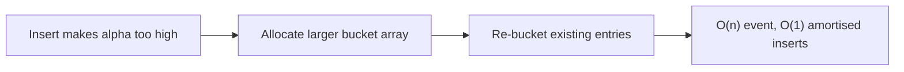
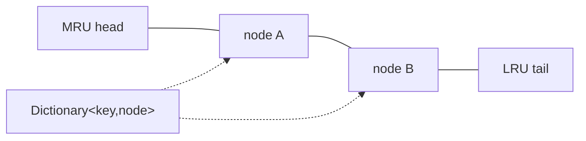

# Hashing

> **Scope** — Hash functions, collision resolution, load factor and resizing, .NET hashing collections, and the interview patterns (frequency count, complement lookup, prefix-sum, sliding window, top-k, RandomizedSet, LRU/LFU, rolling hash) built on top of them.

**Contents**
- [1. Core Concepts](#1-core-concepts)
- [2. Complexity Reference](#2-complexity-reference)
- [3. C# Toolbox](#3-c-toolbox)
- [4. Core Patterns / Techniques](#4-core-patterns--techniques)
- [5. Classic Problems & Solutions](#5-classic-problems--solutions)
- [6. Pattern Recognition](#6-pattern-recognition)
- [7. Interview Focus](#7-interview-focus)
- [8. Common Traps & Edge Cases](#8-common-traps--edge-cases)
- [9. Related LeetCode Problems](#9-related-leetcode-problems)
- [10. Cheat Sheet](#10-cheat-sheet)
- [See Also](#see-also)

---

## 1. Core Concepts

A **hash table** maps `key -> value` by computing a hash code, reducing it to a bucket index (conceptually `hash(key) mod capacity`), and resolving collisions inside that bucket/probe sequence. Average lookup/insert/delete is **O(1)**, but the guarantee is statistical: broken/adversarial hashes or a resize can make a single operation **O(n)**.

> **Quick Note** - The hash code is not the bucket index. Resizing changes capacity, so existing entries must be re-bucketed even if each key's hash code is unchanged.

### 1.1 Hash function checklist

- **Deterministic** for correctness; `Equals`-equal keys must produce equal hashes.
- **Uniform / avalanche-like** so patterned keys do not cluster.
- **Fast enough** because every lookup pays hash cost; strings/sequences are O(key length).
- In interviews, usually use library hashes; only mention division/multiplication when asked to build a table: prime modulus avoids low-bit clustering, multiplication depends on a good constant.

### 1.2 Load factor, resize, amortisation

**Load factor** `alpha = n / m` (entries / buckets) controls probe/chain length.

| Structure | Average cost | Resize rule |
|---|---|---|
| Separate chaining | O(1 + alpha) | Grow when chains/load factor exceed threshold. |
| Open addressing | O(1 / (1 - alpha)) expected probes | Must keep `alpha < 1`, often near 0.7. |

When the threshold is crossed, the table allocates a larger bucket array and re-buckets all entries: O(n) for that insert. Across many inserts the work is geometric (`1 + 2 + 4 + ... + n`), so inserts stay **O(1) amortised**.



### 1.3 Collision resolution

| Technique | Idea | Senior notes |
|---|---|---|
| Separate chaining | Bucket stores a chain/list of entries with the same bucket index. | Lookup scans the chain and uses `Equals` as the final tie-breaker. .NET `Dictionary` uses bucket and entry arrays with `next` indices. |
| Linear probing | Try `h, h+1, h+2, ...` in-array. | Cache-friendly; suffers primary clustering. |
| Quadratic probing | Try `h + c1*i + c2*i*i`. | Reduces primary clustering; constants/table size must cover slots. |
| Double hashing | Try `h + i*h2(key)`. | Better spread; `h2` must be non-zero and coprime to capacity. |

> **Tombstone trap** - In open addressing, deletion cannot clear a slot because later keys in the same probe chain would become unreachable. Mark a tombstone, allow searches to pass through it, allow inserts to reuse it, and periodically rehash.

> **Worst case** - Any hash-table operation can degrade to O(n) when many keys collide or tombstones/probes explode. Randomized string hashing mitigates common hash-flooding attacks, but custom key hashes still matter.

### 1.4 Hash table vs sorted structure

| Need | Hash table | Balanced BST / sorted collection |
|---|---|---|
| Point lookup | O(1) average | O(log n) |
| Ordered iteration | Not guaranteed | Natural |
| Floor/ceil/range query | Not supported | O(log n) entry point plus scan |
| Worst-case guarantee | O(n) without stronger implementation promises | O(log n) |

Use `Dictionary`/`HashSet` for membership/counting/grouping. Use `SortedDictionary`, `SortedSet`, `SortedList` plus binary search, or a custom tree when the problem asks for sorted output, predecessor/successor, k-th by order, nearest neighbor, or range queries.

---
## 2. Complexity Reference

| Operation | Average | Worst Case | Space | Notes |
|---|---|---|---|---|
| Insert | O(1) amortised | O(n) | O(n) | Worst case: all keys collide; a resize/rebucket is an O(n) single-insert event. |
| Search / Contains | O(1) | O(n) | — | Same collision reasoning; include key hash/equality cost separately for long keys. |
| Delete | O(1) | O(n) | — | Chaining unlinks from a bucket; open addressing leaves tombstones. |
| Resize / rehash (single event) | O(n) | O(n) | O(n) | Total rehashed work across `n` doubling inserts is O(n), so inserts stay amortised O(1). |
| Iteration | O(n) library / O(n + m) bucket scan | O(n + m) | — | `m` = bucket count/capacity; order is not part of the hash-table contract. |
| Chaining ops | O(1 + α) | O(n) | O(n) | α = load factor; degrades to a chain scan if α or collisions are high. |
| Open addressing ops | O(1 / (1 - α)) | O(n) | O(m) | Must keep α < 1; tombstones count against probe length until rehashed. |

---

## 3. C# Toolbox

| Type | Backing structure | Ordered? | Thread-safe? | Use when |
|---|---|---|---|---|
| `Dictionary<TKey,TValue>` | Hash table, buckets + entries array | No | No | Default key->value map; O(1) average. |
| `HashSet<T>` | Same hash table without values | No | No | Dedup and membership. |
| `SortedDictionary<TKey,TValue>` | Red-black tree | Yes | No | Ordered map with O(log n) point ops. |
| `SortedList<TKey,TValue>` | Sorted key/value arrays | Yes | No | Compact sorted map; O(log n) lookup, O(n) insert/delete. |
| `SortedSet<T>` | Red-black tree | Yes | No | Ordered unique values; `GetViewBetween` for ranges. |
| `ConcurrentDictionary<TKey,TValue>` | Hash table with concurrency controls | No | Yes | Multi-threaded map; factories must be idempotent. |
| `ILookup<TKey,TValue>` | Immutable multi-map from `ToLookup` | No | N/A | One key -> many values; missing key returns an empty sequence. |

### .NET-specific rules

- `Dictionary` enumeration order is **not guaranteed**. It may look insertion-ordered on one runtime, then change after resize/delete/runtime upgrade.
- `string.GetHashCode()` and `HashCode.Combine` are randomized/not stable across processes or runtime versions; never persist them or use them for cross-process sharding. Use a stable hash when stability matters.
- Prefer `StringComparer.Ordinal` / `OrdinalIgnoreCase` for string keys. Culture-aware comparisons are slower and can vary by locale/OS.
- `ConcurrentDictionary.GetOrAdd` / `AddOrUpdate` value factories may run more than once; only one result wins. Keep factories side-effect-free or idempotent.
- `SortedDictionary` is a tree; `SortedList` is sorted arrays. Pick by mutation rate and memory footprint.

### Equality contract

> **Important** - Override `Equals` => override `GetHashCode`. Equal objects must have equal hash codes; unequal objects may collide, so `Equals` is still checked inside a bucket.

```csharp
public readonly struct Point : IEquatable<Point>
{
    public int X { get; }
    public int Y { get; }

    public Point(int x, int y) => (X, Y) = (x, y);
    public bool Equals(Point other) => X == other.X && Y == other.Y;
    public override bool Equals(object? obj) => obj is Point p && Equals(p);
    public override int GetHashCode() => HashCode.Combine(X, Y);
}
```

- Hash codes must stay stable while the key is in a dictionary/set. Mutating hash-affecting fields after insertion strands the entry in the wrong bucket.
- Prefer immutable keys. `record`, `record struct`, and `ValueTuple` provide structural equality/hash codes when their components are safe.
- Use `HashCode.Combine(...)`, not hand-rolled XOR: XOR is symmetric, so `(1, 2)` and `(2, 1)` collide.
- `IEqualityComparer<T>` changes equality without changing the type:

```csharp
var byId = new Dictionary<string, int>(StringComparer.OrdinalIgnoreCase);
```

### API mechanics

```csharp
if (map.TryGetValue(key, out int value)) { /* one lookup, no throw */ }
int fallback = map.GetValueOrDefault(key, 0);
map[key] = map.GetValueOrDefault(key) + 1;       // common counting path
```

`map[key]` throws on a missing read; `ContainsKey` + indexer usually does two lookups. `CollectionsMarshal.GetValueRefOrAddDefault` can avoid double lookup in hot paths, but do not add/remove while holding the returned `ref`, and initialize new slots.

---
## 4. Core Patterns / Techniques

### Frequency counting

**Use when** counts drive equality, majority, availability, or first/last uniqueness. **Map**: key = element/char, value = count.

```csharp
static Dictionary<char, int> CountCharacters(string s)
{
    var freq = new Dictionary<char, int>();
    foreach (char c in s)
        freq[c] = freq.GetValueOrDefault(c) + 1;
    return freq;
}
```

**Complexity** - O(n) time, O(k) space. For fixed small alphabets, `int[26]`, `int[128]`, or a bitset is faster and allocation-light versus `Dictionary<char,int>`.

### Frequency map + bucket sort (Top K Frequent)

**Use when** top-k by frequency and counts are bounded by `n`. **Map**: value -> count; **bucket**: count -> values.

```csharp
public int[] TopKFrequent(int[] nums, int k)
{
    var freq = new Dictionary<int, int>();
    foreach (int x in nums) freq[x] = freq.GetValueOrDefault(x) + 1;

    var buckets = new List<int>[nums.Length + 1];
    foreach (var pair in freq)
        (buckets[pair.Value] ??= new List<int>()).Add(pair.Key);

    var ans = new List<int>(k);
    for (int count = buckets.Length - 1; count > 0 && ans.Count < k; count--)
        if (buckets[count] is not null)
            foreach (int value in buckets[count])
            {
                ans.Add(value);
                if (ans.Count == k) break;
            }
    return ans.ToArray();
}
```

| Algorithm | Time | Space | Use when |
|---|---|---|---|
| Sort by frequency | O(n log n) | O(n) | Simpler; all results ordered. |
| Size-k min-heap | O(n log k) | O(n) | Streaming or `k << n`. |
| Bucket sort | O(n) | O(n) | Counts are bounded by input length. |

### Seen-set / complement lookup (Two Sum)

**Use when** a nested search asks whether a needed counterpart was already seen. **Map**: value -> index/count.

```csharp
public int[] TwoSum(int[] nums, int target)
{
    var index = new Dictionary<int, int>();
    for (int i = 0; i < nums.Length; i++)
    {
        int need = target - nums[i];
        if (index.TryGetValue(need, out int j)) return new[] { j, i };
        index[nums[i]] = i;        // insert after checking: no self-pair
    }
    return Array.Empty<int>();
}
```

**Complexity** - O(n) time, O(n) space; converts the inner O(n) complement search into O(1) average lookup. Use `long` if `target - nums[i]` can overflow.

### Grouping by canonical key (anagrams)

**Use when** multiple records share a normalized signature. **Map**: canonical key -> originals.

```csharp
static Dictionary<string, List<string>> GroupAnagrams(IEnumerable<string> words)
{
    var groups = new Dictionary<string, List<string>>();
    foreach (string word in words)
    {
        int[] counts = new int[26];
        foreach (char c in word) counts[c - 'a']++;
        string key = string.Join("#", counts);
        if (!groups.TryGetValue(key, out var list)) groups[key] = list = new List<string>();
        list.Add(word);
    }
    return groups;
}
```

**Complexity** - O(n*k) for fixed alphabet. Sorting each word is O(k log k); use count signatures for small alphabets, sorted keys or dictionary-count signatures for Unicode/unknown alphabets.

### Prefix-sum + hash map (subarray sum equals K)

**Use when** contiguous subarray sums/counts must be found and negatives break sliding-window monotonicity. **Map**: prefix sum -> occurrences.

```csharp
public int SubarraySum(int[] nums, int k)
{
    var count = new Dictionary<long, int> { [0L] = 1 };   // seed empty prefix
    long sum = 0;
    int ans = 0;

    foreach (int x in nums)
    {
        sum += x;
        if (count.TryGetValue(sum - k, out int seen)) ans += seen;
        count[sum] = count.GetValueOrDefault(sum) + 1;
    }
    return ans;
}
```

**Why `map[0] = 1`** - it represents the empty prefix, so a current prefix `sum == k` counts the subarray starting at index 0. Use `long` for prefix sums.

### Sliding window with counts

**Use when** the validity condition is monotonic as the window expands/shrinks (distinct count, coverage, no repeats). **Map**: element -> count inside `[start, end]`.

```csharp
static int AtMostKDistinct(int[] a, int k)
{
    if (k < 0) return 0;
    var count = new Dictionary<int, int>();
    int start = 0, distinct = 0, ans = 0;

    for (int end = 0; end < a.Length; end++)
    {
        int right = a[end];
        count[right] = count.GetValueOrDefault(right) + 1;
        if (count[right] == 1) distinct++;

        while (distinct > k)
        {
            int left = a[start++];
            if (--count[left] == 0) { count.Remove(left); distinct--; }
        }
        ans += end - start + 1;
    }
    return ans;
}
// exactlyK(a, k) = AtMostKDistinct(a, k) - AtMostKDistinct(a, k - 1)
```

**Complexity** - O(n) time because each index enters/leaves once; O(k) active space after removing zero-count keys. If negatives make the condition non-monotonic, switch to prefix sums.

### Index maps for O(1) positional lookup

**Use when** the latest/earliest position of a value controls jumps or distance constraints. **Map**: element -> last index.

```csharp
int LongestSubstringNoRepeat(string s)
{
    var last = new Dictionary<char, int>();
    int start = 0, best = 0;
    for (int end = 0; end < s.Length; end++)
    {
        if (last.TryGetValue(s[end], out int i) && i >= start) start = i + 1;
        last[s[end]] = end;
        best = Math.Max(best, end - start + 1);
    }
    return best;
}
```

**Complexity** - O(n) time, O(min(n, alphabet)) space. For ASCII/bytes, `int[128]`/`int[256]` initialized to `-1` is faster.

### Bidirectional maps for bijections (isomorphic strings / word pattern)

**Use when** two sequences need a one-to-one shape mapping. **Maps**: source -> target and target -> source.

```csharp
public bool IsIsomorphic(string s, string t)
{
    if (s.Length != t.Length) return false;
    var fwd = new Dictionary<char, char>();
    var back = new Dictionary<char, char>();

    for (int i = 0; i < s.Length; i++)
    {
        char a = s[i], b = t[i];
        if (fwd.TryGetValue(a, out char mapped) && mapped != b) return false;
        if (back.TryGetValue(b, out char original) && original != a) return false;
        fwd[a] = b;
        back[b] = a;
    }
    return true;
}
```

One forward map fails many-to-one cases such as `"ab" -> "aa"`; two last-seen arrays are an equivalent fixed-alphabet trick. Complexity O(n).

### Hashing for O(1) dedup / set membership

**Use when** only existence matters: duplicates, visited, intersection, set difference, start-of-chain checks. **Set key** = value itself.

```csharp
static bool ContainsDuplicate(int[] nums)
{
    var seen = new HashSet<int>();
    foreach (int x in nums)
        if (!seen.Add(x)) return true;
    return false;
}
```

Average membership is O(1) versus O(n) scan or O(log n) sorted/tree lookup.

### Map + dense list for O(1) random sampling (RandomizedSet)

**Use when** `Insert`, `Remove`, and uniform `GetRandom` must all be O(1). **Map**: value -> index in dense list.

```csharp
public sealed class RandomizedSet
{
    private readonly Dictionary<int, int> _index = new();
    private readonly List<int> _items = new();
    private readonly Random _random = new();

    public bool Insert(int val)
    {
        if (_index.ContainsKey(val)) return false;
        _index[val] = _items.Count;
        _items.Add(val);
        return true;
    }

    public bool Remove(int val)
    {
        if (!_index.TryGetValue(val, out int pos)) return false;
        int lastIndex = _items.Count - 1, last = _items[lastIndex];
        if (pos != lastIndex)
        {
            _items[pos] = last;
            _index[last] = pos;
        }
        _items.RemoveAt(lastIndex);
        _index.Remove(val);
        return true;
    }

    public int GetRandom()
    {
        if (_items.Count == 0) throw new InvalidOperationException("Set is empty.");
        return _items[_random.Next(_items.Count)];
    }
}
```

The list is required for uniform random indexing; delete by swap-with-last, then repair the moved item's index before popping. O(1) average per op, O(n) space.

### LRU cache (Dictionary + doubly linked list)

**Use when** `get`/`put` must be O(1) and capacity eviction is least-recently-used. **Map**: key -> linked-list node; list order = recency.



```csharp
// On Get/Put hit: move node to head.
// On Put miss at capacity: remove tail.Prev, then remove its Key from the map.
// Node must store Key and Value; sentinel head/tail remove null/empty edge cases.
```

**Complexity** - O(1) get/put because map lookup, unlink, insert-after-head, and remove-tail are all constant. LFU follow-up: `key -> node`, `freq -> doubly linked list`, plus `minFreq`.

### Rolling hash (Rabin-Karp)

**Use when** comparing every substring naively is too slow. Maintain a window hash and verify candidate matches.

```text
newHash = ((oldHash - outgoing * base^(m-1)) * base + incoming) mod largePrime
```

Use a large prime modulus (often double-hash for robustness). Equal hashes are candidates, not proof: re-check the substring to avoid collision bugs. Average O(n+m); worst-case O(n*m) if many false positives are forced.

---
## 5. Classic Problems & Solutions

Most classics are thin wrappers around §4 patterns; keep the mapping and only retain code when it adds a new trick.

| Problem | Pattern to name | Key / value meaning | Complexity |
|---|---|---|---|
| Two Sum / Two Sum II / 3Sum variants | Complement lookup; sorted two-pointers when output/order matters | value -> index or remaining count; for 3Sum sort then fix one value | O(n) for Two Sum hash, O(n^2) for 3Sum |
| Valid Anagram / Ransom Note | Frequency count or fixed array | char -> count, decrement and reject negative | O(k), O(1) fixed alphabet |
| Group Anagrams | Canonical-key grouping | count signature or sorted string -> words | O(n*k) fixed alphabet, O(n*k log k) sorted key |
| Top K Frequent | Frequency + bucket sort or size-k heap | value -> count; bucket[count] -> values | O(n) bucket, O(n log k) heap |
| Isomorphic Strings / Word Pattern | Bidirectional maps | source -> target and target -> source | O(n) |
| Subarray Sum Equals K | Prefix sum + count map | prefixSum -> occurrence count, seeded with `0 -> 1` | O(n) |
| Continuous Subarray Sum | Prefix modulo + first index | normalized prefixMod -> earliest index; need distance >= 2 | O(n) |
| Longest Substring Without Repeating | Sliding window + index map | char -> last index, jump `start` forward only | O(n) |
| Minimum Window Substring | Sliding window + frequency deficits | char -> needed/inside counts; shrink while covered | O(n) |
| RandomizedSet | Map + dense list | value -> list index; swap-with-last on delete | O(1) average per op |
| LRU / LFU Cache | Map + linked structures | LRU: key -> node; LFU: key -> node, freq -> list, `minFreq` | O(1) per op |

### Longest Consecutive Sequence (LC 128)

Adds the **start-of-chain guard**: put values in a `HashSet`, expand only from `x` when `x - 1` is absent, so every value is walked once overall.

```csharp
public int LongestConsecutive(int[] nums)
{
    var set = new HashSet<int>(nums);
    int best = 0;

    foreach (int x in set)
    {
        if (x != int.MinValue && set.Contains(x - 1)) continue;

        int cur = x, len = 1;
        while (cur != int.MaxValue && set.Contains(cur + 1))
        {
            cur++;
            len++;
        }
        best = Math.Max(best, len);
    }
    return best;
}
```

**Complexity** - O(n) average time, O(n) space. Guards avoid re-walking the same chain from every member; boundary checks avoid `int` overflow.

---
## 6. Pattern Recognition

Signals that a problem wants hashing:

- "Seen before", duplicate, membership, visited, intersection -> `HashSet`.
- Pair/triplet/complement relation -> map earlier values to index/count; sort/two-pointer if order/range output matters.
- Frequency, anagram, top-k, majority, availability -> count map or fixed array; bucket by count for bounded top-k.
- Group equivalent records -> canonical key, then `Dictionary<key, List<item>>`.
- Contiguous subarray sum with negatives -> prefix sum + map; with monotonic validity -> sliding window + counts.
- Latest position / distance constraint -> index map.
- Same shape / pattern -> two maps for bijection.
- Unsorted consecutive run -> set + start-of-chain check.
- O(1) random delete/sample -> value-to-index map + dense list.
- Cache eviction -> map to linked-list/frequency-bucket nodes.
- Tiny bounded key space -> array/bitset beats hashing.
- Sorted output, floor/ceil, nearest, or range query -> use a sorted structure instead.

---
## 7. Interview Focus

- **What is being probed** - recognizing O(n^2) -> O(n) space-time tradeoffs, choosing the right .NET collection, and stating average vs worst-case complexity honestly.
- **Hash-table design answer** - bucket array, hash -> bucket, collision resolution, load factor threshold, resize/rehash amortisation, and equality/hash-code contract.
- **Hash-function answer** - deterministic, uniform, fast, avalanche-like; combine fields with `HashCode.Combine`; avoid symmetric XOR and mutable keys.
- **Wrong-tool signals** - ordered iteration, predecessor/successor, range queries, k-th by order, stable output order, or tiny fixed alphabets where arrays are simpler.
- **Security/failure mode** - bad/custom hashes or hash-flooding can force O(n); randomized string hashing helps but does not save poor custom key types.
- **Scale/distribution follow-ups** - if data does not fit memory, partition/external-hash by a stable hash. For distributed caches, use consistent hashing so node changes move only a small fraction of keys.
- **Approximation follow-ups** - Bloom filter = approximate membership with false positives/no false negatives; Count-Min Sketch = approximate frequency; HyperLogLog = approximate cardinality.
- **Concurrency follow-ups** - `Dictionary` is unsafe for concurrent mutation; use `ConcurrentDictionary`, immutable snapshots, or external/striped locks. `GetOrAdd` factories may run more than once.
- **Design follow-ups** - RandomizedSet is map + dense list; LRU is map + doubly linked list; LFU is key map + frequency lists + `minFreq`.

---
## 8. Common Traps & Edge Cases

| Trap | Why it bites |
|---|---|
| Hash DoS / adversarial keys | Attacker-crafted keys that all collide can force O(n) behavior repeatedly; randomized string hashing mitigates common string-key flooding, but custom key hashes still need care. |
| Persisting hash codes | `GetHashCode()` / `HashCode.Combine` values are not stable across processes or runtime versions; use a stable hash for disk, network protocols, sharding, or consistent hashing. |
| Assuming iteration order | `Dictionary`/`HashSet` order is **not guaranteed** and can change after resize, deletion, or runtime version changes — never rely on insertion order (use a `List` alongside, or `OrderedDictionary` if truly needed). |
| Thread safety | `Dictionary<TKey,TValue>` and `HashSet<T>` are **not thread-safe** for concurrent writes (or write+read) — use `ConcurrentDictionary` or external locks; factory delegates may run more than once. |
| Boxing of struct keys | A `Dictionary<object, V>` with `struct` keys boxes every key on insert/lookup, adding allocation and defeating `IEquatable<T>` fast paths — always use the concretely typed generic dictionary. |
| Float/double keys | Floating equality is usually the wrong domain model (`0.1 + 0.2 != 0.3`, `==` and `Equals` differ for NaN); quantize first or use a custom comparer/structure. |
| Mutating a key after insertion | Changes the key's hash code post-insertion; the entry becomes unreachable via lookup but still appears in enumeration — treat dictionary keys as immutable. |
| Tombstones in open addressing | Clearing a probed slot breaks later lookups; tombstones preserve the probe chain but too many tombstones require rehashing. |
| Worst-case O(n) chains | A pathological input (or intentionally weak hash) collapses chaining/probing to a linear scan — always know your fallback complexity, don't assume O(1) blindly. |
| Missing key on indexer read | `map[key]` throws `KeyNotFoundException` if absent — prefer `TryGetValue` or `GetValueOrDefault`. |
| Negative modulo while bucketizing | In C#, `x % k` can be negative; normalize with `((x % k) + k) % k` before using it as a bucket/index. |
| Integer overflow in derived keys | `target - nums[i]`, prefix sums, `x - 1`, and `n + length` can overflow at full `int` range — switch to `long` or guard boundaries when constraints demand it. |
| Culture-sensitive string keys | Current-culture comparisons can vary by locale and OS; prefer `StringComparer.Ordinal` / `OrdinalIgnoreCase` for stable keys. |
| Degenerate inputs | Empty arrays, singletons, all-identical values, and duplicate-heavy inputs expose off-by-one bugs and false distinct-key assumptions. |
| One-way map for bijection | Isomorphic/pattern problems need both directions; otherwise many source keys can collapse to one target key. |
| Swap-with-last without index repair | In RandomizedSet, after moving the last item into the removed slot, update that moved item's index before popping. |

---

## 9. Related LeetCode Problems

> The full tiered problem set lives in [Practice Roadmap](../DSAPatterns/Practice-Roadmap.md). The list below is the minimum set for this topic.

| # | Problem | Pattern |
|---|---|---|
| 1 | Two Sum | Complement lookup |
| 217 | Contains Duplicate | Seen-set membership |
| 242 | Valid Anagram | Frequency count |
| 49 | Group Anagrams | Canonical-key grouping |
| 347 | Top K Frequent Elements | Frequency map + bucket sort / heap |
| 128 | Longest Consecutive Sequence | Set + start-of-chain expansion |
| 560 | Subarray Sum Equals K | Prefix sum + hash map |
| 523 | Continuous Subarray Sum | Prefix modulo + earliest index |
| 3 | Longest Substring Without Repeating Characters | Sliding window + index map |
| 76 | Minimum Window Substring | Sliding window + frequency map |
| 205 / 290 | Isomorphic Strings / Word Pattern | Bidirectional maps |
| 380 | Insert Delete GetRandom O(1) | Dictionary + dense list |
| 146 / 460 | LRU Cache / LFU Cache | Map + linked/frequency lists |
| 187 | Repeated DNA Sequences | Rolling hash / encoded frequency |

---
## 10. Cheat Sheet

- Hash table: `hash(key) mod capacity` -> bucket; resize/rebucket is O(n) once, O(1) amortised across inserts.
- Average insert/search/delete O(1); worst case O(n) from collisions, tombstones, bad hashes, or adversarial input.
- Chaining stores colliding entries per bucket; open addressing probes in-array and needs tombstones on delete.
- `Dictionary`/`HashSet` are unordered; iteration order is not guaranteed. `SortedDictionary`/`SortedSet` are O(log n) and ordered.
- Override `Equals` => override `GetHashCode`; equal objects need equal hashes; never mutate a key while it is in a dictionary/set.
- Use `HashCode.Combine`, records, value tuples, or `IEqualityComparer<T>` for compound/custom equality; avoid XOR hash combos.
- `string.GetHashCode`/`HashCode.Combine` are not stable across processes; use stable hashes for persistence, sharding, or consistent hashing.
- Prefer `StringComparer.Ordinal` / `OrdinalIgnoreCase`; avoid culture-sensitive keys unless explicitly required.
- `ConcurrentDictionary.GetOrAdd`/`AddOrUpdate` factories may execute more than once; keep them idempotent.
- `TryGetValue` avoids exceptions/double lookup; `map[key]` throws on missing reads.
- Fixed small key space? Use `int[26]`, `int[128]`, bitsets, or direct indexing instead of hashing.
- Complement lookup: check `target - x` before inserting `x`; watch integer overflow.
- Frequency: count first; Top-K uses bucket sort when counts <= n, heap for streaming/small `k`.
- Canonical grouping: sorted key is generic; count signature is faster for fixed alphabets.
- Prefix sum + map: seed `map[0] = 1` for subarrays starting at index 0; use `long` sums.
- Sliding window + counts needs a monotonic validity condition; remove zero-count keys.
- Bijection requires two maps or two last-seen arrays.
- Longest consecutive: expand only when `x - 1` is absent; boundary-check `int.MinValue`/`MaxValue`.
- RandomizedSet: `Dictionary<value,index>` + dense `List` + swap-with-last and index repair.
- LRU: `Dictionary<key,Node>` + doubly linked list; node stores key. LFU: key map + frequency lists + `minFreq`.
- Rolling hash: update window modulo a large prime, then verify equal-hash substrings.
- Scale: shard/external-hash by stable hash; consistent hashing for cache rebalancing; Bloom filters for approximate membership; Count-Min Sketch for approximate frequency.
- Use sorted structures, not hashes, for sorted output, floor/ceil, range queries, or nearest-neighbor search.

---
## See Also

- [Arrays and Strings](../Arrays%20and%20Strings/Arrays%20and%20Strings.md) — Most frequency, complement and prefix-sum patterns are array problems first.
- [Trees](../Trees/Trees.md) — Tries are the ordered, prefix-aware alternative to hashing string keys.
- [Graphs](../Graphs/Graphs.md) — Visited sets and adjacency maps are hash structures.
- [Linked List](../Linked%20List/Linked%20List.md) — LRU/LFU caches pair a hash map with a doubly linked list.
- [DSA Patterns](../DSAPatterns/DSAPatterns.md) — master index: pattern selection flowchart and complexity-from-constraints.
- [Practice Roadmap](../DSAPatterns/Practice-Roadmap.md) — the tiered problem set to drill this topic.
