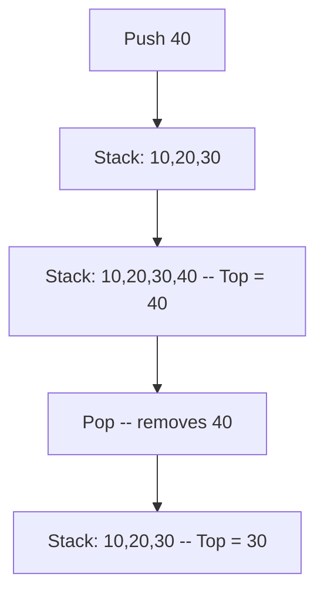
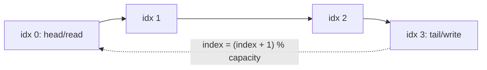

# Stack and Queue

> **Scope** — LIFO/FIFO fundamentals, array vs linked implementations, circular buffers, monotonic stacks/deques, two-structure emulation (stack↔queue), and stack-driven expression parsing/evaluation.

**Contents**
- [1. Core Concepts](#1-core-concepts)
- [2. Complexity Reference](#2-complexity-reference)
- [3. C# Toolbox](#3-c-toolbox)
- [4. Core Patterns / Techniques](#4-core-patterns--techniques)
- [5. Classic Problems & Solutions](#5-classic-problems--solutions)
- [6. Pattern Recognition](#6-pattern-recognition)
- [7. Interview Focus](#7-interview-focus)
- [8. Common Traps & Edge Cases](#8-common-traps--edge-cases)
- [9. Related LeetCode Problems](#9-related-leetcode-problems)
- [10. Cheat Sheet](#10-cheat-sheet)
- [See Also](#see-also)

---

## 1. Core Concepts

**Stack (LIFO)** — last pushed is first popped; only the top is accessible.
**Queue (FIFO)** — first enqueued is first dequeued; remove at front/head, add at rear/tail.



### Array-backed vs linked-backed

| Aspect | Array-backed | Linked-list-backed |
|---|---|---|
| Push/Pop (stack) | O(1) amortised; rare O(n) resize copy | O(1) worst-case at head |
| Enqueue/Dequeue (queue) | O(1) amortised with circular indices | O(1) with head/tail references |
| Growth | Fixed array can overflow; dynamic array doubles | Bounded only by heap memory |
| Cache locality | Excellent contiguous storage | Poor pointer chasing |
| Extra memory | Possible unused capacity | Node object + pointer(s) per element |

A stack tracks one end. A queue tracks two; without circular indices, removing from the front of an array causes O(n) shifting or false overflow.

### Amortised O(1) push via doubling

Dynamic arrays resize from capacity `c` to `2c` when full.

- One resize costs O(n), but resize copies happen at sizes `1, 2, 4, 8, ..., n`.
- Total copy work across `n` pushes is `1 + 2 + 4 + ... + n < 2n`.
- Therefore push is O(1) amortised, though an individual push can still spike to O(n).

### Circular queue (ring buffer)

Array-backed queue where `head` is the next read slot and `tail` is the next write slot. Advance both with `(index + 1) % capacity`; this reuses freed slots instead of shifting elements.



| Full-vs-empty resolution | Idea | Cost |
|---|---|---|
| Explicit `size` counter | Empty when `size == 0`; full when `size == capacity` | 1 extra int, simplest for C# |
| Sacrificial slot | Empty when `head == tail`; full when `(tail + 1) % capacity == head` | Wastes 1 slot |

> Default to the size-counter approach; mention the sacrificial-slot alternative if asked about classic ring buffers.

---
## 2. Complexity Reference

| Operation | Time | Space | Notes |
|---|---|---|---|
| Stack Push/Pop/Peek | O(1) | O(1) | Amortised O(1) for array-backed with doubling |
| Queue Enqueue/Dequeue/Front (circular or linked) | O(1) | O(1) | Naive array queue dequeue is O(n) (shifts elements) |
| Stack/Queue Search (by value) | O(n) | O(1) | No index into the middle |
| Queue-from-two-stacks Enqueue | O(1) | O(1) | Push straight onto input stack |
| Queue-from-two-stacks Dequeue | O(1) amortised, O(n) worst case | O(1) | Each element crosses stacks at most once — see §4 |
| Stack-from-two-queues Push | O(n) or O(1) | O(1) | Depends on which side you make costly |
| Min-Stack getMin | O(1) | O(n) | Auxiliary stack tracks running min |
| Monotonic stack scan (NGE/NSE) | O(n) | O(n) | Each element pushed once, popped at most once |
| Monotonic deque (sliding window max) | O(n) | O(k) | Each index enters/leaves deque once |
| Infix → Postfix (Shunting-yard) | O(n) | O(n) | One pass, operator stack |
| Postfix evaluation | O(n) | O(n) | Operand stack |
| Balanced parentheses check | O(n) | O(n) | Stack of open brackets or expected closers |

**Why monotonic scans are O(n), not O(n²):** the inner `while` loop pops elements, but every element is pushed **exactly once** and popped **at most once** over the entire run. Total pushes + pops <= 2n, so the amortised cost per index is O(1) even though a single index can trigger many pops.

---

## 3. C# Toolbox

| Type / Member | Use for | Gotchas |
|---|---|---|
| `Stack<T>` | LIFO — array-backed, doubling growth | `Pop`/`Peek` throw `InvalidOperationException` on empty stack — prefer `TryPop`/`TryPeek`; enumeration and `ToArray()` are top-to-bottom (top first) |
| `Queue<T>` | FIFO — array-backed circular buffer internally | `Dequeue`/`Peek` throw on empty — prefer `TryDequeue`/`TryPeek`; enumeration is front-to-back |
| `LinkedList<T>` | Deque emulation — `AddFirst`/`AddLast`/`RemoveFirst`/`RemoveLast` all O(1) | No built-in `Deque<T>` in .NET; use this, `List<T>` with a moving head index, two stacks, or a manual ring buffer |
| `PriorityQueue<TElement,TPriority>` (.NET 6+) | Min-heap keyed by `TPriority` | **Not stable** — equal priorities can dequeue in any relative order; it is a **min-heap by default** — negate the key or supply `IComparer<TPriority>` for max-heap behaviour |
| `TryPop`/`TryPeek`/`TryDequeue` | Safe access without try/catch | Return `bool`, out param for the value — prefer these over checking `Count` then calling the throwing member when emptiness is possible |

```csharp
// Deque emulation via LinkedList<T> — O(1) at both ends
var deque = new LinkedList<int>();
deque.AddLast(5);
deque.AddFirst(1);
int front = deque.First!.Value;  // 1
deque.RemoveFirst();

// Max-heap PriorityQueue via negated priority
int priority = 10;
var maxPq = new PriorityQueue<string, int>();
maxPq.Enqueue("task", -priority);   // negate on enqueue
// or supply a reversed comparer:
var maxPq2 = new PriorityQueue<string, int>(Comparer<int>.Create((a, b) => b.CompareTo(a)));
```

> **Important** — `PriorityQueue<TElement, TPriority>` sits at the boundary of this topic: it behaves like a queue conceptually (produce/consume) but is heap-backed, giving O(log n) enqueue/dequeue instead of O(1). See [Heaps](../Heaps/Heaps.md) for the full heap treatment; here it only matters as "the queue that isn't FIFO."

---

## 4. Core Patterns / Techniques

### Stack using two Queues

**When to use** — trick question to test understanding of LIFO emulation with FIFO primitives; rarely production code.

**Template (C#)** — costly push variant (keeps newest element at the front of the active queue):

```csharp
public class MyStack
{
    private Queue<int> q1 = new();
    private Queue<int> q2 = new();

    public void Push(int x)
    {
        q2.Enqueue(x);
        while (q1.Count > 0) q2.Enqueue(q1.Dequeue());
        (q1, q2) = (q2, q1);           // swap references
    }

    public int Pop() => q1.Dequeue();  // front of q1 is always the most recent push
    public int Top() => q1.Peek();
    public bool Empty() => q1.Count == 0;
}
```

**Complexity** — Push O(n) (rebuilds the queue so the newest item is at the front), Pop/Top O(1). Space O(n).

**Pitfalls** — swapping `q1`/`q2` references (not copying) is what keeps this O(n) rather than O(n²); forgetting the swap silently reverts to the wrong active queue.

**One-queue variant** — rotate the queue immediately after each push so the newest element is always at the front:

```csharp
public class MyStackOneQueue
{
    private readonly Queue<int> queue = new();

    public void Push(int x)
    {
        queue.Enqueue(x);
        int rotations = queue.Count - 1;
        for (int i = 0; i < rotations; i++)
            queue.Enqueue(queue.Dequeue());
    }

    public int Pop() => queue.Dequeue();
    public int Top() => queue.Peek();
    public bool Empty() => queue.Count == 0;
}
```

### Queue using two Stacks

**When to use** — same interview motif, inverted; also illustrates the amortised argument tested in interviews.

**Template (C#)** — costly dequeue variant (`inStack` absorbs enqueues, `outStack` serves dequeues):

```csharp
public class MyQueue
{
    private Stack<int> inStack = new();
    private Stack<int> outStack = new();

    public void Push(int x) => inStack.Push(x);

    public int Pop()
    {
        MoveIfNeeded();
        return outStack.Pop();
    }

    public int Peek()
    {
        MoveIfNeeded();
        return outStack.Peek();
    }

    public bool Empty() => inStack.Count == 0 && outStack.Count == 0;

    private void MoveIfNeeded()
    {
        if (outStack.Count == 0)
            while (inStack.Count > 0)
                outStack.Push(inStack.Pop());
    }
}
```

**Complexity — amortised argument**: each element is pushed onto `inStack` once, popped from `inStack` once during transfer, pushed onto `outStack` once, and popped from `outStack` once. Across a sequence, each element causes at most four stack operations, so amortised per-op cost is **O(1)** even though a single `Pop()` that triggers the transfer costs O(n) in the worst case.

**Pitfalls** — only transfer when `outStack` is empty (transferring every call destroys the amortised bound and can reorder elements incorrectly).

### Min-Stack (O(1) getMin)

**When to use** — need running min/max alongside normal stack operations, without re-scanning.

**Template (C#)** — auxiliary stack storing the running minimum at each depth:

```csharp
public class MinStack
{
    private readonly Stack<int> stack = new();
    private readonly Stack<int> minStack = new();

    public void Push(int val)
    {
        stack.Push(val);
        int currentMin = minStack.Count == 0 ? val : Math.Min(val, minStack.Peek());
        minStack.Push(currentMin);
    }

    public void Pop()
    {
        stack.Pop();
        minStack.Pop();
    }

    public int Top() => stack.Peek();
    public int GetMin() => minStack.Peek();
}
```

**Complexity** — All ops O(1) time; O(n) extra space for the shadow stack.

| Variant | Extra space | Notes |
|---|---|---|
| Pair `(value, minSoFar)` per entry | O(n) | Simplest; duplicate minima are automatically correct |
| Shadow min stack at every depth (above) | O(n) | Same behaviour, keeps values and minima separate |
| Min stack only on new min | O(n) worst | Push duplicates too, or store `(min, count)`, otherwise popping one duplicate loses the minimum |
| Encoded value / single stack | O(1) extra | Clever but overflow-prone; mention only if asked to optimize auxiliary storage |

**Pitfalls** — pushing `val` alone without recomputing `currentMin` on every push breaks the min after a smaller value is popped. If using the encoded single-stack variant (`2*x - min` marker), use `long`; `int` arithmetic can overflow.

### Monotonic Stack — Next Greater / Next Smaller Element

**When to use** — "for each element, find the nearest element to the left/right that is greater/smaller" — the umbrella pattern behind daily temperatures, histogram area, rain water, stock span, sum of subarray minimums, and remove-k-digits.

A monotonic stack stores **unresolved candidates**. Popping is not cleanup; it has meaning: the current element just proved something about the popped element (for next-right queries) or removed a blocker so the new top is the nearest valid previous element (for previous-left queries).

| Want | Scan | Stack invariant | Pop while | Pop means / duplicate rule |
|---|---|---|---|---|
| Next greater to the right | Left → right | Decreasing indices by value | `nums[stack.Peek()] < nums[i]` | Current index is the first strictly greater value for each popped index; equal values stay unresolved |
| Next smaller to the right | Left → right | Increasing indices by value | `nums[stack.Peek()] > nums[i]` | Current index is the first strictly smaller value for each popped index; equal values stay unresolved |
| Previous greater to the left | Left → right | Decreasing indices by value | `nums[stack.Peek()] <= nums[i]` | New top is previous strictly greater; use `<` instead if greater-or-equal is allowed |
| Previous smaller to the left | Left → right | Increasing indices by value | `nums[stack.Peek()] >= nums[i]` | New top is previous strictly smaller; use `>` instead if smaller-or-equal is allowed |

> **Interview Tip** — Store **indices**, not values, whenever you may need a distance, span, rectangle width, expiry, or duplicate tie-break. You can always read `nums[index]`, but a value-only stack loses position information.

**Template (C#)** — Next Greater Element value to the right, scanning right→left:

```csharp
public int[] NextGreaterToRight(int[] nums)
{
    int n = nums.Length;
    var result = new int[n];
    var stack = new Stack<int>();          // candidate values; top is the nearest surviving greater value

    for (int i = n - 1; i >= 0; i--)
    {
        while (stack.Count > 0 && stack.Peek() <= nums[i])
            stack.Pop();                  // current value dominates this candidate for all earlier indices

        result[i] = stack.Count == 0 ? -1 : stack.Peek();
        stack.Push(nums[i]);
    }
    return result;
}
```

This value-stack version is only safe because the answer is a value. The stack is strictly increasing from top-to-bottom after the pop loop; using `<=` means duplicates are not considered "greater".

The equally common **index-stack, left→right** variant (used for histogram/temperatures) pushes indices and resolves answers when a *pop* happens rather than up front.

Stack invariant for Daily Temperatures: indices of unresolved days with temperatures decreasing bottom-to-top. Popping means the current day is the first warmer day for the popped index; the comparison is strict (`<`) because equal temperature is not warmer. Unpopped indices correctly keep the default `0`.

```csharp
public int[] DailyTemperatures(int[] temps)
{
    var result = new int[temps.Length];
    var indices = new Stack<int>();        // unresolved indices; temperatures decrease bottom-to-top

    for (int i = 0; i < temps.Length; i++)
    {
        while (indices.Count > 0 && temps[indices.Peek()] < temps[i])
        {
            int prev = indices.Pop();
            result[prev] = i - prev;       // current day is the next warmer day for prev
        }
        indices.Push(i);
    }
    return result;
}
```

**Complexity** — O(n) time: each index is pushed once and popped at most once, so total work across the whole scan is bounded by 2n regardless of how the pops cluster. O(n) space for the stack.

**Applications**:

| Problem | Stack holds + invariant | Pop condition | Pop means / drain |
|---|---|---|---|
| Daily Temperatures | Indices; temperatures decreasing | `temps[top] < temps[i]` | Current day is next warmer day; leftover indices have answer `0` |
| Largest Rectangle in Histogram | Indices; heights increasing | `heights[top] >= currentHeight` plus sentinel `0` | Current index is right boundary; new top is previous smaller boundary |
| Maximal Rectangle | Same histogram stack per matrix row | Same as LC 84 | Rebuild heights per row, sentinel drains each row's histogram |
| Trapping Rain Water (stack method) | Indices; heights decreasing | `height[top] < height[i]` | Popped index is valley bottom bounded by new top and current index; leftover has no right wall |
| Stock Span | `(price, span)` pairs; prices decreasing | `top.Price <= price` | Popped spans merge into current span because current price covers them |
| Sum of Subarray Minimums | Indices; increasing with asymmetric duplicate ownership | Left pass pops `>=`, right pass pops `>` | Each value owns exactly `leftChoices * rightChoices` subarrays |
| Remove K Digits | Kept digits; non-decreasing left-to-right | `topDigit > currentDigit` while `k > 0` | Delete a previous larger digit; after scan, pop the suffix if `k` remains |
| 132 Pattern | Decreasing scan from right | Pop while `nums[i] > top` | Popped value becomes the best "2" candidate |

**Pitfalls** — using `<` vs `<=` in the pop condition changes whether equal elements are kept, merged, or assigned to one side; get this wrong and duplicate values produce off-by-one spans/areas/counts.

### Monotonic Deque — Sliding Window Maximum

**When to use** — running max (or min) over a fixed-size window as it slides across an array, in O(n) instead of O(n·k) brute force or O(n log k) heap-with-lazy-deletion.

Maintain a **deque of indices** whose corresponding values are decreasing front→back. The front is always the max for the current window; indices are mandatory so expired elements can be evicted from the front. The back-pop uses `<=`, so an equal newer value replaces an older equal value and survives longer.

**Template (C#)**:

```csharp
public int[] MaxSlidingWindow(int[] nums, int k)
{
    if (k <= 0 || nums.Length == 0 || k > nums.Length)
        return Array.Empty<int>();

    int[] result = new int[nums.Length - k + 1];
    int write = 0;
    var deque = new LinkedList<int>();     // indices; values decrease front-to-back

    for (int i = 0; i < nums.Length; i++)
    {
        if (deque.Count > 0 && deque.First!.Value <= i - k)
            deque.RemoveFirst();           // index fell out of the window

        while (deque.Count > 0 && nums[deque.Last!.Value] <= nums[i])
            deque.RemoveLast();            // current value dominates older smaller/equal values

        deque.AddLast(i);

        if (i >= k - 1)
            result[write++] = nums[deque.First!.Value];
    }
    return result;
}
```

**Complexity** — O(n) time: each index is added to the deque exactly once and removed at most once (from either end), so total deque operations <= 2n. O(k) space for the deque.

> **Interview Tip** — A deque beats a heap for window max/min because dominated elements can be discarded permanently. It does **not** solve window median/order-statistics; use two heaps, a balanced tree, or indexed heaps there.

**Pitfalls** — check the *expiry* condition (`deque.First!.Value <= i - k`) before the *dominance* condition, otherwise you can compare against a stale front index; for sliding window **minimum**, flip the dominance comparison (`>=`).

### Recursion to Explicit Stack

**When to use** — recursive DFS/backtracking would overflow on deep input, or the interviewer asks for the iterative version. Push the same state you would have passed as recursive arguments.

| Recursion concept | Explicit-stack equivalent |
|---|---|
| Call frame | Tuple/object holding arguments and progress |
| Base case | Skip pushing invalid/null states |
| Recursive-call order | Push children in reverse of desired processing order |
| Runtime stack depth | Heap-allocated stack you control |

```csharp
public void DfsIterative(TreeNode? root)
{
    if (root is null) return;

    var stack = new Stack<TreeNode>();
    stack.Push(root);

    while (stack.Count > 0)
    {
        TreeNode node = stack.Pop();
        // Visit node here.

        if (node.Right is not null) stack.Push(node.Right);
        if (node.Left is not null) stack.Push(node.Left);
    }
}
```

> **Remember** — To convert recursion to iteration, push exactly the state the recursive call would have received; push right before left when you want left processed first.

---

## 5. Classic Problems & Solutions

### Valid Parentheses (LC 20)

Push expected closing brackets; on a closing bracket, pop and compare. Valid iff the stack is empty at the end.

```csharp
public bool IsValid(string s)
{
    var expectedClosers = new Stack<char>();

    foreach (char c in s)
    {
        switch (c)
        {
            case '(':
                expectedClosers.Push(')');
                break;
            case '[':
                expectedClosers.Push(']');
                break;
            case '{':
                expectedClosers.Push('}');
                break;
            case ')' or ']' or '}':
                if (!expectedClosers.TryPop(out char expected) || expected != c)
                    return false;
                break;
            default:
                return false;
        }
    }

    return expectedClosers.Count == 0;
}
```

| Approach | Time | Space | Why |
|---|---|---|---|
| Stack of expected closers | O(n) | O(n) | Nesting resolves most-recent-open first |

### Longest Valid Parentheses (LC 32)

Index stack seeded with `-1`. On `(` push index; on `)`, pop. If empty, push current index as the new base; otherwise `i - stack.Peek()` is a valid length.

```csharp
public int LongestValidParentheses(string s)
{
    var stack = new Stack<int>();
    stack.Push(-1);
    int maxLen = 0;

    for (int i = 0; i < s.Length; i++)
    {
        if (s[i] == '(')
        {
            stack.Push(i);
        }
        else
        {
            stack.Pop();
            if (stack.Count == 0)
                stack.Push(i);
            else
                maxLen = Math.Max(maxLen, i - stack.Peek());
        }
    }
    return maxLen;
}
```

| Approach | Time | Space | Notes |
|---|---|---|---|
| Index stack + `-1` sentinel | O(n) | O(n) | Sentinel is the base before the current valid run |
| Two counter passes | O(n) | O(1) | Left-to-right catches excess `)`, right-to-left catches excess `(` |

### Evaluate Reverse Polish Notation (LC 150)

Postfix expressions need only an operand stack. For each operator, pop `right` first, then `left`.

```csharp
public int EvalRpn(string[] tokens)
{
    var stack = new Stack<int>();

    foreach (string token in tokens)
    {
        if (int.TryParse(token, out int number))
        {
            stack.Push(number);
            continue;
        }

        int right = stack.Pop();
        int left = stack.Pop();
        stack.Push(token switch
        {
            "+" => left + right,
            "-" => left - right,
            "*" => left * right,
            "/" => left / right,
            _ => throw new ArgumentException($"Unknown operator '{token}'.")
        });
    }

    return stack.Pop();
}
```

| Approach | Time | Space | Notes |
|---|---|---|---|
| Operand stack | O(n) | O(n) | C# integer division truncates toward zero |

### Basic Calculator I/II (LC 224 / LC 227)

LC 224 uses a stack of saved `(result, sign)` context for parentheses. Flush the current multi-digit number before changing sign or closing a parenthesis.

```csharp
public int Calculate(string s)
{
    var stack = new Stack<int>();
    int result = 0, number = 0, sign = 1;

    foreach (char c in s)
    {
        if (char.IsDigit(c))
        {
            number = number * 10 + (c - '0');
        }
        else if (c == '+')
        {
            result += sign * number;
            number = 0;
            sign = 1;
        }
        else if (c == '-')
        {
            result += sign * number;
            number = 0;
            sign = -1;
        }
        else if (c == '(')
        {
            stack.Push(result);
            stack.Push(sign);
            result = 0;
            sign = 1;
        }
        else if (c == ')')
        {
            result += sign * number;
            number = 0;
            result *= stack.Pop();
            result += stack.Pop();
        }
    }

    return result + sign * number;
}
```

| Variant | Time | Space | Delta |
|---|---|---|---|
| LC 224: `+`, `-`, parentheses | O(n) | O(n) | Push previous result and sign on `(`; combine on `)` |
| LC 227: `+`, `-`, `*`, `/`, no parentheses | O(n) | O(n) | Use a term stack: push signed terms for `+/-`, immediately fold multiply/divide into the previous term |

### Decode String (LC 394)

At `[`, push the repeat count and previous prefix; at `]`, pop context and append the decoded segment `repeat` times.

```csharp
public string DecodeString(string s)
{
    var counts = new Stack<int>();
    var prefixes = new Stack<System.Text.StringBuilder>();
    var current = new System.Text.StringBuilder();
    int count = 0;

    foreach (char c in s)
    {
        if (char.IsDigit(c))
        {
            count = count * 10 + (c - '0');
        }
        else if (c == '[')
        {
            counts.Push(count);
            prefixes.Push(current);
            count = 0;
            current = new System.Text.StringBuilder();
        }
        else if (c == ']')
        {
            var decoded = current;
            current = prefixes.Pop();

            int repeat = counts.Pop();
            for (int i = 0; i < repeat; i++) current.Append(decoded);
        }
        else
        {
            current.Append(c);
        }
    }

    return current.ToString();
}
```

| Approach | Time | Space | Notes |
|---|---|---|---|
| Stack of counts + prefixes | O(output length) | O(n + depth) | Use `StringBuilder`; repeated output size dominates |

### Asteroid Collision (LC 735)

Stack simulation of unresolved survivors, not a generic physics simulation.

| Pattern | Time | Space | Twist |
|---|---|---|---|
| Survivor stack | O(n) | O(n) | Only `stack.Peek() > 0` collides with `current < 0`; resolve in a loop until one dies or no collision remains |

Return order trap: `Stack<T>.ToArray()` is top-to-bottom, so reverse when the stack represents left-to-right survivors.

### Largest Rectangle in Histogram (LC 84)

Increasing stack of indices. Popping `>= currentHeight` means current index is the first right boundary; new top is the previous smaller boundary. Sentinel height `0` drains leftover bars.

```csharp
public int LargestRectangleArea(int[] heights)
{
    int n = heights.Length, maxArea = 0;
    var stack = new Stack<int>();

    for (int i = 0; i <= n; i++)
    {
        int currentHeight = i == n ? 0 : heights[i];
        while (stack.Count > 0 && heights[stack.Peek()] >= currentHeight)
        {
            int height = heights[stack.Pop()];
            int leftBoundary = stack.Count == 0 ? -1 : stack.Peek();
            maxArea = Math.Max(maxArea, height * (i - leftBoundary - 1));
        }

        if (i < n) stack.Push(i);
    }
    return maxArea;
}
```

| Approach | Time | Space | Why |
|---|---|---|---|
| Monotonic stack | O(n) | O(n) | Each bar's maximal rectangle is resolved once, when a smaller-or-equal right boundary or sentinel appears |

### Maximal Rectangle (LC 85)

Map to LC 84: maintain `heights[c] = consecutive ones ending at current row`, then run largest-rectangle-in-histogram once per row.

| Pattern | Time | Space | Twist |
|---|---|---|---|
| Histogram per row + LC 84 | O(rows * cols) | O(cols) | Reset height to `0` on matrix `0`; sentinel drains each row's histogram |

### Trapping Rain Water (LC 42)

Stack view: decreasing index stack; a pop is a valley bottom, bounded by the new stack top and current index. Strict `<` keeps equal-height walls from creating zero-height layers.

```csharp
public int TrapWithStack(int[] height)
{
    int water = 0;
    var stack = new Stack<int>();

    for (int i = 0; i < height.Length; i++)
    {
        while (stack.Count > 0 && height[stack.Peek()] < height[i])
        {
            int bottom = stack.Pop();
            if (stack.Count == 0) break;

            int left = stack.Peek();
            int width = i - left - 1;
            int boundedHeight = Math.Min(height[left], height[i]) - height[bottom];
            water += width * boundedHeight;
        }
        stack.Push(i);
    }

    return water;
}
```

Two-pointer final answer: advance the side with smaller running max; that side determines the water level with certainty.

```csharp
public int Trap(int[] height)
{
    if (height is null || height.Length == 0) return 0;

    int left = 0, right = height.Length - 1;
    int leftMax = height[left], rightMax = height[right];
    int water = 0;

    while (left < right)
    {
        if (leftMax < rightMax)
        {
            left++;
            leftMax = Math.Max(leftMax, height[left]);
            water += leftMax - height[left];
        }
        else
        {
            right--;
            rightMax = Math.Max(rightMax, height[right]);
            water += rightMax - height[right];
        }
    }
    return water;
}
```

| Approach | Time | Space | Notes |
|---|---|---|---|
| Monotonic stack | O(n) | O(n) | Computes bounded water layers on pop |
| Two pointers | O(n) | O(1) | Preferred final answer after explaining the stack intuition |

### Sum of Subarray Minimums (LC 907)

Contribution counting with an increasing index stack.

| Pattern | Time | Space | Twist |
|---|---|---|---|
| Monotonic stack boundaries | O(n) | O(n) | `arr[i]` contributes `arr[i] * (i - prevLess) * (nextLessOrEqual - i)` |

Duplicate rule: make exactly one side strict. Common choice: left pass pops `>=` to get previous strictly less; right pass pops `>` to get next less-or-equal.

### Remove K Digits (LC 402)

Greedy monotonic stack of kept digits, non-decreasing left-to-right.

| Pattern | Time | Space | Twist |
|---|---|---|---|
| Monotonic digit stack | O(n) | O(n) | While `k > 0` and `top > current`, pop the previous larger digit so current moves left |

After the scan, if `k` remains, pop the suffix; reverse `Stack<T>.ToArray()` output and trim leading zeroes. Return `"0"` if empty.

### Sliding Window Maximum (LC 239)

Direct §4 monotonic deque template: store indices, expire `front <= i - k`, pop dominated back indices `nums[back] <= nums[i]`, then front is the max.

| Approach | Time | Space | Notes |
|---|---|---|---|
| Monotonic deque | O(n) | O(k) | Beats heap for fixed-window max/min because dominated indices are discarded permanently |

### Stack using Queues / Queue using Stacks (LC 225 / LC 232)

Use the §4 templates. The follow-up is the trade-off: which operation is cheap, which is costly, and why two-stack queue operations are still amortised O(1) because each element transfers once.

### Expression Evaluation (Infix ↔ Postfix, Shunting-Yard)

Shunting-yard converts infix to postfix using an operator stack: left-associative operators pop higher-or-equal precedence; right-associative operators pop only higher precedence. It is O(n) time and O(n) space after tokenization.

Modern interviews more often ask RPN evaluation (LC 150) or Basic Calculator variants than a full shunting-yard implementation. Know the idea, but spend coding time on operand-stack evaluation and calculator state handling.

| Topic | Key check |
|---|---|
| Precedence | `*` and `/` bind before `+` and `-` |
| Associativity | `^` is usually right-associative; `+`, `-`, `*`, `/` are left-associative |
| Postfix eval | Pop `right`, then `left`; order matters for `-` and `/` |

---
## 6. Pattern Recognition

| Statement cue | Pattern |
|---|---|
| Balanced brackets, nested tags/calls, undo/redo | Plain stack |
| Evaluate expression, calculator, RPN | Operand/operator stack |
| `k[...]` nested repetition decoding | Stack of counts + previous prefixes |
| Next/previous greater/smaller, span, first boundary that breaks a condition | Monotonic stack |
| Largest rectangle, daily temperatures, stock span, subarray minimum contribution | Monotonic stack with indices |
| Fixed-window maximum/minimum | Monotonic deque |
| Process in arrival order, level order, BFS shortest path | Plain queue |
| Circular buffer, hit counter, fixed-capacity recent events | Ring-buffer queue |
| Need min/max in O(1) alongside push/pop | Min/max stack |
| Opposite-moving unresolved survivors collide | Stack simulation |
| Recursive DFS/backtracking may overflow | Explicit stack of call frames |
| Bounded producer/consumer, backpressure, async work queue | Queue abstraction; in .NET prefer `Channel<T>` or `ConcurrentQueue<T>` plus signalling |
| Highest priority first, kth-largest stream, merge k sorted | Heap / `PriorityQueue<TElement,TPriority>`, not FIFO |

---
## 7. Interview Focus

- **Invariants over code memory**: state what the stack/deque holds, its monotonic order, and what a pop proves.
- **Amortised proof**: for two-stack queues and monotonic scans, each element enters once and leaves once; that is the expected O(n)/O(1-amortised) argument.
- **Strict vs non-strict comparisons**: duplicates change ownership in histograms, subarray-minimums, and window extrema; justify `<` vs `<=`.
- **Index vs value stacks**: store indices for distance, width, expiry, duplicate tie-breaks, or post-loop sentinel handling.
- **When not to force a monotonic stack**: kth largest/smallest, priority scheduling, and window median need heaps/trees, not nearest-boundary logic.
- **Deque vs heap**: deque is O(n) for fixed-window max/min; heap is O(n log k) but supports more general priorities.
- **Production queues**: discuss bounded capacity, cancellation, backpressure, `ConcurrentQueue<T>` for lock-free FIFO, and `Channel<T>` for async producer-consumer workflows.
- **Recursion follow-up**: an explicit stack avoids stack overflow on deep/skewed inputs while preserving traversal order by pushing children in reverse.

---
## 8. Common Traps & Edge Cases

| Trap | Why it bites | Fix |
|---|---|---|
| Popping/peeking an empty stack or queue | `Stack<T>.Pop()`/`Queue<T>.Dequeue()` throw `InvalidOperationException` | Use `TryPop`/`TryDequeue`, or check `Count > 0` right before the call |
| Ring buffer full-vs-empty ambiguity | `head == tail` is ambiguous without extra state | Track an explicit `size` counter, or sacrifice one slot |
| Off-by-one modulo in circular queue | Using `tail % capacity` instead of `(tail + 1) % capacity`, or forgetting to wrap `head` too | Always advance **then** wrap: `index = (index + 1) % capacity` |
| Deep recursion instead of explicit stack | Unbounded recursion depth on large/skewed input causes real stack overflow | Convert to an explicit `Stack<T>` driving an iterative loop |
| `PriorityQueue<TElement,TPriority>` assumed max-heap | .NET's `PriorityQueue` is a **min-heap** by default | Negate priority values or pass a reversed `IComparer<TPriority>` |
| `PriorityQueue` assumed stable | Equal-priority elements are not guaranteed FIFO order internally | Add a secondary tie-breaker (e.g., insertion sequence number) to the priority tuple if stability is required |
| Assuming built-in `Deque<T>` | .NET has no general-purpose `Deque<T>` | Use `LinkedList<T>` for O(1) ends, `List<T>` with a moving head, or write a ring buffer |
| Returning `Stack<T>.ToArray()` directly | It returns top-to-bottom, often reversing left-to-right survivor order | Reverse when the stack models original scan order |
| Monotonic stack `<` vs `<=` confusion | Determines whether equal values are kept, merged, or owned by one side | Match the strict/non-strict condition to the problem's definition and duplicate policy |
| Sum-of-minimums duplicate ownership | Equal values can be counted twice or skipped | Use one strict boundary and one non-strict boundary consistently |
| Sliding-window deque stores values | Values alone cannot expire the correct duplicate when it leaves the window | Store indices; evict front while `index <= i - k` |
| Expression parser reads one char at a time | Multi-digit numbers, spaces, and unary sign are mishandled | Accumulate `number = number * 10 + digit`; flush before `+`, `-`, `(`, `)` transitions |
| Postfix operand pop order for `-`/`/` | First pop is the right operand, not the left | `right = pop(); left = pop(); push(left OP right)` |
| Sliding window deque expiry check order | Checking dominance before expiry can compare a stale index | Expire out-of-window indices from the front **before** enforcing monotonic order at the back |

---

## 9. Related LeetCode Problems

> The full tiered problem set lives in [Practice Roadmap](../DSAPatterns/Practice-Roadmap.md). The list below is the minimum set for this topic.

| # | Problem | Difficulty | Pattern |
|---|---|---|---|
| 20 | Valid Parentheses | Easy | Stack of expected closers |
| 32 | Longest Valid Parentheses | Hard | Index stack + sentinel |
| 42 | Trapping Rain Water | Hard | Monotonic stack; two pointers final |
| 84 | Largest Rectangle in Histogram | Hard | Monotonic stack + sentinel drain |
| 85 | Maximal Rectangle | Hard | LC 84 per row over heights |
| 150 | Evaluate Reverse Polish Notation | Medium | Operand stack |
| 155 | Min Stack | Medium | Auxiliary running-min stack |
| 224 / 227 | Basic Calculator I/II | Hard / Medium | Parenthesis context stack; precedence term stack |
| 225 / 232 | Stack/Queue Emulation | Easy | Two queues; two stacks amortised |
| 239 | Sliding Window Maximum | Hard | Monotonic deque |
| 394 | Decode String | Medium | Count + prefix stacks |
| 402 | Remove K Digits | Medium | Greedy monotonic digit stack |
| 735 | Asteroid Collision | Medium | Survivor stack simulation |
| 739 | Daily Temperatures | Medium | Monotonic stack, resolve on pop |
| 907 | Sum of Subarray Minimums | Medium | Contribution counting with duplicate ownership |

---
## 10. Cheat Sheet

- Stack = LIFO/top only; queue = FIFO/head+tail.
- Dynamic array push is O(1) amortised because doubling copies < 2n total items over n pushes.
- Ring buffer: advance with `(index + 1) % capacity`; disambiguate full/empty with `size` or one sacrificial slot.
- .NET has no built-in `Deque<T>`; use `LinkedList<T>`, a moving-head `List<T>`, or a manual ring buffer.
- Monotonic stack: each index is pushed once, popped at most once; a pop must prove a boundary/answer.
- Store indices for distance, width, expiry, duplicate ownership, or sentinel drains.
- Next greater/smaller usually fills answers on pop; previous greater/smaller reads the new top after popping blockers.
- Histogram: append sentinel `0`; popped width is `i - previousSmallerIndex - 1`.
- Maximal rectangle = maintain per-column heights and run histogram per row.
- Trapping rain water: stack explains valleys; two pointers is O(n)/O(1) final.
- Subarray minimums: contribution is `value * leftChoices * rightChoices`; one duplicate boundary strict, the other non-strict.
- Remove K Digits: pop while `k > 0` and `top > current`; if `k` remains, trim suffix; strip leading zeroes.
- Monotonic deque: expire front indices first, pop dominated back indices second, read front as window extreme.
- Deque beats heap for fixed-window max/min; heaps/trees are needed for median, kth, or general priority.
- Two-stack queue: refill `outStack` only when empty; each element transfers once => amortised O(1).
- Stack-from-queue: rotate after push to keep newest at the front, or choose the opposite cost trade-off.
- Min-stack: push running min per depth, `(min,count)`, or encoded `long`; duplicates and overflow are the bugs.
- `Stack<T>.ToArray()` is top-to-bottom; reverse when preserving scan order.
- RPN/calculators: accumulate multi-digit numbers; for binary ops pop `right` then `left`.
- Production producer-consumer code: prefer `ConcurrentQueue<T>` plus signalling or `Channel<T>` for bounded async queues/backpressure.
- Prefer `TryPop`/`TryPeek`/`TryDequeue` when empty access is possible.

**Related notes:** [Heaps](../Heaps/Heaps.md) · [Arrays and Strings](../Arrays%20and%20Strings/Arrays%20and%20Strings.md) · [Trees](../Trees/Trees.md) · [DSA Patterns](../DSAPatterns/DSAPatterns.md)

---
## See Also

- [Arrays and Strings](../Arrays%20and%20Strings/Arrays%20and%20Strings.md) — Monotonic stacks answer nearest-greater/smaller queries over an array.
- [Trees](../Trees/Trees.md) — Iterative traversals replace recursion with an explicit stack.
- [Graphs](../Graphs/Graphs.md) — BFS is a queue, DFS is a stack.
- [Heaps](../Heaps/Heaps.md) — A monotonic deque beats a heap for sliding-window extrema.
- [DSA Patterns](../DSAPatterns/DSAPatterns.md) — master index: pattern selection flowchart and complexity-from-constraints.
- [Practice Roadmap](../DSAPatterns/Practice-Roadmap.md) — the tiered problem set to drill this topic.
