# System Design

Design complex systems that are scalable, reliable, and maintainable and solves a real world problem

- Product Design - Uber, Whatsapp, Instagram, Twitter, Netflix
- Infrastructure Design - Load Balancer, Caching, Sharding, Data Modeling, Message Queues

## Framework

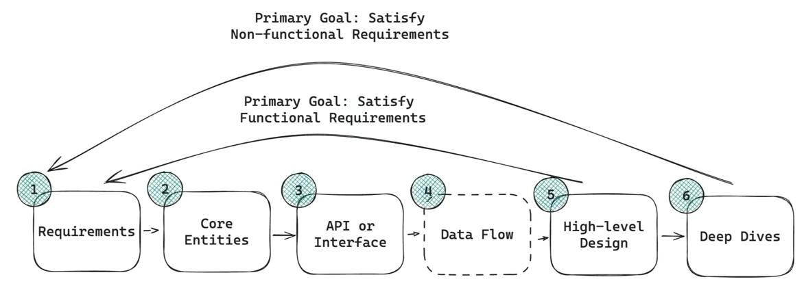

1. Requirements Gathering - Functional and Non-Functional Requirements
2. Core Entities
3. API Design
4. Data Flow
5. High Level Design > Satisfy Functional Requirements
6. Deep Dives > Satisfy Non-Functional Requirements

## Evaluatiuon Criteria

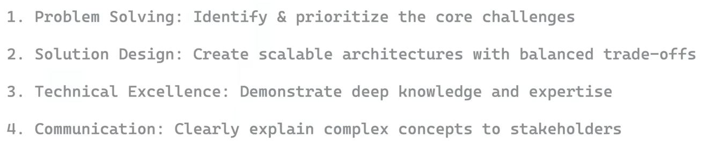

## Fundamentals

1. Storage - DB, ACID vs BASE
2. Scalability - Vertical vs Horizontal Compute, Scaling Storage
3. Networking - OSI (Application, Transport, Network Layers)
4. Latency Throughput and Performance
5. Fault Tolerance and Redundancy
6. CAP Theorem - Consistency, Availability, Partition Tolerance [Essential for Distributed Systems]

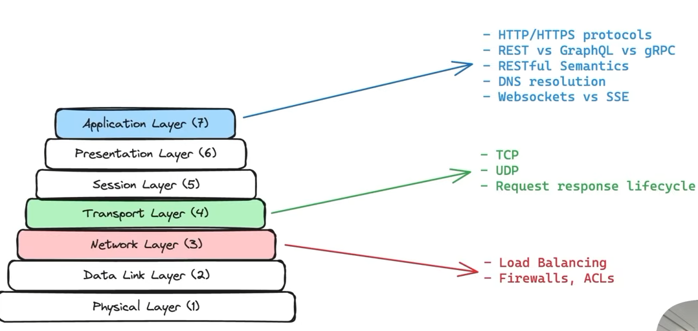
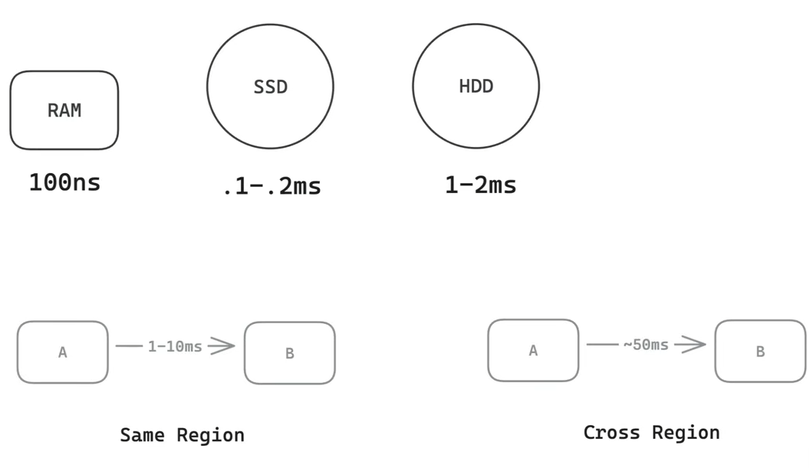

## Components

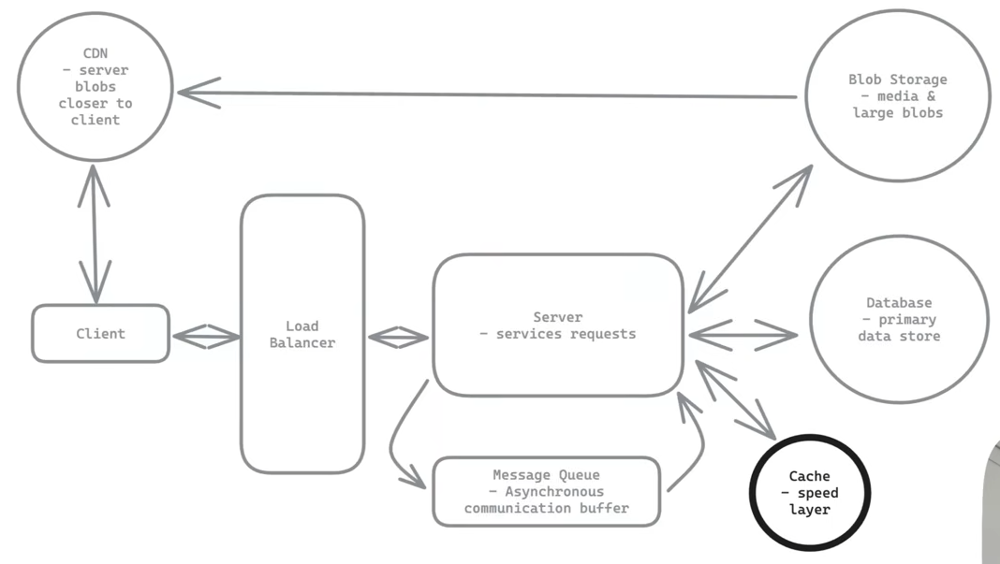

## Problems

## 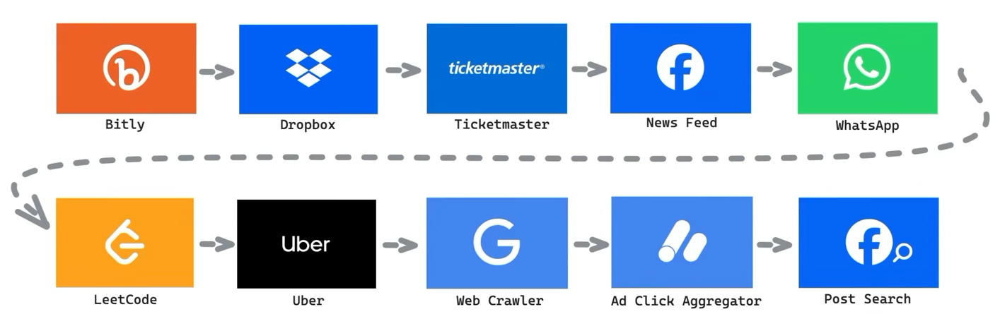

# Caching

A cache is a temporary storage area that stores frequently accessed data to improve performance and reduce latency. Caching can be implemented at various levels, including application-level caching, database caching, and distributed caching.

Disk - 1 ms
Cache - 100 ns

- Cache Hit
- Cache Miss

## Where to cache

### 1. External Cache

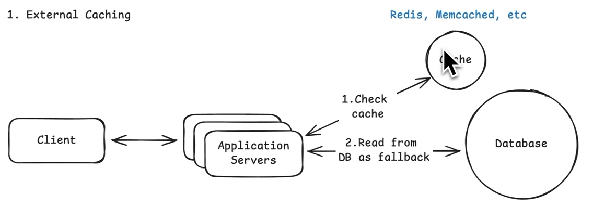{width=500}

- Shared and Scalable
- Redis, Memcached

> Default Choice

### 2. In-Process Cache / In-Memory Cache

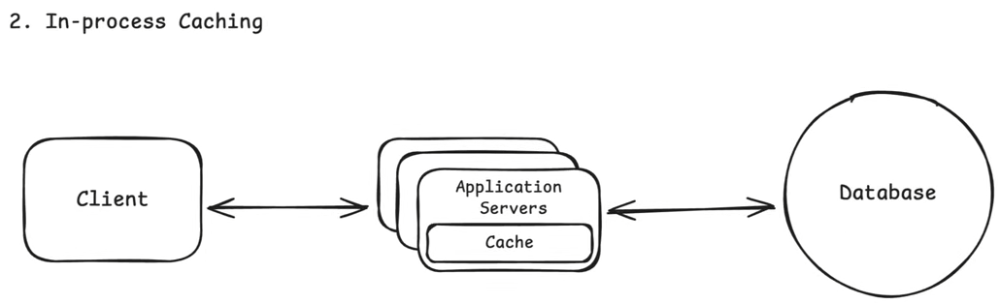{width=500}

- Fastest
- Local to the process, not shared across processes

### 3. CDN Cache

{width=500}

- Cache static assets like images, videos, and scripts at the edge servers closer to the users to reduce latency and improve performance.

### 4. Client Side Cache

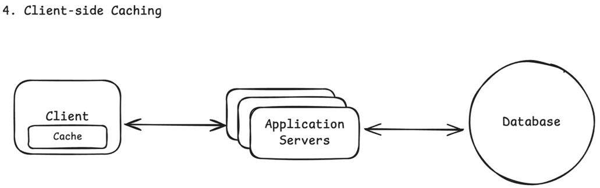{width=500}

- Cache data on the client side, such as in the browser or mobile app, to reduce the number of requests to the server and improve performance.
- Not suitable for sensitive data, as it can be accessed by the client.
- Not controlled by the server, and can be cleared by the client at any time.
- Can go stale

## Cache Architecture

### 1. Cache Aside

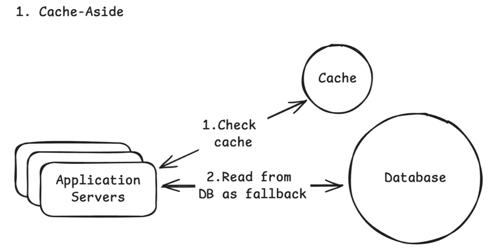{width=500}

- On cache miss, the application loads data from the database and puts it in the cache. On cache hit, the application reads data from the cache.
- Advantage: Only cache what is needed, and the cache is always up to date with the database.
- Disadvantage: Cache miss can cause high latency, and the application needs to handle cache

> Default choice for most applications

### 2. Write Through

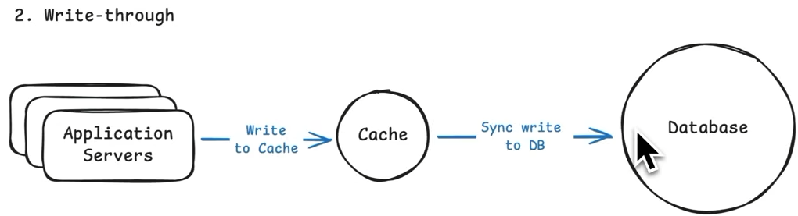{width=500}

- On write, the application writes data to the cache and the database. On read, the application reads data from the cache.
- Advantage: Cache is always up to date with the database, and cache hit is fast.
- Disadvantage: Write latency is higher, and the cache can become a bottleneck if the write load is high. Bloated cache, as all writes go through the cache.

### 3. Write Behind / Write Back

{width=500}

- On write, the application writes data to the cache and asynchronously writes data to the database. On read, the application reads data from the cache.
- Advantage: Write latency is lower, and the cache can handle high write load. Cache is always up to date with the database.
- Disadvantage: Cache can become a bottleneck if the write load is high, and there is a risk of data loss if the cache fails before the data is written to the database.

### 4. Read Through

{width=500}

- On read, the application reads data from the cache. If the data is not in the cache, the cache loads data from the database and puts it in the cache. On write, the application writes data to the database and invalidates the cache.
- Advantage: Cache is always up to date with the database, and cache hit is fast.
- Disadvantage: Cache miss can cause high latency, and the cache can become a bottleneck if the read load is high.

## Cache Eviction Policies

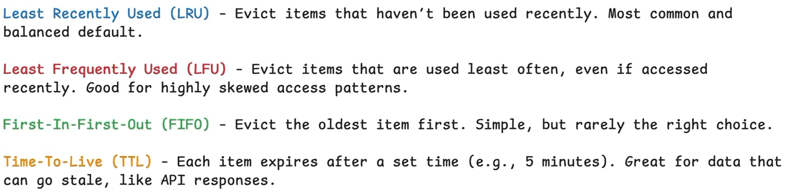{width=500}

## Deep Dives

### 1. Cache Stampede

{width=500}

All requests for the same data miss the cache and go to the database, causing high load on the database. This can happen when the cache expires or is invalidated, and multiple requests for the same data arrive at the same time.

Prevention:

1. Request Coalescing / Single Flight - Only one request goes to the database, and the other requests wait for the response from the first request.
2. Cache Warming - Preload the cache with frequently accessed data before it is requested by the application.

### 2. Cache consistency

{width=500}
Cache consistency ensures that the cache and the database have the same data. Inconsistent cache can lead to stale or incorrect data being served to the application.

Prevention:

1. Write Through / Write Behind - Ensures that writes go through the cache, keeping it consistent with the database.
2. Cache Invalidation on write- Invalidate the cache when the underlying data changes, forcing the application to fetch fresh data from the database.
3. Short TTL - Set a short time-to-live for cache entries, so that they expire quickly and are refreshed from the database.
4. Eventual Consistency - Accept that the cache and the database may be temporarily inconsistent, but will eventually converge to the same state.

### 3. Hot Key

{width=500}

Single key that is accessed frequently, causing high load on the cache and the database. This can happen when a popular item is requested by many users at the same time.

Prevention:

1. Sharding - Split the hot key into multiple keys, so that requests can be served from multiple keys on different cache nodes.
2. Fallback Cahche - In Memory Cache

## Interview Perspective

## 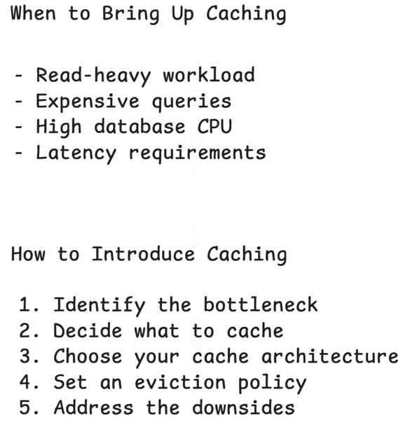{width=500}

---

# Sharding

Sharding is a process of dividing a large database into smaller, more manageable pieces called shards. Each shard is a separate database that contains a subset of the data. Sharding can improve performance, scalability, and availability of the database. Horizontal Scaline technique

But sharding also introduces complexity in terms of data distribution, query routing, and maintaining consistency across shards.

## Sharding Strategies

1. What to shard by
2. How to distribute data across shards

### Choosing a sharding key

Good Example - User ID, Product ID, Order ID
Bad Example - Timestamp, Random ID, Auto Increment ID

### Distributing data across shards

- Range Sharding
  - Divide the data into ranges based on the sharding key and assign each range to a shard.
  - Example: User IDs 1-1000 go to Shard 1, 1001-2000 go to Shard 2
  - But if the data is not evenly distributed, some shards may become hot and overloaded while others are underutilized.
- Hash Sharding
  - Distribute the data across shards based on a hash function applied to the sharding key. This can help to evenly distribute the data across shards.
  - Example: Hash(User ID) % Number of Shards
  - But if the hash function is not good, it may lead to uneven distribution of data across shards.
  - On increasing the number of shards, the hash function needs to be changed, which can lead to data migration and downtime.
  - Consistent Hashing [Default]
    - Distribute the data across shards based on a hash function applied to the sharding key, and use a hash ring to map the hash values to shards. This allows for dynamic addition and removal of shards without affecting the existing data distribution.
    - Example: Hash(User ID) % Number of Shards, but the number of shards can change dynamically without affecting the existing data distribution.
    - But if the hash function is not good, it may lead to uneven distribution of data across shards.
- Directory Based Sharding
  - Use a directory service to map the sharding key to the shard that contains the data. This allows for dynamic addition and removal of shards without affecting the existing data distribution.
  - Example: Use a directory service to map keys to shards, allowing for dynamic addition and removal of shards without affecting the existing data distribution.
  - But if the directory service fails, it can lead to unavailability of the data. Also latency can be introduced due to the extra hop to the directory service.

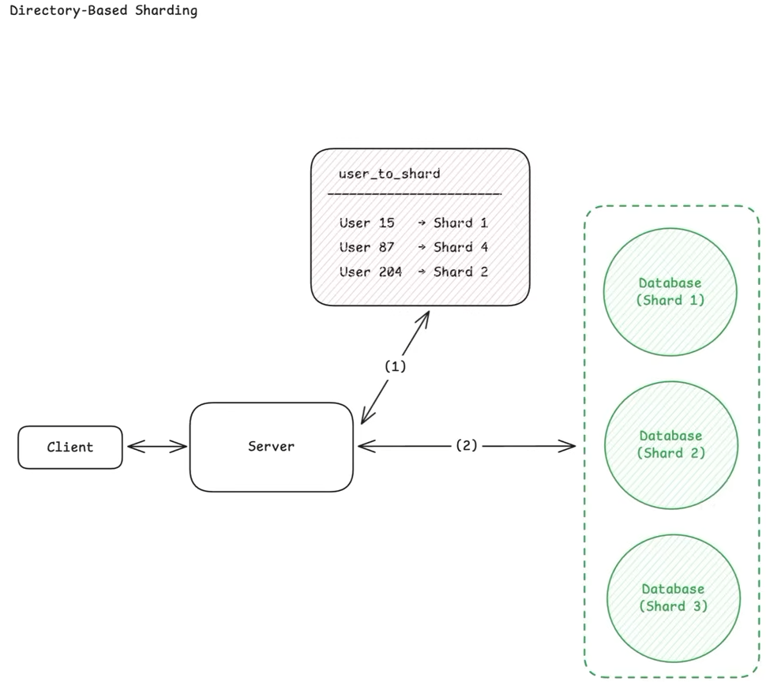

## Challenges of Sharding

### 1. Hot Spots

One shard receives a disproportionate amount of traffic, causing it to become a bottleneck and degrade performance. This can happen when the sharding key is not chosen properly, or when the data is not evenly distributed across shards.

Solution

- Dedicated Shard for Hot Key
- Sharding by a different key [Composite Key] to evenly distribute the load across shards.

### 2. Cross Shard Queries

When data is distributed across multiple shards, queries that need to access data from multiple shards can become complex and inefficient. This can happen when the sharding key is not chosen properly, or when the data is not evenly distributed across shards. Data is not distributed according to the query pattern, which can lead to cross shard queries.

Solution

- Choose a sharding key that aligns with the query patterns, so that most queries can be satisfied by a single shard.
- Cache the results of cross shard queries to reduce the load on the shards and improve performance.
- Denormalize the data to reduce the need for cross shard queries, at the cost of increased storage and complexity.

### 3. Maintaining Consistency

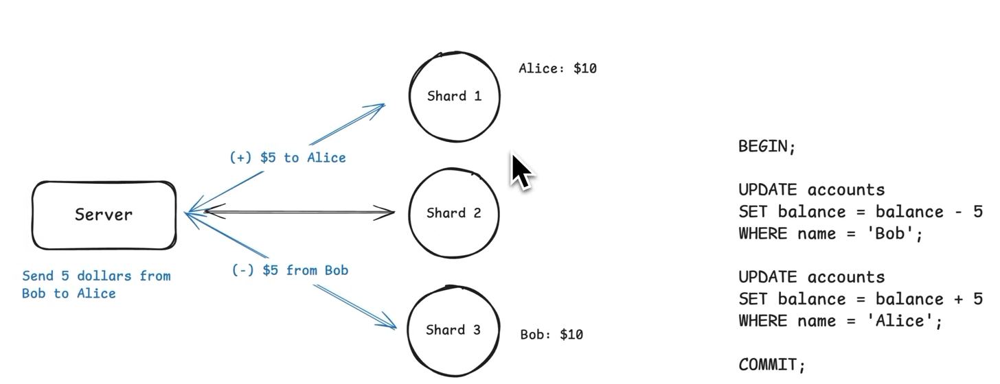

When data is distributed across multiple shards, maintaining consistency can become challenging. Data can live in multiple shards, and updates to the data may need to be propagated to all relevant shards. This can lead to inconsistencies if the updates are not properly synchronized.

Solution

- 2 Phase Commit - Use a distributed transaction protocol to ensure that updates to the data are atomic and consistent across all relevant shards. This technique can be complex and may introduce latency, but it ensures that the data remains consistent across shards.
- Saga Pattern - Use a series of local transactions that are coordinated to achieve eventual consistency across all relevant shards. This technique can be more flexible and scalable than 2 Phase Commit, but it may require more complex application logic to handle failures and retries.

## Sharding in Practice

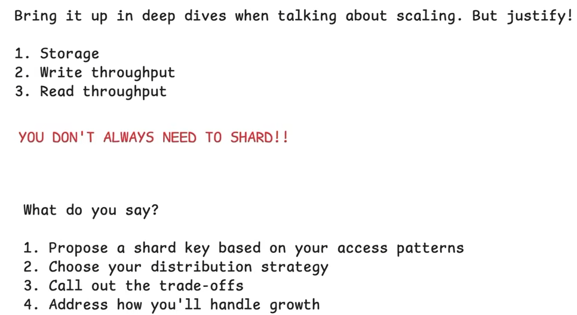

Shard only when single db cant handle the load.

---

# Consistent Hashing

Problem with Traditional Hashing

- Redistribution of keys when the number of shards changes, leading to data migration and downtime.
- Removing a shard can cause a large number of keys to be remapped to different shards, leading to data loss and downtime.

1. Create a hash ring
2. Map each shard to a point on the hash ring using a hash function
3. Map each key to a point on the hash ring using the same hash function, Move clockwise on the ring until a shard is found, and assign the key to that shard.

- If new shard is added, only the keys that fall between the new shard and its predecessor on the hash ring need to be remapped to the new shard.
- If a shard is removed, only the keys that were assigned to that shard need to be remapped to its successor on the hash ring.
  - But this can lead to uneven distribution of keys across shards
  - Solution - Use virtual nodes, where each shard is mapped to multiple points on the hash ring. This allows for more even distribution of keys across shards, and reduces the impact of adding or removing shards.
  - 

Used by Redis, Cassandra, Amazon DynamoDB, and CDNs

---

# Data Modeling

Data Modeling defines hoow the data is

- Structured
- Stored
- Related

## When should be done

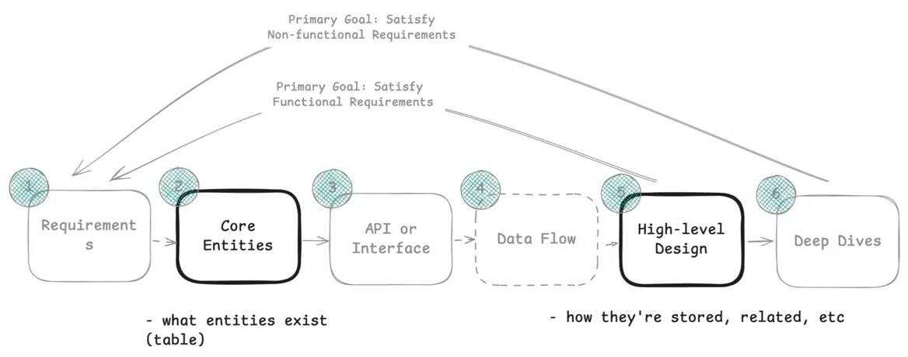

## Data Modeling Options

1. Relational Database - PostgreSQL, MySQL, Oracle [Default]
   - Structured data, Fixed schema, Normalized data, Good for transactional data
2. Document Database - MongoDB, Couchbase, Cosmos DB, Firestore
   - Schema-less, JSON documents, Nested data, Flexible schema, Good for hierarchical data
3. Key-Value Database - Redis, DynamoDB, Riak
   - Simple data model, Fast read and write, Good for caching and session management
4. Graph Database - Neo4j, ArangoDB, Amazon Neptune
   - Graph data model, Nodes and edges, Good for social networks, recommendation engines, and fraud detection
5. Wide Column Database - Cassandra, HBase, ScyllaDB
   - Column family data model, Good for time series data, IoT data, and big data analytics
   - When write volume is high, and read volume is low, and data is not relational, and data is large and distributed across multiple nodes.
   - Each row can have a different number of columns, and columns can be added or removed dynamically. Good for large-scale, distributed data storage and retrieval.

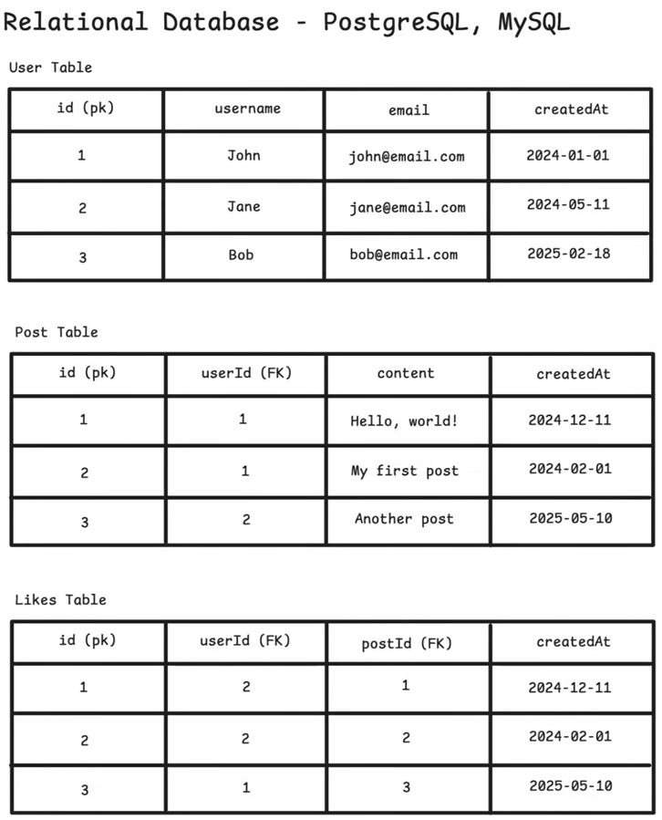
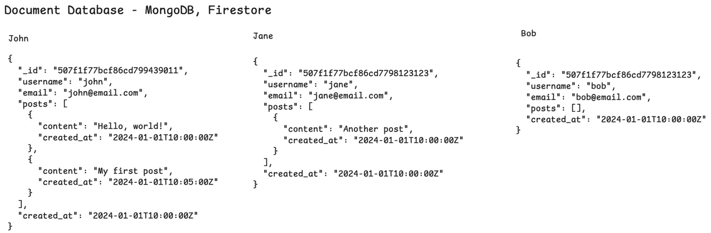
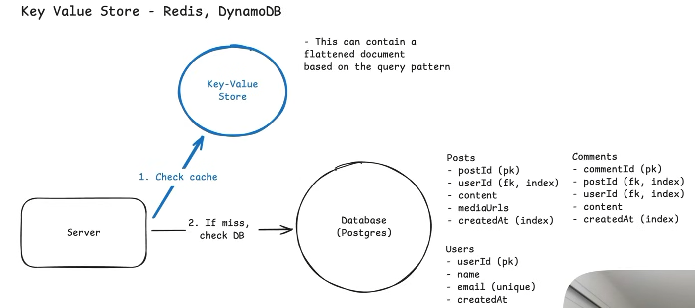
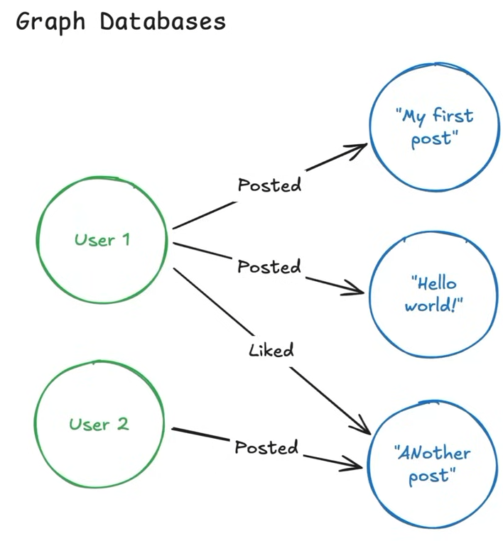
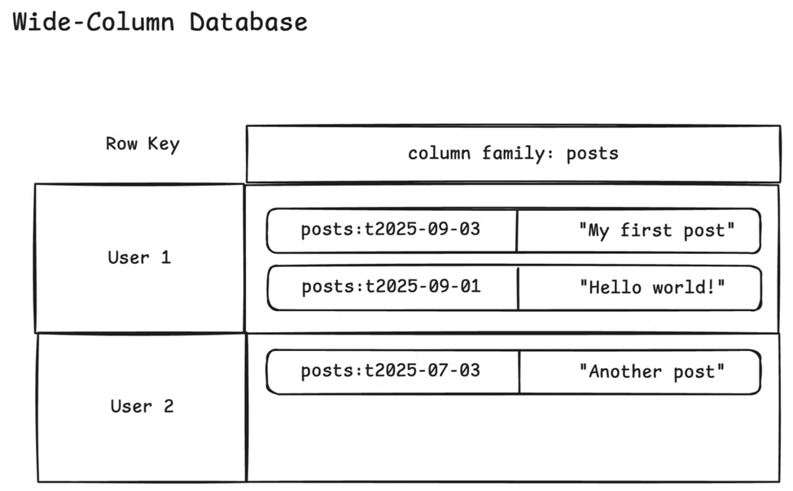

## Schema Design

Key Factors

1. Data Volume - Where data live - Single or Distributed
2. Access Patterns - How data is accessed - Read heavy or Write heavy
3. Consistency Requirements - Strong or Eventual

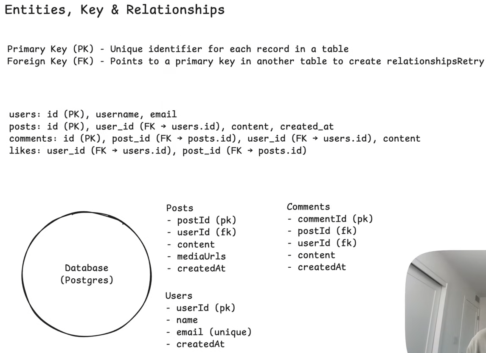

- Keys - PK and FK
- Constraints - Unique, Not Null, Check

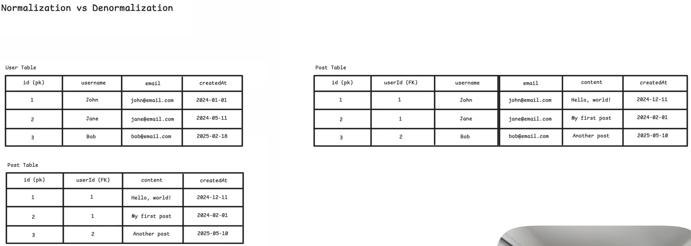
Normalization - No Data Duplication, Reduce Redundancy, Reduce Anomalies, Increase Consistency, Increase Integrity
Denormalization - Data Duplication, Consistency Issues, Increase Redundancy, Increase Performance, Reduce Joins, Reduce Complexity

> Usually data in db are normalized, and data in cache is denormalized.

## Indexing

Indexing is a technique used to improve the performance of database queries by providing a fast lookup mechanism for data retrieval.

Types of Indexes:

1. B-Tree Index - Default index type, good for range queries and equality searches.
2. Hash Index - Good for equality searches, not suitable for range queries.
3. Bitmap Index - Efficient for low-cardinality columns, often used in data warehousing.
4. Full-Text Index - Used for text search, supports complex search queries.

Considerations:

- Indexes improve read performance but can degrade write performance.
- Choose indexes based on query patterns and access frequency.

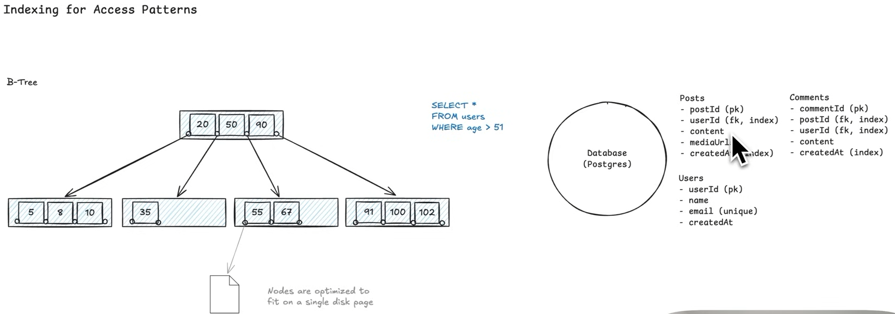

## Scaling and Sharding

Vertical Scaling - Increase the resources of a single database instance (CPU, RAM, Storage). Simple but limited by hardware constraints.
Horizontal Scaling - Distribute the data across multiple database instances (sharding). More complex but allows for greater scalability and fault tolerance.
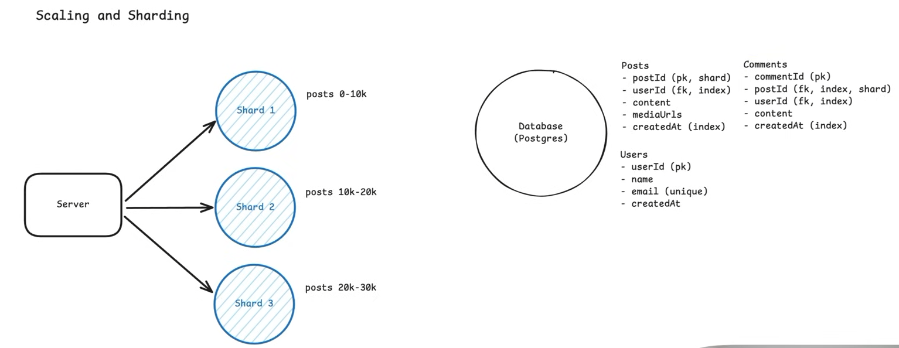

> Shard by query pattern, not by data volume. Shard only when single db cant handle the load.

## Data Modeling in Practice

## 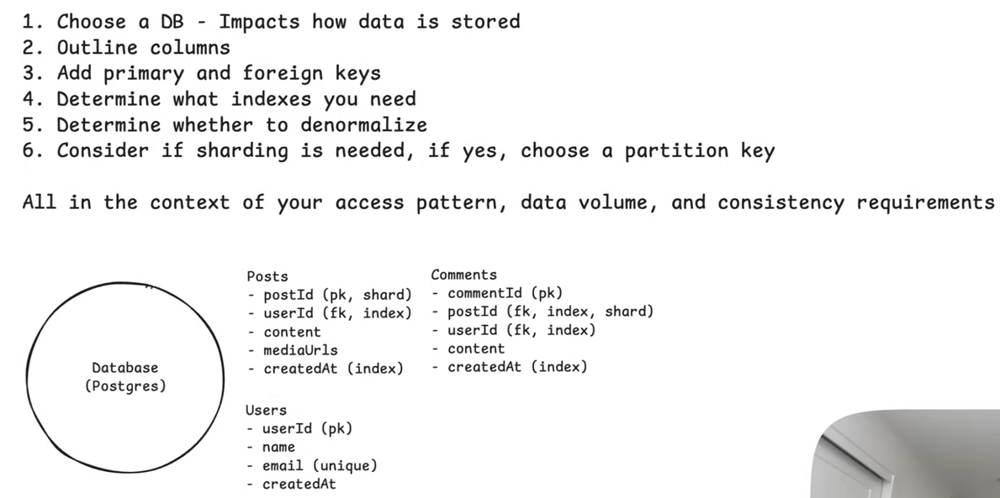

---

# API Design

> Dont spend too much time on API design in interviews, focus on the core entities and data flow.

APIs enables communication between different software components using set of definitions and protocols.

REST [Default], GraphQL, RPC [S2S], SOAP, WebSockets, gRPC

## REST

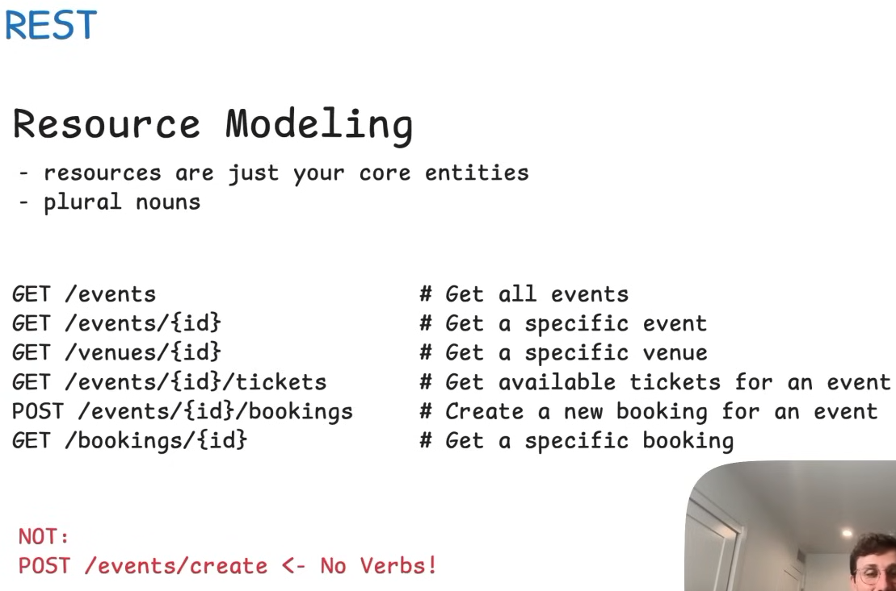
Resources are mapped to core entities.
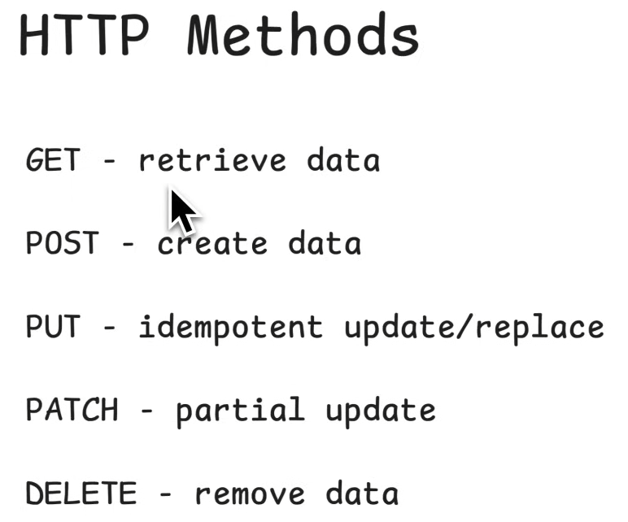
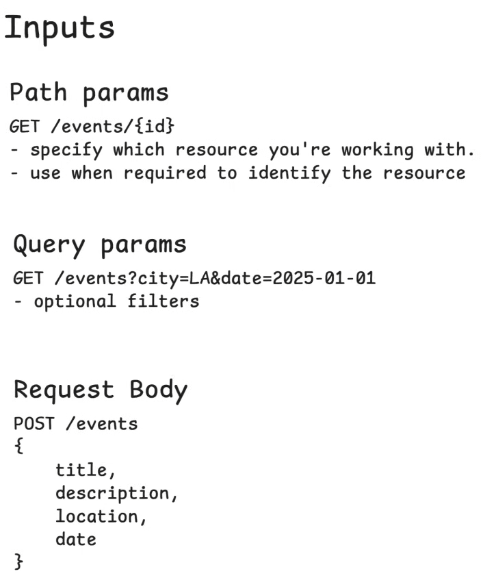
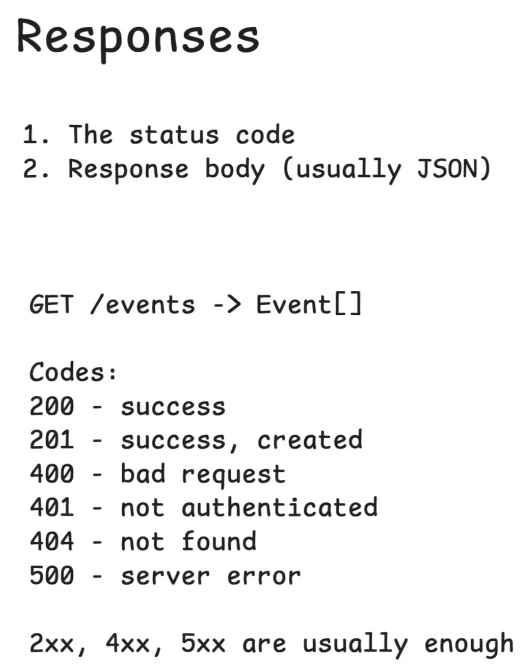

## GraphQL -

Client specify required data, and server returns only the requested data in single call.

### N++1 Problem

The N+1 problem occurs when an application executes N+1 queries to fetch related data, instead of using a single optimized query. This can lead to performance issues, especially in database-driven applications.

SOLUTION - Use JOINs or batch queries to fetch related data in a single query, reducing the number of database round trips and improving performance.

### Schema Resolver

Permissions are field by field in graphql, and the resolver is responsible for fetching the data for each field.

## RPC - Remote Procedure Call

Intra Microsservice communincation
Efficient, Direct function calls between services, Proto Buffers - Binary serialization format
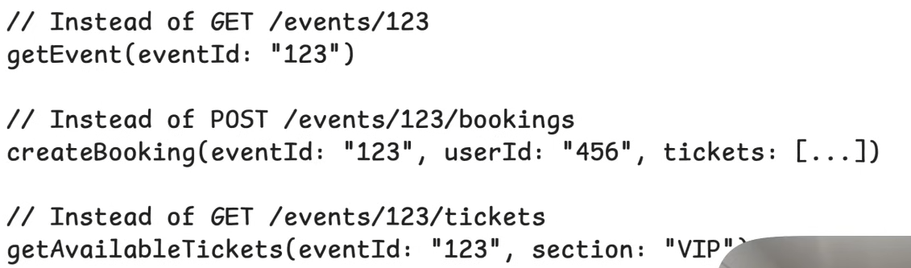

- Strongly Typed, Contract based, Language agnostic - Proto Buffers, gRPC

## Follow Ups

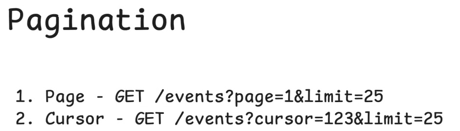
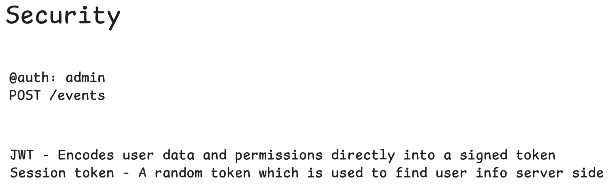

---

# Message Queues

## Motivation

Asynchronous communication is a common pattern in distributed systems, message queues are used to decouple the sender and receiver of messages. This allows for better scalability, fault tolerance, and flexibility in processing messages.
Example - Image processing pipeline, where images are uploaded to a queue and processed by multiple workers.

## Message Queue

Buffer or Queue that stores messages until they are processed by the consumer.
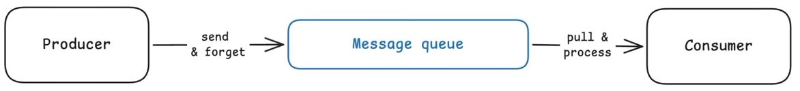{width=500}
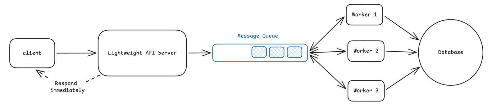{width=500}

- Fast Response
- Failures Isolated
- Scalable
- Decoupled Producer and Consumer, can be scaled independently

Analogy - Waiter puts the order in the queue, and the chef picks up the order from the queue and prepares it. The waiter can take more orders while the chef is busy preparing the previous orders.

## When to use Message Queues

- Async Server Processing
- Burst Traffic
- Decoupling Microservices
- Reliability and Fault Tolerance

> Not to be used for synchronous communication, where the sender needs an immediate response from the receiver or has strict latency requirements.

**Acknowledgement** - Queue holds the message until the consumer acknowledges that it has processed the message. If the consumer fails to acknowledge, the message will be re-queued and sent to another consumer.

### Prevent Double Processing

Broker needs to ensure that a message is not processed more than once.

- If the message is still in the queue, it can be picked up by another consumer.
- If the message is not acknowledged as the consumer processed but crashed before acknowledging, the message will be re-queued and sent to another consumer.

#### Delivery Guarantees

1. At least once - Message is delivered at least once, and may be delivered multiple times. Idempotent processing is required to handle duplicates. Practical and common delivery guarantee in most message queues.
2. At most once - Fire and Forget. Message is delivered at most once, and may be lost if the consumer fails to acknowledge.
3. Exactly once - Message is delivered exactly once, and will not be lost or duplicated.

## Deep Dive

### How to scale processing of messages

Queues are divided into partitions. Each partition can be consumed by a different consumer in a consumer group. This allows for parallel processing of messages. Number of consumer cannot exceed the number of partitions, otherwise some consumers will be idle. Each partition is an ordered, immutable sequence of messages that is continually appended to—a structured commit log. The messages in the partitions are each assigned a sequential id number called the offset that uniquely identifies each message within the partition.
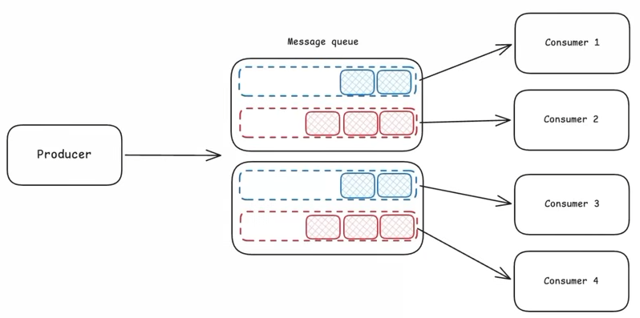

- Partition Key - Determines which partition a message will be sent to. Messages with the same key will always go to the same partition, ensuring ordering of messages with the same key. It should evenly distribute messages across partitions to avoid hot partitions. If the key is not provided, the message will be sent to a random partition.

### What if producers are producing messages faster than consumers can consume?

1. Autoscaling - Scale the queue or consumers.
2. Backpressure - If the queue is full, the producer can be slowed down or blocked until the queue has space. This can be done by using a bounded queue, where the producer will block when the queue is full, or by using a rate limiter, where the producer will be slowed down when the queue is full.
3. Alerts - If the queue is full, an alert can be sent to the operations team to investigate and take action.

### Message fails to be processed by the consumer

- Retries - The broker can retry delivering the message a certain number of times before sending it to the dead letter queue.
- Dead Letter Queue - Messages that fail to be processed multiple times can be sent to a dead letter queue for further investigation.

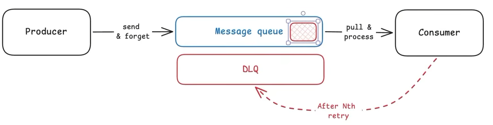

## What if the queue goes down?

- Replication - The queue can be replicated across multiple nodes to ensure high availability. If one node goes down, the other nodes can continue to process messages.
- Disk - The queue can be persisted to disk to ensure that messages are not lost in case of a crash. If the queue goes down, the messages can be recovered from disk when the queue comes back up. Kafka stores messages on disk and replicates them across multiple nodes to ensure durability and high availability.

## Kafka

Distributed streaming platform that can be used as a message queue. It is designed for high throughput, low latency, and fault tolerance. Kafka is based on a distributed commit log, where messages are stored in topics and partitions. Each partition is an ordered, immutable sequence of messages that is continually appended to—a structured commit log. The messages in the partitions are each assigned a sequential id number called the offset that uniquely identifies each message within the partition.

- Messages are not removed from the topic until they expire or are deleted. This allows for multiple consumers to read the same message at their own pace or replay the message if needed. Kafka maintains the offset of the consumer, so it can resume from where it left off. This allows for replaying messages and building event-driven architectures.

> Kafka - Important Queue Technology to know

## Amazon SQS

Amazon simple queue service is a fully managed message queue service that enables you to decouple and scale microservices, distributed systems, and serverless applications. It supports both standard queues (at least once delivery) and FIFO queues (exactly once processing).

- Amazon SQS - Visibility Timeout : Message becomes invisible to other consumers for a period of time after being read by a consumer. If the consumer fails to acknowledge, the message will be re-queued and sent to another consumer.

## RabbitMQ

RabbitMQ is a message broker that implements the Advanced Message Queuing Protocol (AMQP). It supports multiple messaging protocols and can be deployed in distributed and federated configurations to meet high-scale, high-availability requirements.

# Kafka vs RabbitMQ

Kafka and RabbitMQ are both popular messaging systems, but they have different architectures and use cases.
{width=500}

## RabbitMQ

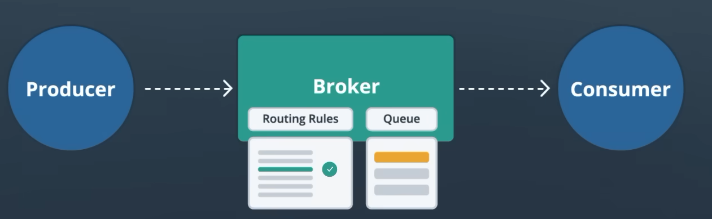{width=800}
Broker puts the message in the queue based on the routing rules. Once consumer acknowledges the message, it is removed from the queue. If the consumer fails to acknowledge, the message will be re-queued and sent to another consumer.

Broker Functionality:

- Routing
- Delivery Tracking
- Retries
- Dead Letter Queue

## Kafka

Distributed append only log. Puts message into topics, consumer reads from the topic at its own pace. Consumer can read the message multiple times, and it is not removed from the topic until it expires or is deleted. It also maintains the offset of the consumer, so it can resume from where it left off.

Multiple consumer can read from same topic.
Message persists
A topic can have multiple partitions, and each partition can be consumed by a different consumer in a consumer group. This allows for parallel processing of messages.
Consumer pull messages in batches

{width=800}

| RabbitMQ                                                                           | Kafka                                                                                                                                  |
| ---------------------------------------------------------------------------------- | -------------------------------------------------------------------------------------------------------------------------------------- |
| Broker                                                                             | Distributed log                                                                                                                        |
| Push                                                                               | Pull                                                                                                                                   |
| Smart broker                                                                       | Simple Broker                                                                                                                          |
| Simple consumer                                                                    | Complex consumer                                                                                                                       |
| Strict ordering                                                                    | Partitioned ordering                                                                                                                   |
| Low Throughput                                                                     | High Throughput                                                                                                                        |
| Low Latency                                                                        | High Latency                                                                                                                           |
| Azure Service Bus                                                                  | Kafka on Azure Event Hubs                                                                                                              |
| Used when task queues, smart routing, Low latency, moderate scale, Simple consumer | Used when high throughput, partitioned ordering, complex consumer, high latency, large scale, Replay, Multiple readers, Durable events |
| Instagram post uploads, Reddit comments                                            | Netflix recommendations, Uber trip events, LinkedIn activity feed, Twitter tweets, Spotify song plays                                  |

---

# Object Storage

Stores files. Example - Amazon S3, Google Cloud Storage, Azure Blob Storage

Not stored in DB as it bloats, replication is expensive, and DB is not optimized for storing files, DB are expensive, and files are large and unstructured.
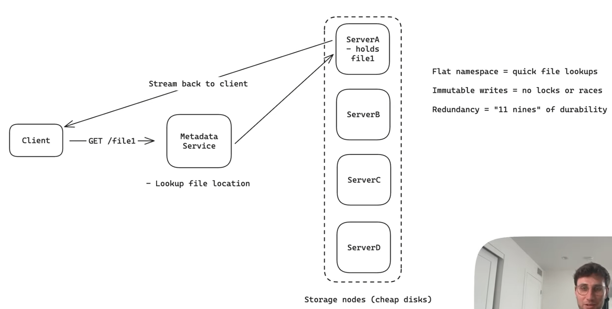

- Flat Namespace
- Immutable Objects
- Redundant and Durable

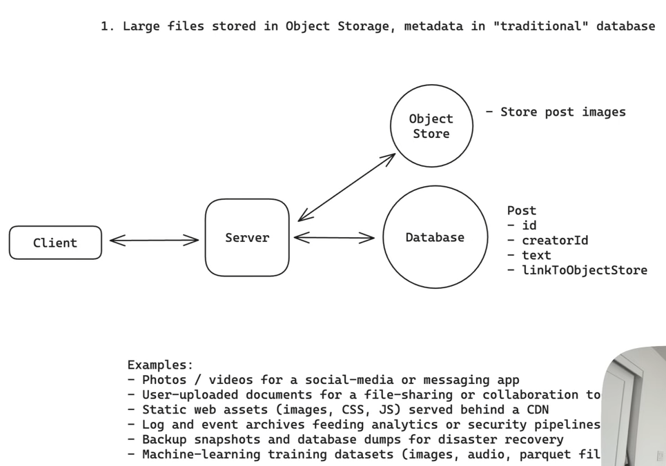
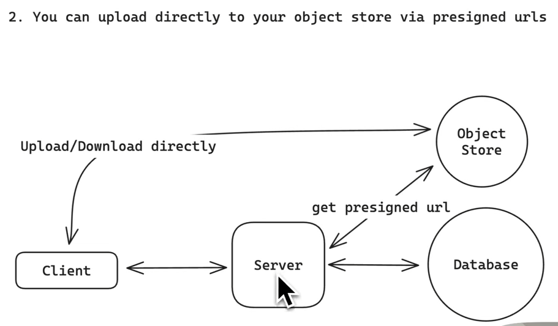
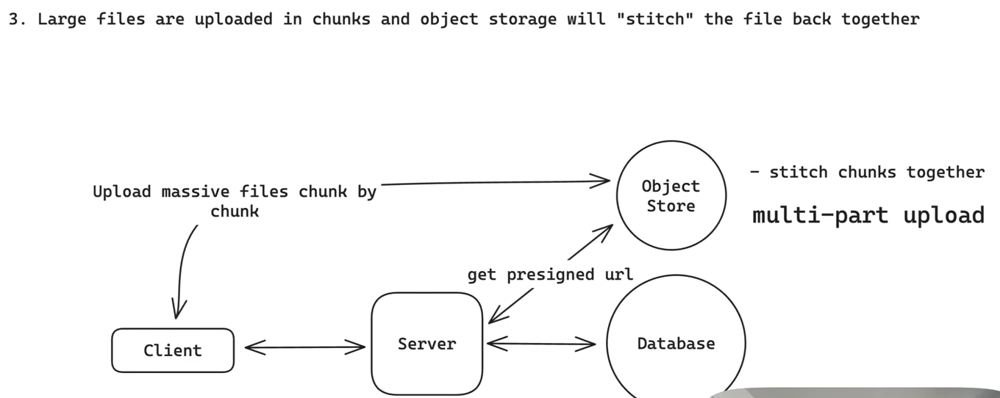
