# System Designs

## Fundamentals

1. Storage - DB, ACID vs BASE
2. Scalability - Vertical vs Horizontal Compute, Scaling Storage
3. Networking - OSI (Application, Transport, Network Layers)
4. Latency Throughput and Performance
5. Fault Tolerance and Redundancy
6. CAP Theorem - Consistency, Availability, Partition Tolerance [Essential for Distributed Systems]

## Components

---

# Data Modeling

Data Modeling defines hoow the data is

- Structured
- Stored
- Related

## When should be done

## Data Modeling Options

1. Relational Database - PostgreSQL, MySQL, Oracle [Default]
   - Structured data, Fixed schema, Normalized data, Good for transactional data
2. Document Database - MongoDB, Couchbase, Cosmos DB, Firestore
   - Schema-less, JSON documents, Nested data, Flexible schema, Good for hierarchical data
3. Key-Value Database - Redis, DynamoDB, Riak
   - Simple data model, Fast read and write, Good for caching and session management
4. Graph Database - Neo4j, ArangoDB, Amazon Neptune
   - Graph data model, Nodes and edges, Good for social networks, recommendation engines, and fraud detection
5. Wide Column Database - Cassandra, HBase, ScyllaDB
   - Column family data model, Good for time series data, IoT data, and big data analytics
   - When write volume is high, and read volume is low, and data is not relational, and data is large and distributed across multiple nodes.
   - Each row can have a different number of columns, and columns can be added or removed dynamically. Good for large-scale, distributed data storage and retrieval.

## Schema Design

Key Factors

1. Data Volume - Where data live - Single or Distributed
2. Access Patterns - How data is accessed - Read heavy or Write heavy
3. Consistency Requirements - Strong or Eventual

- Keys - PK and FK
- Constraints - Unique, Not Null, Check

Normalization - No Data Duplication, Reduce Redundancy, Reduce Anomalies, Increase Consistency, Increase Integrity
Denormalization - Data Duplication, Consistency Issues, Increase Redundancy, Increase Performance, Reduce Joins, Reduce Complexity

> Usually data in db are normalized, and data in cache is denormalized.

## Indexing

Indexing is a technique used to improve the performance of database queries by providing a fast lookup mechanism for data retrieval.

Types of Indexes:

1. B-Tree Index - Default index type, good for range queries and equality searches.
2. Hash Index - Good for equality searches, not suitable for range queries.
3. Bitmap Index - Efficient for low-cardinality columns, often used in data warehousing.
4. Full-Text Index - Used for text search, supports complex search queries.

Considerations:

- Indexes improve read performance but can degrade write performance.
- Choose indexes based on query patterns and access frequency.

## Scaling and Sharding

Vertical Scaling - Increase the resources of a single database instance (CPU, RAM, Storage). Simple but limited by hardware constraints.
Horizontal Scaling - Distribute the data across multiple database instances (sharding). More complex but allows for greater scalability and fault tolerance.

> Shard by query pattern, not by data volume. Shard only when single db cant handle the load.

## Data Modeling in Practice

## 

---

# Message Queues

## Motivation

Asynchronous communication is a common pattern in distributed systems, message queues are used to decouple the sender and receiver of messages. This allows for better scalability, fault tolerance, and flexibility in processing messages.
Example - Image processing pipeline, where images are uploaded to a queue and processed by multiple workers.

## Message Queue

Buffer or Queue that stores messages until they are processed by the consumer.
{width=500}
{width=500}

- Fast Response
- Failures Isolated
- Scalable
- Decoupled Producer and Consumer, can be scaled independently

Analogy - Waiter puts the order in the queue, and the chef picks up the order from the queue and prepares it. The waiter can take more orders while the chef is busy preparing the previous orders.

## When to use Message Queues

- Async Server Processing
- Burst Traffic
- Decoupling Microservices
- Reliability and Fault Tolerance

> Not to be used for synchronous communication, where the sender needs an immediate response from the receiver or has strict latency requirements.

**Acknowledgement** - Queue holds the message until the consumer acknowledges that it has processed the message. If the consumer fails to acknowledge, the message will be re-queued and sent to another consumer.

### Prevent Double Processing

Broker needs to ensure that a message is not processed more than once.

- If the message is still in the queue, it can be picked up by another consumer.
- If the message is not acknowledged as the consumer processed but crashed before acknowledging, the message will be re-queued and sent to another consumer.

#### Delivery Guarantees

1. At least once - Message is delivered at least once, and may be delivered multiple times. Idempotent processing is required to handle duplicates. Practical and common delivery guarantee in most message queues.
2. At most once - Fire and Forget. Message is delivered at most once, and may be lost if the consumer fails to acknowledge.
3. Exactly once - Message is delivered exactly once, and will not be lost or duplicated.

## Deep Dive

### How to scale processing of messages

Queues are divided into partitions. Each partition can be consumed by a different consumer in a consumer group. This allows for parallel processing of messages. Number of consumer cannot exceed the number of partitions, otherwise some consumers will be idle. Each partition is an ordered, immutable sequence of messages that is continually appended to—a structured commit log. The messages in the partitions are each assigned a sequential id number called the offset that uniquely identifies each message within the partition.

- Partition Key - Determines which partition a message will be sent to. Messages with the same key will always go to the same partition, ensuring ordering of messages with the same key. It should evenly distribute messages across partitions to avoid hot partitions. If the key is not provided, the message will be sent to a random partition.

### What if producers are producing messages faster than consumers can consume?

1. Autoscaling - Scale the queue or consumers.
2. Backpressure - If the queue is full, the producer can be slowed down or blocked until the queue has space. This can be done by using a bounded queue, where the producer will block when the queue is full, or by using a rate limiter, where the producer will be slowed down when the queue is full.
3. Alerts - If the queue is full, an alert can be sent to the operations team to investigate and take action.

### Message fails to be processed by the consumer

- Retries - The broker can retry delivering the message a certain number of times before sending it to the dead letter queue.
- Dead Letter Queue - Messages that fail to be processed multiple times can be sent to a dead letter queue for further investigation.

## What if the queue goes down?

- Replication - The queue can be replicated across multiple nodes to ensure high availability. If one node goes down, the other nodes can continue to process messages.
- Disk - The queue can be persisted to disk to ensure that messages are not lost in case of a crash. If the queue goes down, the messages can be recovered from disk when the queue comes back up. Kafka stores messages on disk and replicates them across multiple nodes to ensure durability and high availability.

## Kafka

Distributed streaming platform that can be used as a message queue. It is designed for high throughput, low latency, and fault tolerance. Kafka is based on a distributed commit log, where messages are stored in topics and partitions. Each partition is an ordered, immutable sequence of messages that is continually appended to—a structured commit log. The messages in the partitions are each assigned a sequential id number called the offset that uniquely identifies each message within the partition.

- Messages are not removed from the topic until they expire or are deleted. This allows for multiple consumers to read the same message at their own pace or replay the message if needed. Kafka maintains the offset of the consumer, so it can resume from where it left off. This allows for replaying messages and building event-driven architectures.

> Kafka - Important Queue Technology to know

## Amazon SQS

Amazon simple queue service is a fully managed message queue service that enables you to decouple and scale microservices, distributed systems, and serverless applications. It supports both standard queues (at least once delivery) and FIFO queues (exactly once processing).

- Amazon SQS - Visibility Timeout : Message becomes invisible to other consumers for a period of time after being read by a consumer. If the consumer fails to acknowledge, the message will be re-queued and sent to another consumer.

## RabbitMQ

RabbitMQ is a message broker that implements the Advanced Message Queuing Protocol (AMQP). It supports multiple messaging protocols and can be deployed in distributed and federated configurations to meet high-scale, high-availability requirements.

# Kafka vs RabbitMQ

Kafka and RabbitMQ are both popular messaging systems, but they have different architectures and use cases.
{width=500}

## RabbitMQ

{width=800}
Broker puts the message in the queue based on the routing rules. Once consumer acknowledges the message, it is removed from the queue. If the consumer fails to acknowledge, the message will be re-queued and sent to another consumer.

Broker Functionality:

- Routing
- Delivery Tracking
- Retries
- Dead Letter Queue

## Kafka

Distributed append only log. Puts message into topics, consumer reads from the topic at its own pace. Consumer can read the message multiple times, and it is not removed from the topic until it expires or is deleted. It also maintains the offset of the consumer, so it can resume from where it left off.

Multiple consumer can read from same topic.
Message persists
A topic can have multiple partitions, and each partition can be consumed by a different consumer in a consumer group. This allows for parallel processing of messages.
Consumer pull messages in batches

{width=800}

| RabbitMQ                                                                           | Kafka                                                                                                                                  |
| ---------------------------------------------------------------------------------- | -------------------------------------------------------------------------------------------------------------------------------------- |
| Broker                                                                             | Distributed log                                                                                                                        |
| Push                                                                               | Pull                                                                                                                                   |
| Smart broker                                                                       | Simple Broker                                                                                                                          |
| Simple consumer                                                                    | Complex consumer                                                                                                                       |
| Strict ordering                                                                    | Partitioned ordering                                                                                                                   |
| Low Throughput                                                                     | High Throughput                                                                                                                        |
| Low Latency                                                                        | High Latency                                                                                                                           |
| Azure Service Bus                                                                  | Kafka on Azure Event Hubs                                                                                                              |
| Used when task queues, smart routing, Low latency, moderate scale, Simple consumer | Used when high throughput, partitioned ordering, complex consumer, high latency, large scale, Replay, Multiple readers, Durable events |
| Instagram post uploads, Reddit comments                                            | Netflix recommendations, Uber trip events, LinkedIn activity feed, Twitter tweets, Spotify song plays                                  |

---

# Object Storage

Stores files. Example - Amazon S3, Google Cloud Storage, Azure Blob Storage

Not stored in DB as it bloats, replication is expensive, and DB is not optimized for storing files, DB are expensive, and files are large and unstructured.

- Flat Namespace
- Immutable Objects
- Redundant and Durable

---

# Networking Essentials

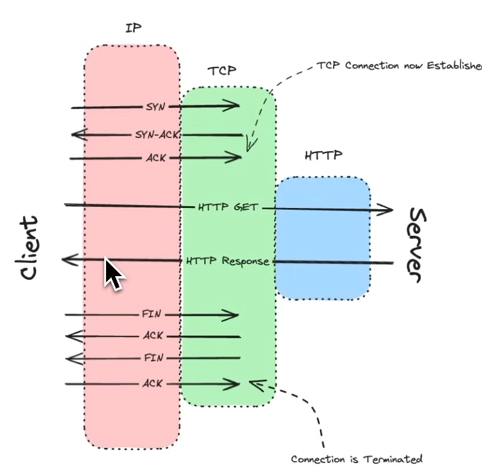

- Latency Involved
- Connection Establishment

## Internet Protocols

Routing and IP Addressing

- IPv4 vs IPv6
- Public [Externally Facing Components] vs Private IP Address

## Transport Layer

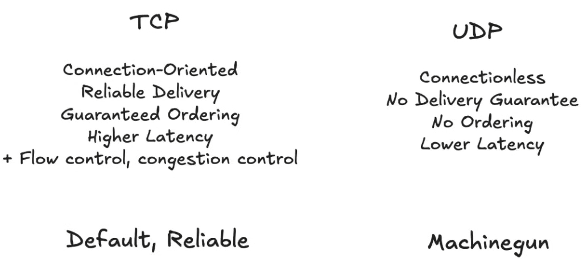

- UDP is not supported by browsers by default, and is not suitable for reliable communication. It is used for real-time applications like video streaming, online gaming, and VoIP, where low latency is more important than reliability.

## HTTP

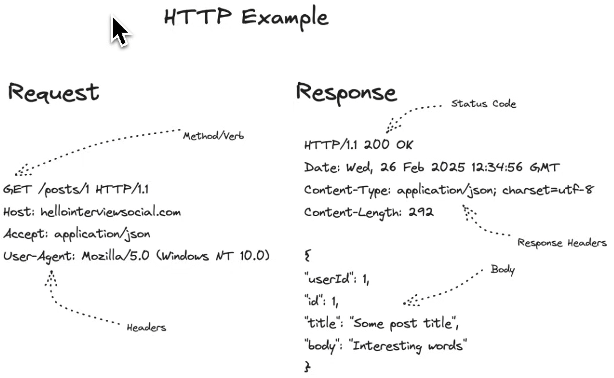

- REST, GraphQL, RPC, SOAP, WebSockets, gRPC

REST

- APIs

GraphQL

- Client specify required data, and server returns only the requested data in single call.

gRPC

- Efficient serialization format, Strongly Typed, Contract based, Language agnostic - Proto Buffers, gRPC
  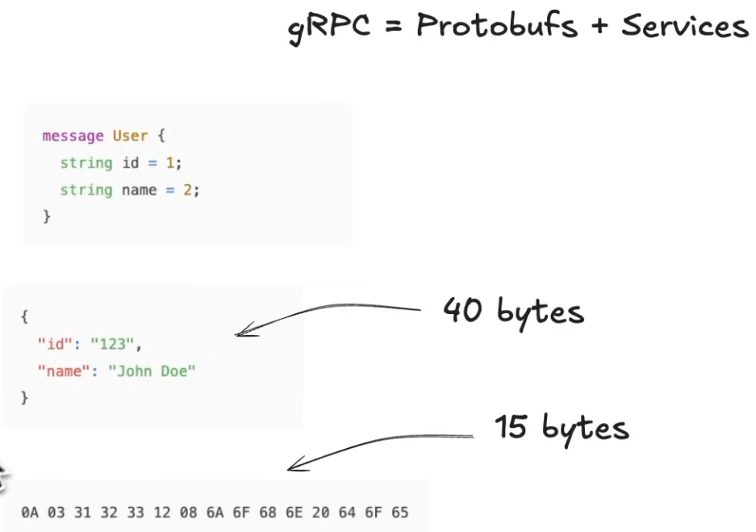
  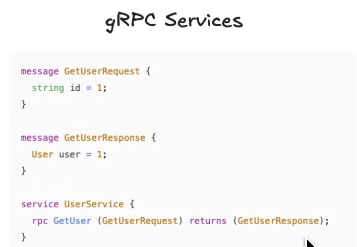
  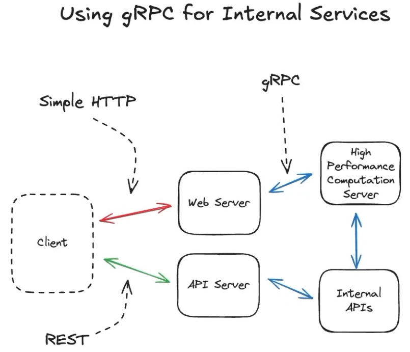

Server Sent Events (SSE) - Server can push data to the client over a single HTTP connection. It is a unidirectional communication from server to client, and is suitable for real-time applications like notifications, live updates, and AI chat applications.

Web Sockets

- Bidirectional communication.
- Stateful connection between client and server, allowing for low latency and real-time communication.
- But requires a separate connection, and is not suitable for all use cases. It is suitable for real-time applications like chat applications, online gaming, and collaborative editing.

WebRTC

- Peer to peer communication between browsers, allowing for low latency and real-time communication. It is suitable for real-time applications like video conferencing, audio calling, online gaming, and file sharing.
  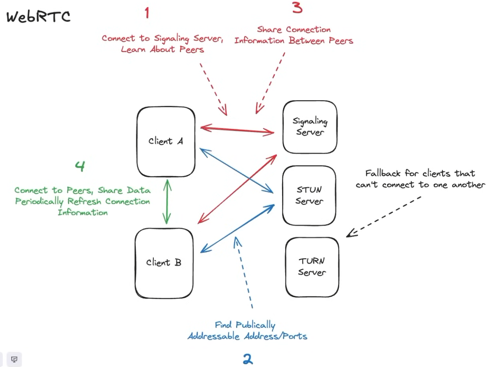

## Scaling

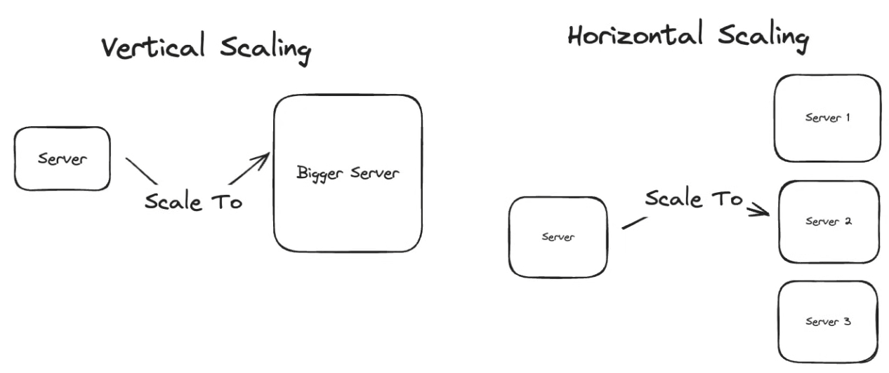

### Load Balancing

- Client Side Load Balancing - Client can choose which server to send the request to, based on the server's health and load. This can be done using DNS round-robin, or by using a service discovery mechanism like Consul or etcd. Usually in internal microsservices.
- Load Balancer - A load balancer is a reverse proxy that distributes incoming requests to multiple backend servers, based on a load balancing algorithm. It can also perform health checks on the backend servers, and remove unhealthy servers from the pool.

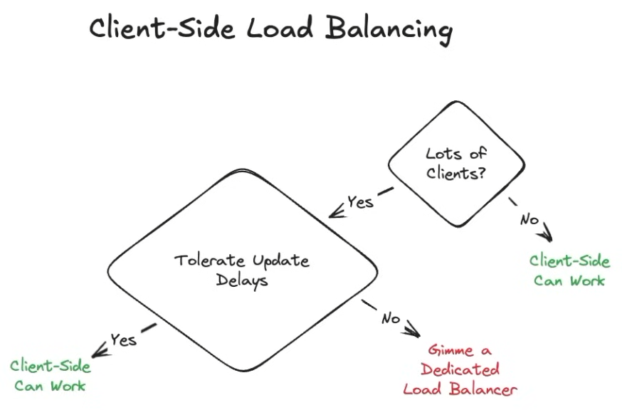

Layer 4 or Layer 7 Load Balancer
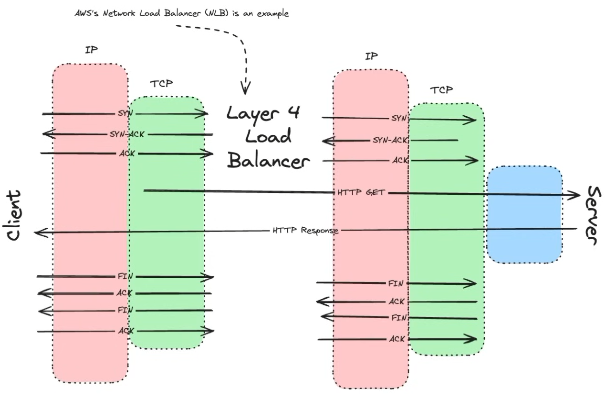
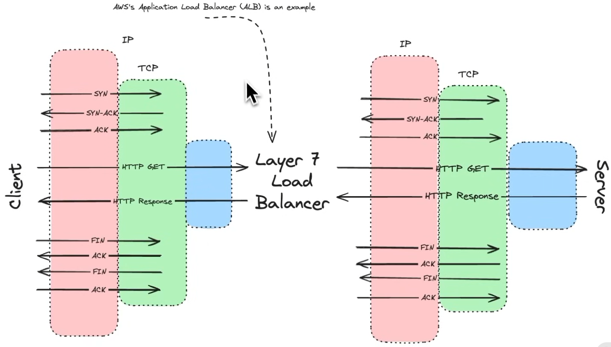

| Layer 4 Load Balancer                                   | Layer 7 Load Balancer                                                                       |
| ------------------------------------------------------- | ------------------------------------------------------------------------------------------- |
| Operates at the transport layer (TCP/UDP)               | Operates at the application layer (HTTP/HTTPS)                                              |
| Cannot inspect application layer data                   | Can inspect application layer data                                                          |
| Can perform load balancing based on IP address and port | Can perform load balancing based on URL, headers, cookies, and other application layer data |
| Simple and fast                                         | More complex and slower                                                                     |
| Used for non-HTTP traffic, such as TCP and UDP          | Used for HTTP and HTTPS traffic                                                             |

## Regionalization

Networking across the world

> Regional Servers
> Database and Servers should be close by
> Data Replication and Sharding
> CDNs
> Caching

## Timeouts, Backoff, and Retries

Jitter - Randomized delay to avoid thundering herd problem, where multiple clients retry at the same time, causing a spike in traffic and overwhelming the server.
Exponential Backoff Retries with Jitter : Best Choice

## Cascading Failures

Circuit Breaker - Prevents a service from being overwhelmed by requests when it is experiencing high latency or errors. It monitors the health of the service, and if the error rate exceeds a certain threshold, it trips the circuit breaker and stops sending requests to the service for a certain period of time. This allows the service to recover and prevents cascading failures in the system.
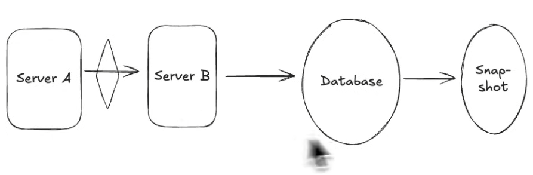
